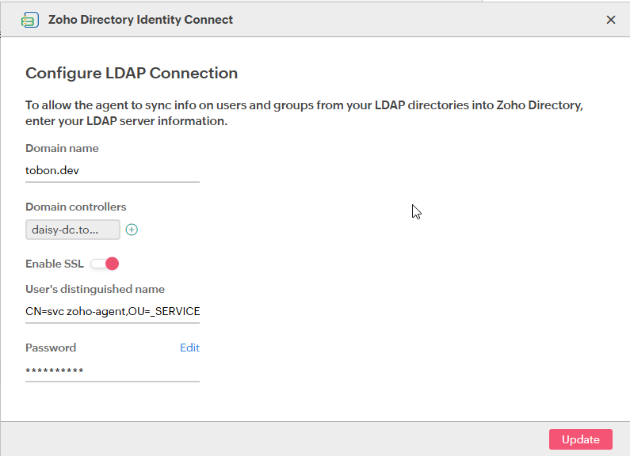
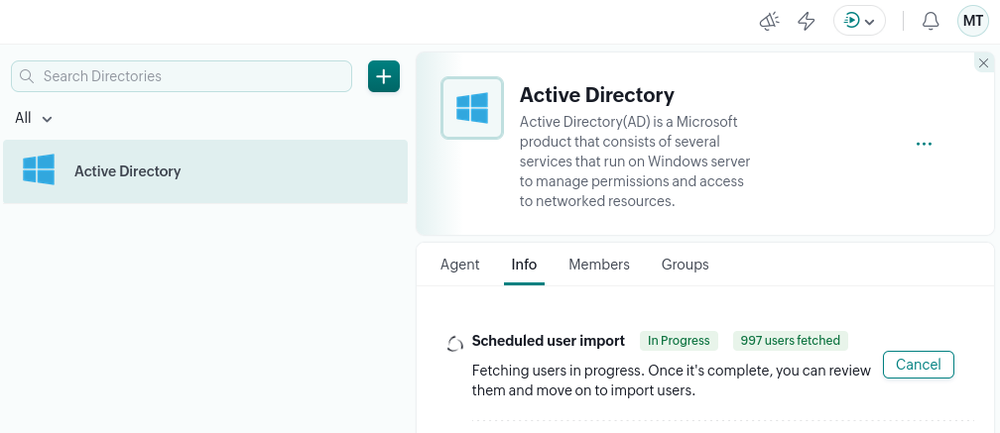
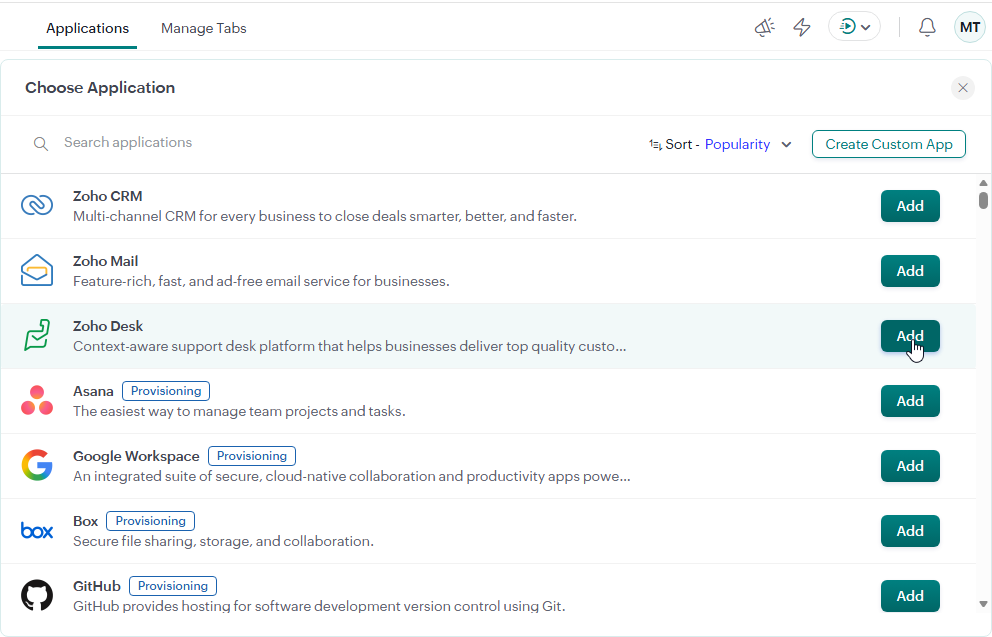
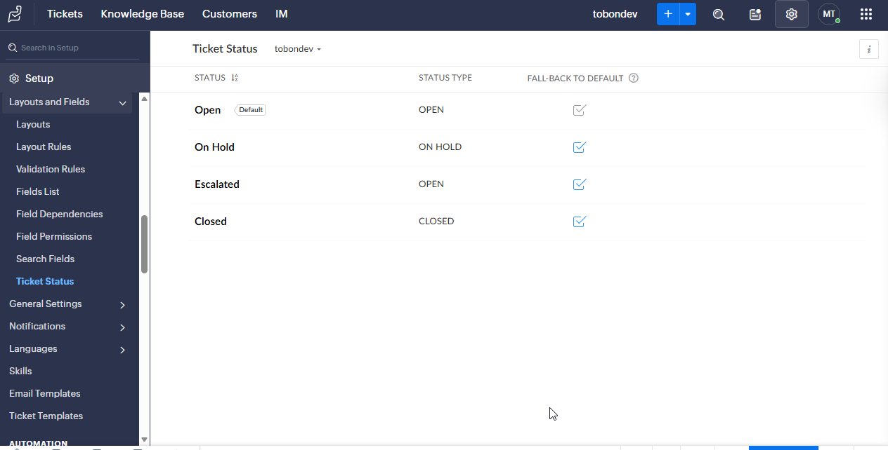
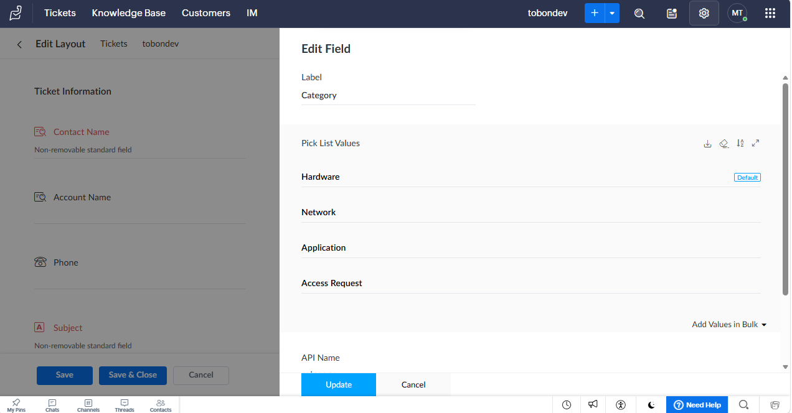

# Deployment Spec: Zoho Desk MVP

**ID:** dep-2026-09-05-001
**Owner:** @tobondev
**Status:** In-Progress
**Lifecycle Class:** Temporary Lab
**Target Expiry / Review Date:** 2026-10-05 

---

## 1. Scope & Objective

### Objective

Deploy Zoho Desk to demonstrate IT Service Management (ITSM) workflows, request logging, and identity-driven access control. The deployment will utilize on-premise Active Directory for Role-Based Access Control (RBAC) and implement SLAs and categorical ticketing queues.

### Boundary & Lifecycle Criteria

* **Deployment Lifespan:** 30-day Proof-of-Concept.
* **Teardown Trigger:** Completion of SLA testing and export of the Incident Management SOP.
* **Out-of-Scope:** Multiple departments (Free Tier limitation), email-based ticket parsing, and Entra ID/M365 integration.

---

## 2. Integration Architecture & RBAC

### Network & Authentication Flow
* **Target System:** Zoho Desk (Free Tier SaaS)
* **Identity Source:** On-premise Active Directory Domain Services.
* **Permissions Scope:** `szhagent` (Read-only access to `OU=DEPARTMENTS`)

### Identity & Permission Mapping
| AD Group / Principal | Zoho Desk Role | Zoho Desk Profile | Permitted Scope / Permissions |
| :--- | :--- | :--- | :--- |
| `Helpdesk` | Agent | Helpdesk Staff | Ticket management, status updates, internal notes |
| `Employees` | End User | Portal User | Ticket creation, view own tickets only |
| `DomainAdmins` | Administrator | Desk Admin | Department routing, SLA configuration, user sync |

---

## 3. Prerequisites & Environment State

### Infrastructure Prerequisites

- [x] Service account created with minimal required read attributes.
- [x] Baseline snapshot created for on-premise infrastructure (`win2k25`).

---

## 4. Execution & Verification

### Phase 1: Directory Integration

1. **Zoho Agent Installation:** Zoho Agent Installed in Windows Server GUI instance, using the newly created service account `zshagent`.



2. **Zoho Directory Sync:** Zoho Directory Portal Synced Active Directory Users with the Online Directory.



3. **Zoho Directory Add App:** Connect Zoho Desk with Zoho Directory



4. **Zoho Desk Ticket Status:** Configure Ticket Status Options



5. **Zoho Desk Ticket Category:** Configure Ticket Category Options



6. **Zoho Directory Sync:** Zoho Directory Portal Synced Active Directory Users with the Online Directory.


### Phase 2: Role Assignment & Portal Configuration

1. **[Configuration Step 1]:** [Department and team setup]
2. **[Configuration Step 2]:** [Ticket assignment rules and portal security limits]

### Verification & Test Matrix

| Test ID | Scenario | Expected Result | Actual Result | Status |
| :--- | :--- | :--- | :--- | :--- |
| **TEST-01** | End-user submits ticket via portal | Account created under `Portal User`, ticket routed | | [Pass/Fail] |
| **TEST-02** | End-user attempts agent dashboard access | Access denied (403 or redirect to portal) | | [Pass/Fail] |
| **TEST-03** | Agent updates ticket status and reassigns | Ticket updated; audit log records agent identity | | [Pass/Fail] |
| **TEST-04** | Agent attempts administrative department edit | Access denied | | [Pass/Fail] |

---

## 5. Teardown & Decommissioning

*Execute these steps to return the infrastructure to its pre-deployment baseline.*

1. **Identity Revocation:** Disable and delete `svc_zohodesk` service account from Active Directory.
2. **Access Revocation:** Revoke API keys, tenant tokens, and enterprise application registrations.
3. **State Rollback:** Revert VM snapshot if local agent software was installed:
   ```bash
   # Snapshot rollback command if applicable
```

4. **Directory Cleanup:** Remove any staging OUs, test attributes, or test security groups.

---

## 6. Artifacts & Session Log

| Artifact Name | Path / Repository Link | Description |
| --- | --- | --- |
| Sync Script / Config | `configs/zoho-sync-config.json` | Sanitized sync configuration schema |
| Audit Export | `docs/artifacts/zoho-perm-audit.csv` | Evidence of permission separation |

### Operational Notes

* [Record technical quirks, rate limits, or integration hurdles encountered during deployment]
