# Sysadmin Log: Hybrid OS Lab Stage 1

**Date:** 2026-05-08

**Report Time:** 11:38

**Category:** Architecture

**Status:** Completed

---

## 1. Context & Problem Statement


**One-line summary:** Stage 1 of the Hybrid Identity Architecture Project consists of an Isolated Windows Active Directory sandbox, containing a DC and a Windows 11 client.

**Background:** The current Infrastructure Architecture focuses heavily on Linux. Stage 1 of the Hybrid OS Lab creates a fully isolated Windows testbed to develop hands-on experience with Active Directory Domain Services, PowerShell Scripting, DNS and DHCP (in the context of AD). The Sandbox architecture builds an isolated Windows-native network stack: the Domain Controller runs RRAS/NAT, DHCP, DNS and AD DS. This ensures the foundational knowledge of Active Directory architecture supports the Stage 2 buildout, which integrates Active Directory into the existing OPNsense Network Topology (which requires separating DNS duties in a segmented VLAN, and relegating DHCP to OPNsense).


## 2. Architectural Decisions & Strategy

Since Windows Active Directory is inseparable from DNS, this presents a series of challenges for an infrastructure with OPNsense at its core, handling DNS and DHCP. Stage 1 solves this by embracing complete isolation in a Dual-NAT setup, which has the benefit of providing hands-on experience with the Domain Controller handling DNS and RRAS. Stage 2 will focus on a hybrid solution that uses VLAN separation and DNS forwarding.


### Decision 1: GUI MVP for Stage 1 - CLI for Stage 2

**Decision:** Configure Windows Server as Domain Controller using the GUI, for Stage 1, then destroy the VM and move on to CLI and automated deployment for Stage 2.
**Rationale:** Descriptions, images and configuration wizards provide guidance for configuration that goes further in the learning process than typing a command would: by separating steps and slowing down in the way that GUI use requires, the GUI-based MVP forces an understanding of the underlying structures and steps required to promote a server to Domain Controller, set-up DNS and RRAS. CLI provisioning knowledge is required for deploying at scale, and the knowledge built from Stage 1 will be used in the development and deployment of Stage 2.

### Decision 2: QEMU Snapshots for Baseline Client Configuration

**Decision:** Use QEMU Snapshots for Baseline Clients, to preserve a pre-domain join state and allow for cloning of Virtual Machines for automated deployment and multi-user testing.
**Rationale:** While BTRFS snapshots would achieve a similar result, utilizing hypervisor-controlled snapshots is more in line with industry standard practices, such as those used by Proxmox and VMware. It establishes demonstrable familiarity with core virtualization concepts, which aligns with a documentation-first mindset.

### Decision 3: Limited Scope for Graphical Documentation

**Decision:** Embrace the need for Graphical Documentation as a trade-off stemming from the GUI-first approach for Stage 1.
**Rationale:** While existing documentation has focused on terminal logs and text-based artifacts, the virtualized, cross-os and GUI-heavy nature of the project, but especially Stage 1, requires documenting with images. All images live inside `docs/artifacts/hybrid-os-lab-stage-1` and are linked inline.

### Decision 4: Designate tobon.dev as the forest root domain

**Decision:** Use tobon.dev as the forest root for the AD deployment from Stage 1 on.
**Rationale:** Entra ID Connect requires a verified public domain for UPN suffix validation. Rather than producing documentation and artifacts that have to be reworked for Stage 3, the decision is made to use the existing tobon.dev domain for all stages.

## 3. Implementation & Execution


* **Phase 1 (Preparation):** Virtual Network and Host Configuration

An isolated QEMU virtual network named `AD-Sandbox-LAN` was created with no external routing, ensuring the sandbox has zero connectivity to the primary network. IPv4 addressing, subnet mask, and DHCP range were assigned. The network is fully self-contained; the Domain Controller will itself provide DHCP and NAT services.

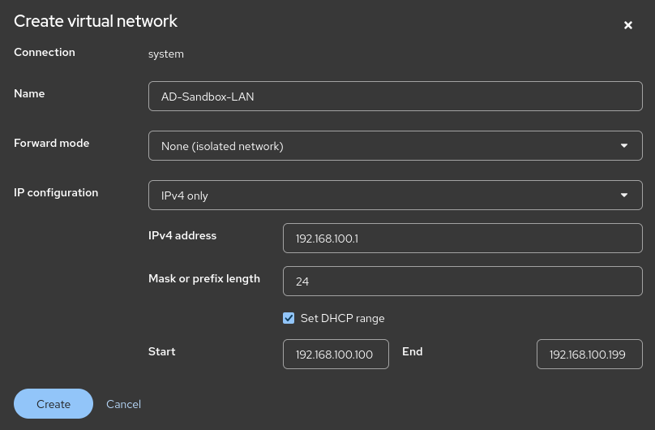
NOTE: While QEMU initially serves as DHCP server and sets an IP range, this is superseded by the AD DC DHCP Server's configuration.

The Domain Controller VM was provisioned with 64 GB of virtual disk (thin-provisioned, qcow2) and 8 GB of RAM, running under the system session (`QEMU/KVM - System`) to enable `macvtap` passthrough. The modest storage reflects the ephemeral nature of the sandbox; Stage 2 will allocate larger volumes.

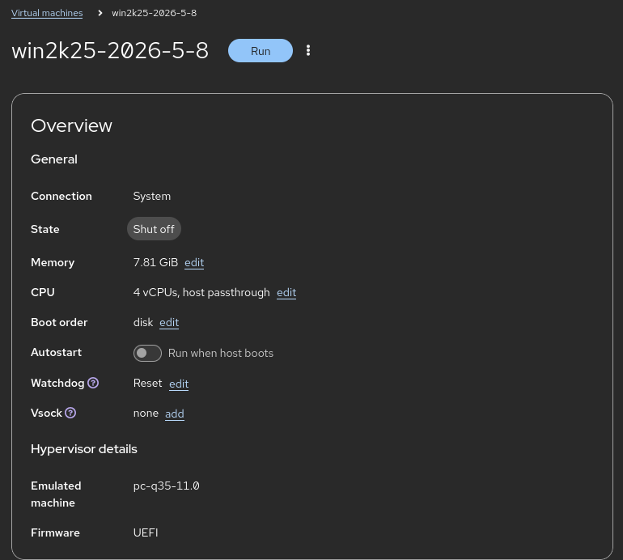

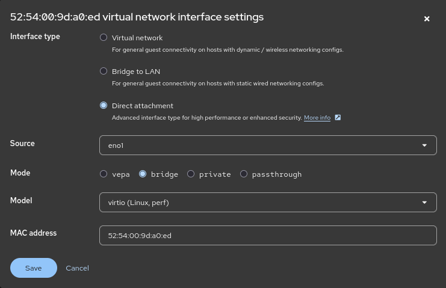

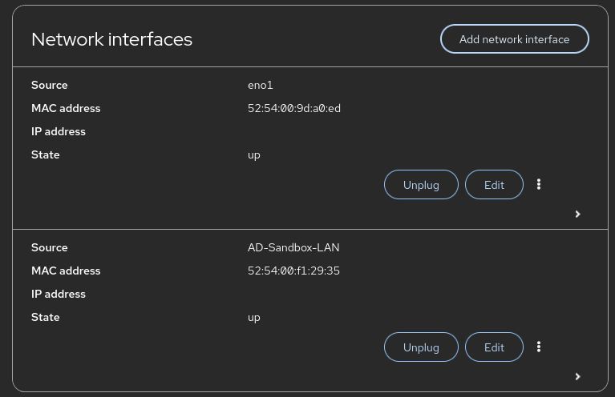

Windows Server 2025 (Desktop Experience) was installed manually via ISO.

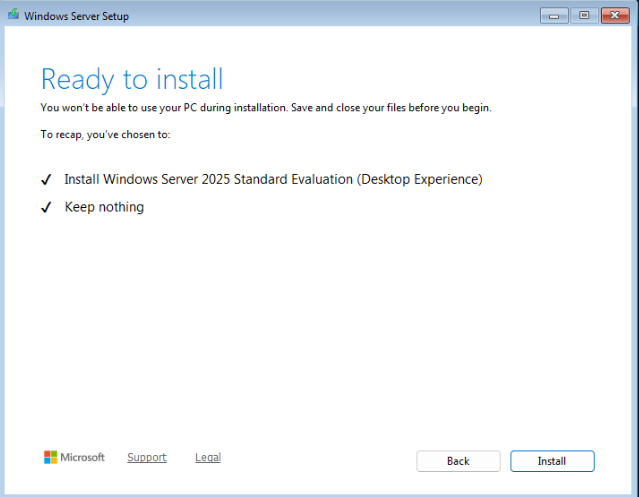

A Windows 11 Pro client VM was provisioned with 4GB of RAM and attached exclusively to `AD-Sandbox-LAN`. The Windows 11 OOBE network requirement was bypassed using `BypassNRO` to create a local account offline.

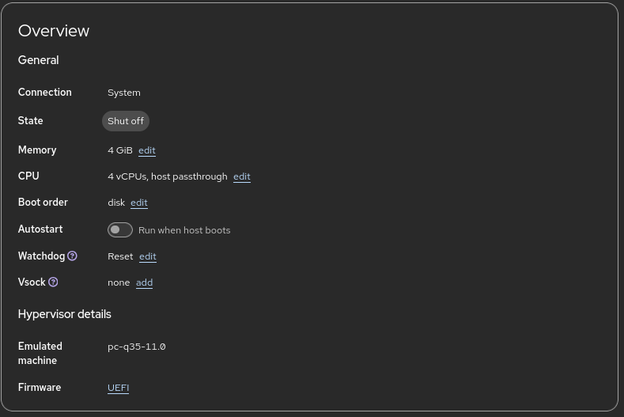

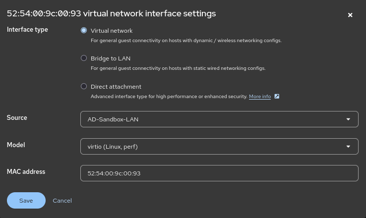

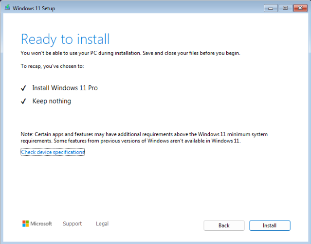

VirtIO guest drivers were installed on both VMs using `virtio-win.iso` from AUR. A QEMU internal snapshot named `Win11Client_Base` was taken on the client after guest driver installation, but before domain-join. This is the baseline client image that can be replicated in future mass deployment exercises.

* **Phase 2 (Execution):** Domain Controller Promotion and Network Services


The server was updated and renamed to `DC001` before promotion, per best practice.

Domain Controller Promotion (GUI path):

Active Directory Domain Services role was added via Server Manager. A new forest root domain `tobon.dev` was created. The DSRM password was set, NetBIOS name `TOBONDEV` was accepted, and default paths for database, logs, and SYSVOL were retained. DNS was integrated.

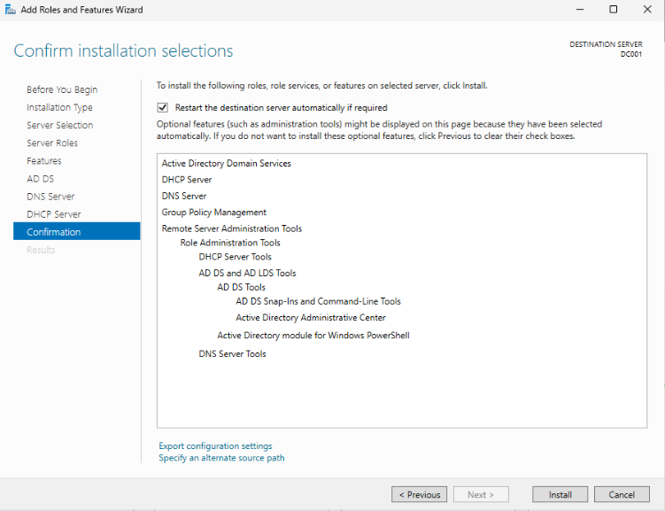

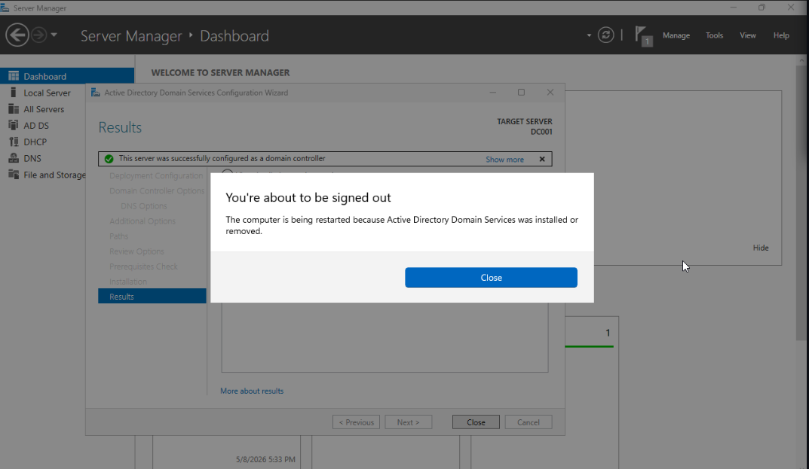

During the promotion process, the equivalent PowerShell deployment script was captured for future automation:

```powershell

Import-Module ADDSDeployment
Install-ADDSForest `
-CreateDnsDelegation:$false `
-DatabasePath "C:\WINDOWS\NTDS" `
-DomainMode "Win2025" `
-DomainName "tobon.dev" `
-DomainNetbiosName "TOBONDEV" `
-ForestMode "Win2025" `
-InstallDns:$true `
-LogPath "C:\WINDOWS\NTDS" `
-NoRebootOnCompletion:$false `
-SysvolPath "C:\WINDOWS\SYSVOL" `
-Force:$true

```

* **Phase 3 (Verification):**

During promotion, the Server reported a dependency error. The feature installation wizard was opened again, and all selected features had been installed correctly. This suggested a race condition, where a service had attempted to start before a dependency was installed/launched, or before a mandated reboot, which had not been alerted. A reboot of the Server VM was performed. The promotion wizard was run again, using the exact configuration described in the PowerShell script above, which was now successful.

After promotion, DHCP was configured with a scope of .150–.250 on the sandbox subnet, and the scope was authorized. RRAS/NAT was configured to provide internet access from the client through the DC’s second interface; this will be removed in Stage 2.

**Client Domain Join & Troubleshooting**

First join attempt (failure): The Windows 11 client could resolve DC001.tobon.dev and tobon.dev successfully, but domain join failed with the generic error: “Can't join this domain. Contact your IT admin for more info.”

The following server-side checks were immediately performed and returned healthy:

Domain Controller resolution: `nltest /dsgetdc:tobon.dev` passed with no errors.

Key services: KDC and Netlogon reported running

Windows Firewall: Network profile correctly set to Domain

Primary DNS Suffix: correctly set to `tobon.dev`

DNS Health: `DCDIAG /TEST:DNS` initially flagged a warning about the DC's second interface using a DHCP address. That address was changed to a static IP matching the same assignment. A re-run of the test passed without warnings.

The Domain Controller itself could successfully authenticate domain accounts locally — confirming the domain was healthy internally.

Suspecting a client-side locator or timing issue, `nltest /dsgetdc:tobon.dev` was run from the client, which failed, despite name resolution succeeding. An SRV record query (_ldap._tcp.tobon.dev) also failed. All indications pointed to the Netlogon locator service not responding to the client, even though the server appeared fully operational.

Client DNS was refreshed using `ipconfig /flushdns`. All tests were re-attempted. All failed.

Despite failures, a Domain join was re-attempted on the client. Domain Join was successful.

Suspected Root causes: 

- Incomplete Service start: A freshly promoted Domain Controller can report all services as running while background registration of SRV records and the Netlogon locator service remains incomplete. 

- Stale DNS cache: it is possible that the DNS cache on the Windows 11 client had not updated after being flushed, by the time initial tests were re-run, but had succeeded in the background by the time the Domain Join was re-attempted.

**User Provisioning:**

The first step was running Josh Madakor's Powershell Script. Since it wasn't digitally signed, Windows refused to run it, as a security policy. Bypassing it proved surprisingly easy: editing it and saving it was enough to remove the Zone Identifier, which meant it was no longer evaluated under the RemoteSigned execution policy, and ran without requiring a signature. This is an important future security consideration, since it demonstrates how trivial it is to bypass the RemoteSigned protection for downloaded scripts.

Josh Madakor's PowerShell script was executed on the DC with a small test user list (users.txt). Each user was created with a uniform password. The script leverages New-ADUser in a simple loop. 
```powershell
# ----- Edit these Variables for your own Use Case ----- #
$PASSWORD_FOR_USERS   = "S1llyP@ssw0rd1$1lly"
$USER_FIRST_LAST_LIST = Get-Content .\names.txt
# ------------------------------------------------------ #

$password = ConvertTo-SecureString $PASSWORD_FOR_USERS -AsPlainText -Force
New-ADOrganizationalUnit -Name _USERS -ProtectedFromAccidentalDeletion $false

foreach ($n in $USER_FIRST_LAST_LIST) {
    $first = $n.Split(" ")[0].ToLower()
    $last = $n.Split(" ")[1].ToLower()
    $username = "$($first.Substring(0,1))$($last)".ToLower()
    Write-Host "Creating user: $($username)" -BackgroundColor Black -ForegroundColor Cyan
    
    New-AdUser -AccountPassword $password `
               -GivenName $first `
               -Surname $last `
               -DisplayName $username `
               -Name $username `
               -EmployeeID $username `
               -PasswordNeverExpires $true `
               -Path "ou=_USERS,$(([ADSI]`"").distinguishedName)" `
               -Enabled $true
}
```
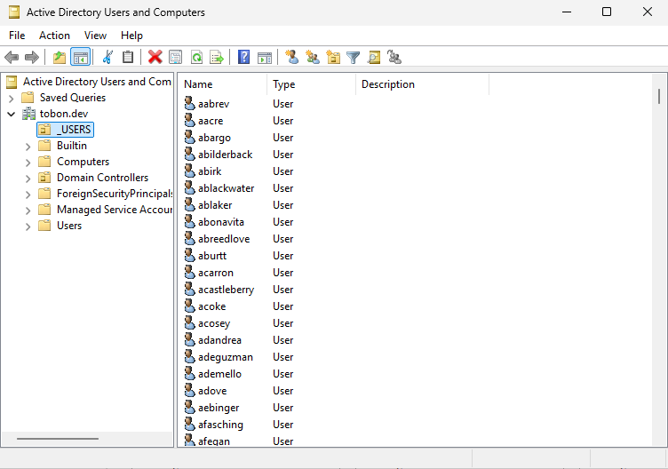


This is the foundation from which the Stage 2 script will be built, using a JSON schema, more in line with John Hammond's approach to AD provisioning.
Domain users were successfully created and visible under Active Directory Users and Computers. A test login from the client using one of the provisioned accounts succeeded.


## 4. Outcome & Future Considerations

* **Result:** Stage 1 is complete. A fully isolated Active Directory sandbox was built from scratch, a GUI-driven Domain Controller promoted, a client joined after diagnosing a non-obvious service-ready delay, and a PowerShell user provisioning script validated. A QEMU snapshot baseline preserves the domain-joined client for future stages.
 

* **Diagnostic Knowledge:** The troubleshooting chain from DNS, KDC, Netlogon, firewall profile, suffix, DCDIAG, SRV records to nltest was fully exercised and documented. While unexpected, the domain join failure provides more hands-on experience with diagnostic tools and common Active Directory Domain issues, and is welcome as portfolio experience. 

* **Technical Debt / Disposables:**

- The server VM is ephemeral. It is destroyed at the start of Stage 2, in order to create a Server Core VM.

- The RRAS/NAT role, GUI configuration, and flat-text user provisioning are Stage 1 artifacts only. JSON schema design and Server Core deployment replace them in Stage 2.
- The basic Powershell script is saved as an artifact to automate future DC promotion.


## References

- [Josh Madakor's AD HomeLab:](https://www.youtube.com/watch?v=MHsI8hJmggI) foundational lab structure and initial PowerShell User Provisioning Script.
- [John Hammond's Active Directory Series:](https://www.youtube.com/watch?v=pKtDQtsubio&list=PL1H1sBF1VAKVoU6Q2u7BBGPsnkn-rajlp) JSON provisioning schema, and Server Core methodology for Stage 2.

### Next Steps
- [ ] **Pending:** Design JSON user provisioning schema for Stage 2.
- [ ] **Pending:** Deploy Stage 2 Server Core DC via Terraform.
- [x] **Completed:** Stage 1 Sandbox Built, client joined, provisioning script tested. (2026-05-08)
- [x] **Completed:** Created QEMU Snapshot of pre-join AD Client. (2026-05-08)
- [x] **Completed:** Publish Updated Roadmap reflecting Stage 1 completion and Stage 5 restructure. (2026-05-09)
