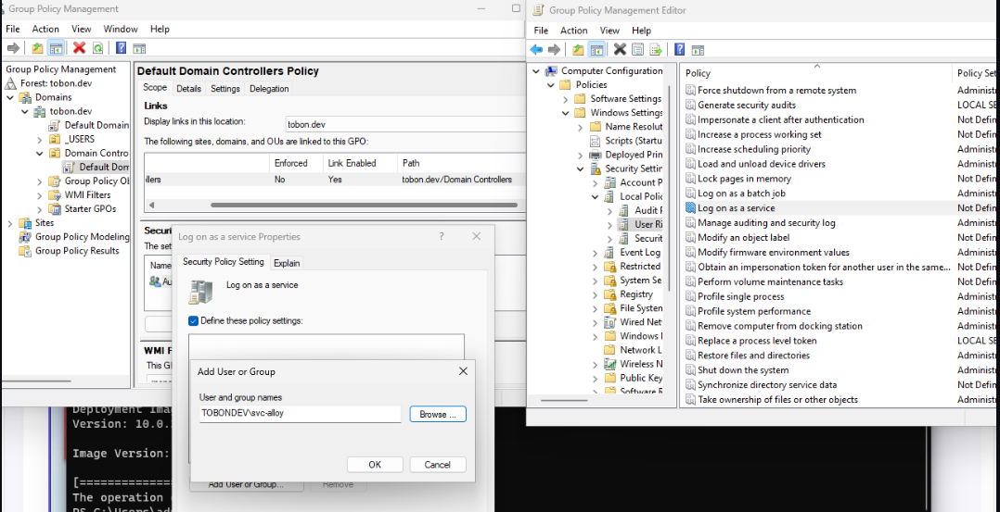
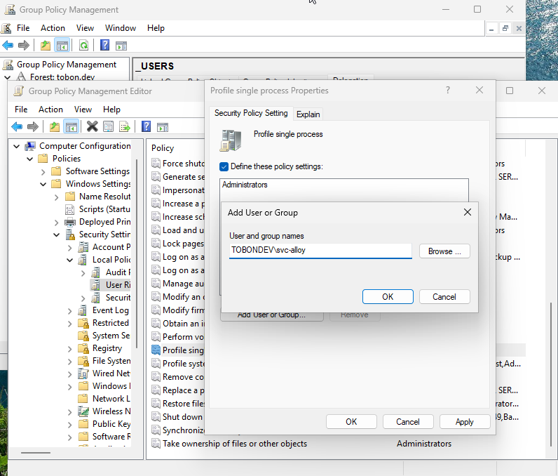
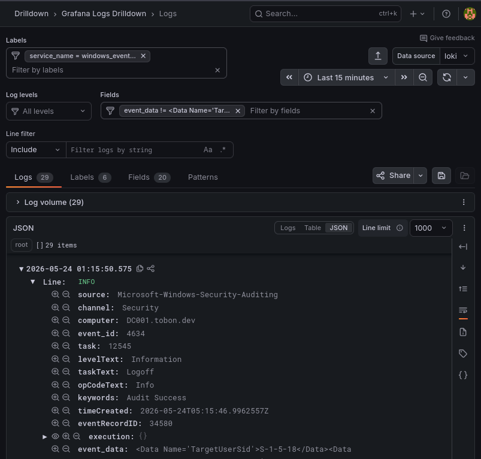
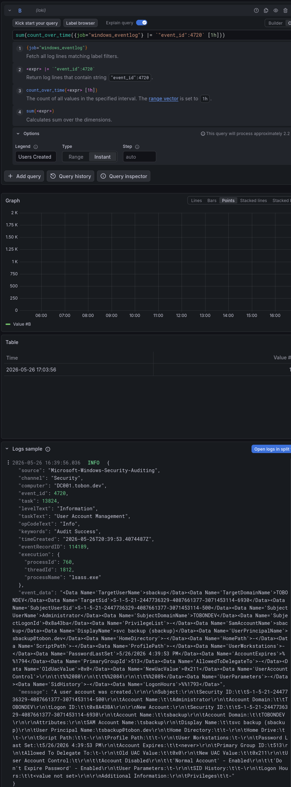

# Sysadmin Log: Hybrid OS Lab Stage 2

**Date:** 2026-05-11
**Report Time:** 13:37
**Category:** Architecture | Networking
**Status:** Completed

---

## 1. Context & Problem Statement


**One-line summary:** Stage 2 of the Hybrid Identity Architecture Project consists of integrating the network into production via a dedicated VLAN in OPNsense, and upgrading the user provisioning script.

**Background:** Following the completion of Stage 1, the goal of this stage is to take the foundational knowledge gained, including a basic PowerShell ADDS provisioning script, and use it to automate the deployment of an Active Directory Domain Controller running Windows Server Core. Stage 2 integrates the AD Domain Service to the production network, by defining an AD-VLAN, and keeping DHCP duties to OPNsense, while allowing the AD DC to handle DNS *within* the AD-VLAN (with OPNsense acting as the Upstream DNS for ADDS).


## 2. Architectural Decisions & Strategy


**Deprecated and Superseded:** Automating deployment requires understanding deployment. As such, additional testing was determined necessary before introducing Terraform. This testing proved extremely relevant, since it exposed the difficulties of using Windows' `autounattend.xml` system. The following architectural decisions were made based on Stage 1 findings, and amendments were added to those superseded or deprecated during the course of Stage 2.


### Decision 1: Standardize Deployment via 'Golden Image'.

**Decision:** Define a 'Golden Image' via QEMU snapshotting, which will form the basis of future Terraform deployments, rather than relying on Windows's `autounattend.xml` pipeline. [PARTIALLY-SUPERSEDED] (2026-05-20)

**Rationale:** Pre-automation deployment testing revealed a series of issues when dealing with Windows' default unattended installation system. Microsoft's use of `UDF` as an `ISO` filesystem makes editing the installation media (to inject `autounattend.xml`) unreasonably complex. Attempts at creating a floppy disk, virtual CD-ROM and USB to deliver the XML script all failed, likely because of QEMU's approach to UEFI systems (no native floppy support). A USB drive passed through to the VM successfully started the unattended installation process but failed to complete it. Debugging and troubleshooting the XML workflow was time-consuming, and unsuccessful. The decision was made to abandon the XML pipeline and focus on a 'Golden Image' as a base system from which to clone all deployments. See Phase 1 for detailed troubleshooting information.

*Modification:*  Terraform is removed from Project scope. The decision to standardize remains, albeit modified: the minimum viable configuration for the Windows Server VM is still snapshotted and treated as the baseline for future deployments. See `DECISION 8`.

### Decision 2: Provide a separate NIC to the AD-VLAN, and use MacVTap to bridge multiple clients to a single interface. 


**Decision:** Rely on the existing Distributed Switch Architecture over WP3-mesh as giant, wireless managed switch for AD-VLAN connectivity, by providing a second NIC to the hypervisor. [PARTIALLY-SUPERSEDED] (2026-05-11). 

**Rationale:** Replacing the connection to the hypervisor with a VLAN trunk was rejected for the following reasons:
- It would break IPMI and remote SSH unlocking.
- It would broaden the attack surface and greatly increase Lateral Movement risk in a VMEscape scenario.
- It needlessly introduces additional Network Overhead by recreating a job that is *already* handled by the batman-adv mesh: trunk -> wireless DSA -> trunk -> OpenVSwitch -> VM.

By provisioning a dedicated secondary NIC carrying only the AD-VLAN, host isolation is preserved, while reducing overhead on the VM networks thanks to MacVTap's L2 bare-metal performance.
While there are inherent performance constraints in using B.A.T.M.A.N. Advanced as a Managed Switch, none of them are additional, given the architecture is already in place. Additionally, if the virtualization workload exceeds the resources available to the hypervisor, a secondary hypervisor can be deployed and join the VLAN using the mesh as the switch.
*Modification:*  A critical L2 failure was identified with the batman-adv server node that prevents it from acting as a VLAN access port for its own LAN interface. See *Incident 1* in Phase 2. This does not invalidate the architecture, but relocates the hypervisor. See `DECISION 6`.


### Decision 3: Deploy All VMs in the Primary Server [SUPERSEDED BY DECISION 6]

**Decision:** ~~The Main Server is designated as the hypervisor, with the Workstation available for additional capacity.~~  

**Rationale:** While the resources required to virtualize the Hybrid OS Lab are fairly large, the current Server workload is light enough to handle a Server Core instance and 1-2 Windows clients. The Workstation provides overflow capacity if required. Decision 2 guarantees seamless VLAN connectivity for both hosts by simply provisioning an additional NIC to the Workstation.


### Decision 4: Delay Mitigation for Layer 2 Spoofing Attacks [PARTIALLY-SUPERSEDED] (2026-05-20).

**Decision:** Accept the risk of Domain Controller impersonation via ARP Cache Poisoning/ARP Spoofing during the entire project. This attack surface is left open for Stage 5. 

**Rationale:** Mitigating DC impersonation via ARP spoofing requires implementing 802.1X authentication, LDAP signing/Channel Binding, or SMB signing, none of which fall within the objectives of Stages 2, 3, or 4.
The original compensating control (mandating the destruction of the domain at the end of Phase 2) is no longer applicable. However, the risk profile of the environment remains limited: `MESH_AD` is an isolated VLAN containing only virtual hosts under single-operator control. There is no production data, no credential reuse, and no lateral movement path to the primary network. A successful spoofing attack within this environment has no impact on the infrastructure.

The vulnerability is therefore preserved intentionally. Stage 5 is structured around realistic Active Directory attack paths and their corresponding defensive telemetry. ARP spoofing and DC impersonation are real-world attack vectors that generate specific, detectable artifacts in Windows Security Event logs and Suricata, regardless of success. Priority is given to preserving a viable attack surface for Stage 5. See `docs/architecture/ROADMAP-HYBRID-IDENTITY-INFRASTRUCTURE.md`.


### Decision 5: Define new Firewall Group `ISOLATED_INFRA`

**Decision:** Create an `ISOLATED_INFRA` Firewall Group for the ``MESH_AD`` instead of relying on existing `NOTRUST` group.

**Rationale:** While the `NOTRUST` group is useful for rapid testing and MVP deployment, the firewall rules required for the Hybrid OS Lab are more nuanced. OPNsense rules are evaluated in sequence, with group rules near the top. Any rule that blocks access to a network or port cannot be superseded by a subsequent rule within the same group. Folding AD-specific rules into `NOTRUST` would add complexity and failure points to an established ruleset. A dedicated group is more secure and simpler to maintain independently.

###Decision 6: Deploy All VMs in the Workstation. [SUPERSEDES DECISION 3]

**Decision:** The Workstation is designated as the hypervisor for Stage 2. No additional overflow capacity is required.

**Rationale:** Given both the successful MVP test carrying the new VLAN tag over the mesh to the Workstation, and the failure of the batman-adv server node to act as a VLAN access port for its own LAN interface, the decision is made to move the lab to the Workstation. Priority is given to continued development. Infrastructure as Code means the lab can be migrated back to the Main Server if an alternative VLAN provisioning path is identified. That investigation falls outside the scope of Stage 2.

###Decision 7: Use MAC-Based DHCP Reservations for Predictable VM IP Assignment 

**Decision:** Assign static MAC addresses to ~~Terraform-managed~~ QEMU VMs and configure corresponding DHCP reservations in OPNsense, rather than baking static IPs into the Golden Image. [PARTIALLY-DEPRECATED] (2026-05-20).

**Rationale:** ~~A static IP embedded in the Golden Image would be inherited by every clone, producing address conflicts from the first Terraform deployment.~~ The DC requires a static IP in order to act as the DNS server for the AD Domain. DHCP with reservations solves this cleanly: QEMU allows MAC addresses to be manually declared in VM definitions, and OPNsense maps those MACs to fixed leases. Each cloned VM receives a predictable, unique IP without the Golden Image carrying any host-specific configuration. This also keeps the Golden Image genuinely generic — it can be cloned for future roles beyond the DC without modification. Given the current Stage 2 scope of a single Domain Controller, there is no risk of DHCP collision

*Modification:*  Terraform is removed from Project scope. The decision to employ static lease assignment remains. The logic is far simpler: it is necessary in order to assign DNS services to the DC. There are no risks of collisions. See `DECISION 8` and `DECISION 1`.

###Decision 8: Terraform integration is declared out of project scope.

**Decision:** The original Roadmap proposed Terraform as a tool to facilitate automated deployment of the AD Domain. While it would solve the problem, it inflates the scope of the project. 

**Rationale:** The original inclusion of Terraform in the project was intended to solve two problems: speed-up the deployment of the Active Directory Domain, and act as a real-world case-study on Terraform automation. It fails on both accounts. Automating is the right idea, but Terraform is the wrong tool. QEMU/KVM VM Cloning, alongside PowerShell, Bash and Ansible are more realistic tools for this purpose. Terraform, while an interesting technology, and a future project, belongs in the cloud: it is there where it can actually save time deploying at scale. See `DECISION 7` and `DECISION 1` for ramifications.

## 3. Implementation & Execution

* **Phase 1 (Preparation):** Pre-Deployment Research & Network Segmentation:


**Pre-Stage Testing: Unattended Installation with `autounattend.xml`** [PARTIALLY-SUPERSEDED] --- See `DECISION 8` and `DECISION 1`. (2026-05-20)

Before proceeding to network configuration, a viable automated installation path was investigated. The goal was to have Windows Server install and configure itself unattended, without manual interaction, as the basis for future Terraform-based deployments. 

A 50MB virtual USB image was created, partitioned, formatted, and populated with `autounattend.xml`:

```bash
sudo dd if=/dev/zero of=unattended-usb.img bs=1M count=50
sudo losetup -f --show -P unattended-usb.img
# /dev/loopX is the assigned loop device
sudo parted -s /dev/loopX mklabel msdos
sudo parted -s /dev/loopX mkpart primary fat32 1MiB 100%
sudo mkfs.fat -F 32 /dev/loopXp1
sudo mount /dev/loopXp1 /mnt/{location}
sudo cp autounattend.xml /mnt/{location}
sudo umount /dev/loopXp1
sudo losetup -d /dev/loopX
```

The resulting image was correctly detected as a disk in QEMU/KVM. However, it presented as persistent storage rather than a removable USB device, and the Windows Installer does not read `autounattend.xml` from persistent storage. To work around this, a physical USB drive was used instead:

```bash
sudo parted -s /dev/sdX mklabel msdos
sudo parted -s /dev/sdX mkpart primary fat32 1MiB 100%
sudo mkfs.fat -F 32 /dev/sdXp1
sudo mount /dev/sdXp1 /mnt/{location}
sudo cp autounattend.xml /mnt/{location}
sudo umount /dev/sdXp1
```

The physical USB was passed through to the Windows Server VM directly. This time, Windows Server detected and read the file, and the unattended installation process began. However, after the first reboot, the installer failed with the following errors:

```
hwreqchk: ERROR … Failed to get NetworkCostType
hwreqchk: ERROR … Unable to GetSettings [0x80070002]
BFSVC: Failed to check UEFI DB variable. Error code = 0xcbc
IBSLIB BCD: Failed to add system store from file.
    File: \Device\HarddiskVolume3\EFI\Microsoft\Boot\BCD
    Status: c000000f
```

Errors indicated failures in reading Secure Boot variables, locating the EFI system partition, and passing the hardware requirements check. A manual installation on the same VM succeeded without modification, ruling out a hardware or configuration issue with the VM itself. Reviewing the XML files revealed no syntax errors. Minimal XML files sourced externally were also tested, but the errors persisted. The conclusion is that the unattended installation pipeline itself was causing the hardware check to fail. This led directly to `DECISION 1`.

**OPNsense Configuration:**

Following the existing standards for network segmentation, a dedicated VLAN was provisioned for the Active Directory domain.

VLAN Definition: Repurposed the staging tag VLAN 70 (previously designated for virtual Windows clients) and assigned it to the parent interface BAT_TRUNK as `MESH_AD`.

DHCP & IPAM: Configured the DHCP server for the interface, adhering to the internal IP schema convention where the third octet matches the VLAN tag (x.x.70.x).

MVP VLAN Segmentation: Added the new `MESH_AD` to the existing `NOTRUST` firewall group. The `NOTRUST_Gateways` alias was updated to include the `MESH_AD` gateway. This ensures the new network inherits the established isolation policies: allowing external DNS resolution (Port 53/UDP) while strictly blocking inter-VLAN routing via the existing `RFC1918_Networks` alias. This is a temporary, pre-deployment test. See Decision 5 above.

**B.A.T.M.A.N. Advanced Mesh Configuration:**

With Layer 3 governance established on the firewall, the physical transport layer was configured to deliver the VLAN across the wireless mesh.

Server Node: Created a bridge device linking `WAN.70` to `bat0.70`, and added an unmanaged interface for the ad-bridge. To provision the KVM host, `bat0.70` was additionally bridged to the LAN port, delivering the tagged traffic directly to the hypervisor's dedicated secondary NIC.

Client Node: Created a bridge device linking `bat0.70` to the WAN port. This primes the Workstation for immediate VLAN access per `DECISION 2`.

**Validation & Testing:**

A physical test device (nanoKVM) was connected to the client node's WAN port to validate the configuration before introducing virtualization variables.

| Test | Source | Target | Expected | Actual | Status |
| :--- | :--- | :--- | :--- | :--- | :--- |
| DHCP Handshake | `MESH_AD` | `MESH_AD` Gateway | DHCP ACK | IP assigned in the .70 scope | Pass |
| Gateway Ping | `MESH_AD` | `MESH_AD` Gateway | Drop per default deny | ICMP ping timeout | Pass |
| DNS Resolution | `MESH_AD` | Upstream DNS | Allow | nslookup resolved google.com (8.8.4.4) | Pass |
| Management Plane Access | `MESH_AD` device | OPNsense control plane (VLAN 99) | Drop | ICMP ping timeout | Pass |
| Inter-Segment Reach (Untrusted → Untrusted) | `MESH_AD` | `MESH_TV` device | Drop | ICMP ping timeout | Pass |
| Inter-Segment Reach (Untrusted → Trusted) | `MESH_AD` | `MESH_CTRL` device | Drop | ICMP ping timeout | Pass |
| Intra-LAN connectivity  | `MESH_AD` | nanoKVM local IP | (Does not traverse Firewall) | ICMP ping response | Pass |


Minimal VLAN deployment is considered a success. Layer 2 transport via the mesh and Layer 3 communication via OPNsense are validated.

**`ISOLATED_INFRA` Firewall Group:**

Post-validation, a new firewall group `ISOLATED_INFRA` was defined, and the `ISOLATED_INFRA_Gateways` alias was assigned to the `MESH_AD` gateway. The firewall rules mirror those governing `NOTRUST` as a baseline:

| Action | Source | Destination | Description |
| :--- | :--- | :--- | :--- |
| Pass | ISOLATED_INFRA net | ISOLATED_INFRA_Gateways (Port 53/UDP) | Allow DNS resolution for Isolated Infrastructure Network |
| Reject | ISOLATED_INFRA net | RFC1918_Networks | Zero-Trust Isolation — block inter-VLAN routing |

This ensures policy parity with `NOTRUST` as a starting point, while allowing fine-grained rule changes that do not affect the existing infrastructure.

### Phase 2 (Execution): Infrastructure Deployment

**Incident 1 — Server Node LAN Port Fails as VLAN Access Port:**

VMs attached to the server hypervisor's secondary NIC via MacVTap (bridge mode) were unable to reach the gateway or resolve DNS, despite appearing to receive DHCP leases.

| Symptom | Details | Implication |
| :--- | :--- | :--- |
| No DNS resolution or gateway reachability | Clients received IPs in the correct range but could not reach the gateway or resolve DNS. The gateway could not reach the clients either. | Initial indication of an L3 failure, with L2 appearing functional. |
| Physical NIC generating incomplete DHCP handshakes | OPNsense logs showed continuous DHCP Discover → Offer exchanges where the MAC address belonged to the physical NIC, not any MacVTap device. No DHCP Request followed. These incomplete handshakes buried the successful handshakes from the Windows VMs in the log. | Red herring. The physical NIC has no device connected to it directly — there is nothing to complete the handshake. The Windows VMs did successfully obtain leases; this was confirmed once the incomplete handshakes were filtered out from the log. |
| Rogue DHCP hypothesis raised and eliminated | DNS queries between VMs produced "not found" responses sourced from the peer VM rather than OPNsense, suggesting the VMs might be acting as rogue DHCP servers. Once the OPNsense-issued leases for both VMs were located in the log, this was disproven. The VMs held valid leases in the .70 scope. | Diagnostic red herring resulting from the incomplete handshake noise obscuring the successful ones. |
| Inter-VM communication succeeds; intra-VLAN communication fails | Both VMs on the MacVTap switch could ping each other. Neither could reach the nanoKVM; the nanoKVM could not reach them. | VMs communicate through the MacVTap switch as expected. Packets requiring firewall routing fail. Consistent with an L2 breakdown at the point where traffic must exit the physical NIC into the mesh. |
| Linux devices receive no DHCP offer | Android, laptop, and Linux VMs connected to the same NIC received no DHCP offer at all — not even a Discover reaching OPNsense. Windows devices completed the handshake internally but still failed to route. | Linux DHCP clients are strict about the handshake sequence; Windows clients are more tolerant. The divergence points to a malformed packet or broadcast issue at L2, not an OPNsense configuration problem. |

**Diagnostic Steps:**

1. **Eliminated the NIC as the cause.** Moved the secondary NIC to the client mesh node (the one previously serving the nanoKVM). All clients — including Linux — obtained leases and routed correctly. The NIC is not faulty.

2. **Tested with a different VLAN tag.** Identical symptoms on a different VLAN ID, ruling out an OPNsense misconfiguration specific to VLAN 70.

3. **Simplified the bridge topology.** The original bridge had three members (`WAN.70`, `bat0.70`, `LAN`). Splitting into two daisy-chained bridges (`WAN.70` ↔ `bat0.70` and `bat0.70` ↔ `LAN`) produced identical results, ruling out a three-way bridge forwarding bug.

4. **Compared against other mesh nodes.** On every other mesh node, attaching a device to a LAN port bridged to `bat0.X` worked for both L2 and L3. The failure is unique to the batman-adv server node.

5. **Confirmed intra-mesh forwarding was unaffected.** Other nodes on `bat0.70` continued to communicate normally throughout. The batman-adv protocol was not broken; only the LAN port egress on the server node was affected.

*Root Cause Analysis:*

The exact root cause is not fully transparent. The failure occurs at Layer 2, based on the Linux DHCP evidence — a client that never receives an offer indicates the Discover broadcast is not propagating beyond the physical NIC. The Windows behavior (completing a handshake within the MacVTap switch but failing to route externally) is consistent with Windows tolerating a malformed or partially-formed packet that Linux rejects outright.

The two factors that distinguish the server node from every other mesh node are: it originates the VLAN trunk and injects it into the batman-adv mesh, and it is the batman-adv server. Its ability to carry VLAN traffic across the mesh is not in question — that has been in production for nearly a month. What it cannot do is use its own LAN port as a VLAN access port while simultaneously acting as the mesh origin for that VLAN. Whether this is a batman-adv protocol constraint, a Linux kernel bridge limitation, an OpenWRT VLAN implementation detail, or a vendor firmware issue is outside the scope of this project to determine. The practical conclusion is the same in any case.

*Why this was not caught earlier:* The server node's physical LAN port had never been used after initial deployment. Until this incident, the node had exclusively bridged VLAN traffic between the batman-adv mesh and the wireless interface.

*Resolution:* The batman-adv server node's LAN port is abandoned as a VLAN access port. Further root cause investigation is deferred indefinitely. The lab is moved to the Workstation per `DECISION 6`. This decision modifies `DECISION 2` and supersedes `DECISION 3`.

**Workstation MacVTap Validation (`testbench`):**

Before building the Golden Image, the secondary NIC and MacVTap architecture were validated on the Workstation to confirm the failure was isolated to the server node.

A secondary NIC was connected to the Workstation and attached to the batman-adv client node's WAN port, which has `bat0.70` bridged to it. An existing Windows 11 Pro VM (`testbench`),  maintained for rapid testing, was provisioned with a MacVTap interface bridged to this secondary NIC.

| Test | Source | Target | Expected | Actual | Status |
| :--- | :--- | :--- | :--- | :--- | :--- |
| DHCP Handshake | `testbench` (MacVTap) | `MESH_AD` Gateway | IP in .70 scope | IP assigned in the .70 scope | Pass |
| Gateway Reachability | `testbench` | `MESH_AD` Gateway | Drop per default deny | ICMP ping timeout | Pass |
| DNS Resolution | `testbench` | Upstream DNS | Allow | nslookup resolved google.com | Pass |
| Inter-VLAN Reach | `testbench` | `MESH_CTRL` device | Drop | ICMP ping timeout | Pass |
| Host Network Isolation | Workstation primary NIC | `testbench` | No direct path | Unaffected — traffic routes via firewall | Pass |

MacVTap on the Workstation via the client node operates correctly across all tests. The architecture defined in `DECISION 2` is sound; the failure in Incident 1 is confirmed to be specific to the server node. The Golden Image build proceeds on the Workstation.

---

**DC001 | Golden Image Build:** [PARTIALLY-SUPERSEDED] --- See `DECISION 8` and `DECISION 1`. (2026-05-20)

A fresh Windows Server Core VM was provisioned on the Workstation. The computer name was set to `DC001` via `sconfig`. The keyboard layout was set to Dvorak:

```powershell
$List = Get-WinUserLanguageList
$List[0].InputMethodTips.Clear()
$List[0].InputMethodTips.Add('0409:00010409')
Set-WinUserLanguageList $List -Force
```
#### [SUPERSEDED]
WinRM was configured to accept remote connections from Terraform's provisioner:

```powershell
winrm quickconfig -quiet
winrm set winrm/config/service/auth '@{Basic="true"}'
winrm set winrm/config/service '@{AllowUnencrypted="true"}'
netsh advfirewall firewall add rule name="WinRM-HTTP" protocol=TCP dir=in localport=5985 action=allow
```

The listener was verified:

```powershell
winrm enumerate winrm/config/listener
---
Listener
    Address                 = *
    Transport               = HTTP
    Port                    = 5985
    Hostname
    Enabled                 = true
    URLPrefix               = wsman
    CertificateThumbprint
    ListeningOn             = 127.0.0.1, X.X.70.171
```

A QEMU internal snapshot was taken at this point. The VM was then shut down cleanly. The resulting qcow2 disk image — with Server Core installed, WinRM configured, and no host-specific state beyond the computer name — is the Golden Image that Terraform will clone for all subsequent deployments.

~~IP assignment for Terraform-cloned VMs is handled via MAC-based DHCP reservations per `DECISION 7`.~~
### /[SUPERSEDED]

Since Terraform is no longer part of the scope, WinRM is disabled until otherwise called for.

```powershell
Stop-Service WinRM
Set-Service WinRM -StartupType Disabled
```

This state supersedes the previous snapshot. While snapshots are no longer necessary for cloning, it is still a relevant practice, given that the DC now persists through all remaining stages. These snapshots will serve as restore points at known-good configuration boundaries, rather than provisioning templates.

For Promotion the PowerShell Script developed for Stage 1 was executed.

Execution of the script in this Server Core image resulted in an error message. Module not found.
The issue resulted from the failure to install Domain Services components prior to running. When created by the GUI-installer, the Powershell script assumed components already existed. 

The solution proved to be installing Domain Services prior to running the promotion script.

```powershell
Install-WindowsFeature -Name AD-Domain-Services -IncludeManagementTools
```

Once installed, the promotion script ran successfully, and the Domain Controller Rebooted.

Now, it was time to delegate DNS services to the Domain Controller within the `MESH_AD` VLAN, and set up dns forwarding to OPNsense.

For the DC, it's a matter of setup.

```powershell
Add-DnsServerForwarder -IPAddress "x.x.70.1" -PassThru
```
The response confirms that the DNS Forwarding is set.
The next step is testing that the queries forward properly.

```powershell
Resolve-DnsName -Name "google.com" -Server 127.0.0.1
```
Since this query returns the IP address of the selected website, instead of an error, the forwarding for the DC is successful.

For OPNsense, the process requires directing all VLAN Clients to the Domain Controller as their primary DNS Server. DNSMASQ is modified to add a DHCP option: the `MESH_AD` interface sets the `dns-server` to the DC IP-Address. This is validated by spinning up a Windows 11 client on the same VLAN and running

```powershell
ipconfig /all
```
The results confirm the configuration is successful:
```
Ethernet adapter Ethernet:
    Connection-specific DNS Suffix. . :  ad
    Description . . . . . . . . . . . :  Red Hat VirtIo Ethernet Adapter
    Physical Address. . . . . . . . . :  52-5U-XX-XX-XX-93
    DHCP Enabled. . . . . . . . . . . :  Yes
    Autoconfiguration Enabled . . . . :  Yes
    Link-local IPv6 Address . . . . . :  fe80: XXXXXXXXXXXXXXXXXXXXXXXXX (Preferred)
    IPV4 Address. . . . . . . . . . . :  X.X.70.135 (Preferred)
    Subnet Mask . . . . . . . . . . . :  255.255.255.0
    Lease Obtained. . . . . . . . . . :  XXXXXXXXXXXXXXXXXXXXXXXXX
    Lease Expires . . . . . . . . . . :  XXXXXXXXXXXXXXXXXXXXXXXXX
    Default Gateway . . . . . . . . . :  X.X.70.1
    DHCP Server . . . . . . . . . . . :  X.X.70.1
    DHCPV6 IAID . . . . . . . . . . . :  XXXXXXXXXXXX
    DHCPV6 Client DUID. . . . . . . . :  XX-XX-XX-XX-XX-XX-XX-XX-XX-XX-XX-XX-XX-XX-XX
    DNS Servers . . . . . . . . . . . :  X.X.70.171
    NetBIOS over Tcpip. . . . . . . . :  Enabled

```

DHCP is handled by OPNsense, the gateway is correct, and DNS requests are authoritatively set to the DC in the VLAN.

Then, DNS resolution was verified for the DC on the Windows 11 Client.

```powershell
Resolve-DnsName DC001.tobon.dev
```
The response confirmed that the internal DNS resolution was successful:


| Name | Type | TTL | Section | IPAddress |
| --- | --- | --- | --- | --- |
| DC001.tobon.dev | A | 3600 | Answer | X.X.70.171 |


```powershell
nslookup google.com
```

The response was a DNS timeout for the DC, followed by a non-authoritative response of the corresponding IP address for the requested url. This signifies that the DC determined that the url is not a local domain, and forwarded the query to OPNsense. This timeout is not a failure of execution, but rather an expected behaviour of DNS forwarding. Running `Resolve-DnsName` on the same url returns no error.

| Name | Type | TTL | Section | IPAddress |
| --- | --- | --- | --- | --- |
| google.com | AAAA | 299 | Answer | XXXX:XXXX:XXXX:XXXX:XXXX |
| google.com | A | 237 | Answer | X.X.X.X |

The logs for UnboundDNS confirm that the DC forwarded this query through Unbound, and not to an external upstream DNS provider.

```
[43594:0] query: X.X.70.171 google.com. AAAA IN
[43594:0] reply: X.X.70.171 google.com. AAAA IN NOERROR 0.015596 0 68
```

This confirms the success of DNS resolution at two levels: the DC has authority within the `MESH_AD` VLAN, and will respect the upstream authority of OPNsense via UnboundDNS.

Next, a sanity check was performed to confirm that the DC's authority is strictly confined to the `MESH_AD` VLAN by checking DNS resolution on the Workstation.

```bash
nmcli dev show eth0
```
The response confirmed that DNS authority was limited to the `MESH_AD` VLAN, as designed.
```
IP4.ADDRESS[1]:                         X.X.10.X/24
IP4.GATEWAY:                            X.X.X.X
IP4.ROUTE[1]:                           dst = X.X.10.0/24, nh = 0.0.0.0, mt = 100
IP4.ROUTE[2]:                           dst = 0.0.0.0/0, nh = X.X.10.1, mt = 100
IP4.DNS[1]:                             X.X.10.1
```

Now the next step is installing Grafana Alloy in the Domain Controller and scraping Windows Event Logs, then forwarding to Loki.

In order to maintain least-privilege principles, an Alloy Service Account was created, and it was granted the permissions required to scrape and forward logs, exclusively. For this purpose, the minimal groups that it must belong to are "Event Log Readers", "Performance Monitor Users" and "Performance Log Users"

```powershell
# Create Organizational Unit for _USERS
New-ADOrganizationalUnit -Name _USERS -ProtectedFromAccidentalDeletion $false
# Create a minimal domain service account for Alloy
New-AdUser -AccountPassword (ConvertTo-SecureString "averysecurepassword" -AsPlainText -Force) `
           -Name "svc-alloy" `
           -SamAccountName "svc-alloy" `
           -UserPrincipalName "svc-alloy@tobon.dev" `
           -Path "ou=_USERS,$(([ADSI]`"").distinguishedName)" `
           -PasswordNeverExpires $true `
           -CannotChangePassword $true `
           -Enabled $true `
           -Description "Grafana Alloy Service Account -- Event Log Reader"
# Add Alloy Service Account to the Event Log Readers group.
Add-ADGroupMember -Identity "Event Log Readers" -Members "svc-alloy"
# Add Alloy Service Account to the Performance Monitor Users group
Add-ADGroupMember -Identity "Performance Monitor Users" -Members "svc-alloy"
# Add Alloy Service Account to the Performance Log Users Group 
Add-ADGroupMember -Identity "Performance Log Users" -Members "svc-alloy"
```

The last step for this task is enabling "Log On as Service" for the Alloy Service account. Since this must be set at a Group Policy level, and there is no native PowerShell module to edit User Rights assignments inside a GPO, this requires using the Group Policy Management Console (GPMC). This is a GUI tool, so enlisting a Windows 11 client into the domain is required. This will become the Management Client. As suggested by the tests above, the domain join succeeded immediately, and GPMC was installed.

```powershell

DISM.exe /online /add-capability /CapabilityName:Rsat.GroupPolicy.Management.Tools~~~~0.0.1.0

```

Then, GPMC was used to add the `svc-alloy` to the allowed Log on as service policy object.



On the Domain Controller, Grafana Alloy installation was performed by downloading the installer from the official Grafana Github Repository, then running the exe silently, with additional flags retrieved from the Grafana docs:

```powershell

# Download latest Alloy release (v1.16.1 at the time of writing)
Invoke-WebRequest -Uri "https://github.com/grafana/alloy/releases/download/v1.16.1/alloy-installer-windows-amd64.exe" `
                  -OutFile ".\alloy.exe"

# Silent install #Declare Username as "alloy"
.\alloy.exe /S /USERNAME="TOBONDEV\svc-alloy" /PASSWORD="averysecurepassword"

#Verify Alloy is Running
Get-Service -Name "Alloy"
```
Response reveals Alloy is stopped:

| Status | Name | DisplayName |
| --- | --- | --- |
| Stopped | Alloy | Alloy |

The debugging process consists of trying to restart the service in order to find a useful error code. `Restart-Service -Name "Alloy"` simply produces "Cannot start service Alloy on computer '.' ". However, running `sc.exe start Alloy` reveals the culprit:

```powershell
[SC] StartService FAILED 1069:

The service did not start due to a logon failure.
```

This suggests that the group policy change that was performed earlier either hasn't applied or did not work. Group Policy was force-updated and then Alloy was restarted again.

```powershell

# Update Group Policy
gpupdate /force
# Restart Alloy
sc.exe start Alloy

```

Unfortunately, this produced the same result. The Management Client was used once again to verify the GP, which was confirmed correct and applied. Suspecting incorrect credentials, they were reset and the service was restarted.

```powershell

# Reset credentials
sc.exe config Alloy obj= "TOBONDEV\svc-alloy" password= "averysecurepassword"
# Restart service
sc.exe start Alloy

```

This also returned the same error. The service account was verified as not locked out, and then the password was changed as the next troubleshooting step.

```powershell

Get-ADUser -Identity svc-alloy -Properties PasswordExpired, LockedOut | Select-Object Name, PasswordExpired, LockedOut

Set-ADAccountPassword svc-alloy -NewPassword (ConvertTo-SecureString "averysecurepassword" -AsPlainText -Force)

```

Then the service was restarted again using `sc.exe`. This time, the error had changed:

```powershell
[SC] StartService FAILED 1053:

The service did not respond to the start or control request in a timely fashion.
```

Given this response, the logical conclusion is that, yes, the password was initially incorrect, but there is also a permissions issue remaining. This means adding NTFS permissions to `svc-alloy` for the two folders it needs: `%ProgramFiles%\GrafanaLabs\Alloy` and `%PROGRAMDATA%\GrafanaLabs\Alloy\data` using GPMC. This proved not to be enough, either. Further reading revealed the need to grant `Profile Single Process` privileges to `svc-alloy` using GPMC, followed by `gpupdate.exe /force` on the DC.



Despite this change, the service continued presenting error code 1053. Alloy was then run manually to rule-out any configuration file issues.

```powershell

& 'C:\Program Files\GrafanaLabs\Alloy\alloy.exe' run 'C:\Program Files\GrafanaLabs\Alloy\config.alloy'

```

This results in Alloy running successfully. This confirms it's an issue with permissions. The log is reviewed for the specific error message that Alloy is sending out when running as `svc-alloy`

The DC was restarted in order to rule-out a pending restart as a possible cause for DC GPO misalignment. This had no effect. Since at this point there weren't any other suspects to rule out, the decision was made to switch the approach for the Service Account. The Alloy service only needs to run on the DC, so, using a Managed Service account is an option that can be pursued.

```powershell
# Remove Original Service Account
Remove-ADUser -Identity "svc-alloy"
# Create a new key for the Kerberos Authentication Ticketing Service, setting the effective time 10 hours before. The service account will fail to add otherwise.
Add-KdsRootKey –EffectiveTime ((Get-Date).AddHours(-10))
# Add new service account, restricted to a single computer
New-ADServiceAccount -Name "svc-alloy" -DNSHostName "svc-alloy.tobon.dev"
# Associate the service account with the Domain Controller. Note the lowercase command.
add-adcomputerserviceaccount -identity "DC001" -serviceaccount "svc-alloy"
# Set DC001 as an authorized computer to retrieve managed password
Set-ADServiceAccount "svc-alloy" -PrincipalsAllowedToRetrieveManagedPassword DC001$
# Install MSA on the computer
Install-ADServiceAccount -Identity svc-alloy
# Change the account assigned to the Alloy Service
sc.exe config Alloy obj= TOBONDEV\svc-alloy$
```

Attempting to start the service using `sc.exe start Alloy` resulted in a "logon failure" error. This is likely due to the new account not having permission to log-on as a service. GPMC was used on the Management Client and the account was added to the LogOn As Service privileges, along the previous ones. This still resulted in the same logon error. The service management console was opened on the Management Client and connected to the DC. The password field seemed populated,despite not being assigned, but the configuration was grayed out. Suspecting a lingering password issue, the configuration for the service was changed to run as LocalSystem `sc.exe config Alloy obj= "LocalSystem"`, and then the service started successfully. Moreover, this resolved the grayed-out configuration in the Service Management Console, which was then directly used to set the service username to `TOBONDEV\svc-alloy$` and the password was deleted. Despite the change, the service continued producing the same "logon failure" error. The Domain controller was then restarted to ensure that the Kerberos Ticketing list was updated. This also had no effect.

```powershell
# Verify the Group Service Account is enabled
Get-ADServiceAccount -Identity "svc-alloy" -Properties Enabled |
    Select-Object Name, Enabled

# Get the full 4625 event to see the SubStatus code
Get-WinEvent -LogName Security |
    Where-Object { $_.Id -eq 4625 -and
                   $_.TimeCreated -gt (Get-Date).AddMinutes(-10) } |
    Select-Object -First 1 |
    Format-List Message
```

The full `4625` event revealed three fields beyond the `SubStatus` code: `Authentication Package: Negotiate`, `Key Length: 0`, and `SubStatus: 0xC000006A`. Taken together, these are more specific than a password mismatch. Negotiate means Local Security Authority (`LSA`) attempted `Kerberos Authentication` instead of `NTLM`, `Key Length 0` means the Kerberos session was never established, while SubStatus 0xC000006A confirms the account was found, but the credentials didn't validate.
For a Group Managed Service Account (`gMSA`), Kerberos pre-authentication works as follows: the `LSA` computes the managed password locally using the `KDS` root key, derives Kerberos keys from it, and encrypts a timestamp for the `AS-REQ`. The `KDC` independently computes the same managed password using the same root key and validates the timestamp. If both sides use the same key, the passwords match and authentication succeeds.

Running `Get-KdsRootKey` revealed two root keys. This explained the mismatch: the `gMSA` had computed the password against key 1, while the `LSA` was doing so against key 2. Two different keys produced two different hashes, and, thus on comparison, the password was deemed incorrect.

```powershell
# Set variable for key path
$keysPath = "CN=Master Root Keys,CN=Group Key Distribution Service,CN=Services,CN=Configuration,DC=tobon,DC=dev"

Remove-ADObject -Identity "CN=<old_KeyId>,$keysPath" -Confirm:$false

# Verify only one remains
Get-KdsRootKey
```
This confirms only one key remains, so the account is removed and recreated to guarantee it uses the correct remaining key.

```powershell

Remove-ADServiceAccount -Identity "svc-alloy"

New-ADServiceAccount -Name "svc-alloy" `
    -DNSHostName "svc-alloy.tobon.dev" `
    -PrincipalsAllowedToRetrieveManagedPassword "DC001$"

Install-ADServiceAccount -Identity "svc-alloy"
Test-ADServiceAccount -Identity "svc-alloy"

```
The extra key was removed, the `gMSA` was deleted and recreated to bind it to the single remaining key, the local credential cache was cleared, and the service was restarted. The same error persisted. This suggested a deeper issue with the `LSA` cache. Because the `svc-alloy` account was previously installed, deleted from AD, and then recreated with the exact same name, the local DC001 host may have retained an orphaned `LSA` Secret tied to the old SID. The new AD object had a new SID and a newly generated password, creating an unresolvable mismatch in the local cache.

Following this hypothesis, a new `gMSA` was created and named `alloy-svc`.

```powershell
# Purge the corrupted state
Remove-ADServiceAccount -Identity "svc-alloy"

# Provision a fresh gMSA to force a clean LSA cache
New-ADServiceAccount -Name "alloy-svc" -DNSHostName "alloy-svc.tobon.dev" -PrincipalsAllowedToRetrieveManagedPassword "DC001$"
Install-ADServiceAccount -Identity "alloy-svc"

# Update SCM (passing empty password to clear cache)
sc.exe config Alloy obj= "TOBONDEV\alloy-svc$"
```
After updating the necessary Group Policies (`Log On as Service`, `Profile Single Process`) and `NTFS` folder permissions, the service was started. This resulted in a new error:

```powershell

[SC] StartService FAILED 1053:
The service did not respond to the start or control request in a timely fashion.
```
Critically, this error occurred immediately, without the standard 30-second SCM timeout. This indicated the application was crashing instantly upon execution.

Suspecting a permissions error, PsExec was used in order to bypass SCM and get raw console output. 

```powershell
# Spawn a shell using the Service Account Credentials
psexec.exe -u TOBONDEV\alloy-svc$ -p ~ cmd.exe
# Run the ALloy binary manually
'C:\Program Files\GrafanaLabs\Alloy\alloy-windows-amd64.exe' run 'C:\Program Files\GrafanaLabs\Alloy\config.alloy'

```

The core Alloy binary executed without errors, which proves two things: the `gMSA` is correctly authenticating using `Kerberos Authentication`, and the `alloy-svc$` account has the necessary read/write permissions to execute the Alloy Binary. Which means the issue lies with the Service-Wrapper Binary `alloy-service-windows-amd64.exe`. Running `'C:\Program Files\GrafanaLabs\Alloy\alloy-service-windows-amd64.exe'` on the `alloy-svc$` shell produced a Permission Denied error, confirming the source of the issue.

The next troubleshooting step was checking registry permissions (HKEY_LOCAL_MACHINE\SOFTWARE\GrafanaLabs\Alloy) to ensure the wrapper could read its launch arguments from the registry. The permissions were added to the service account, but the error remained. After this, the NTFS permissions were reviewed once again and it was confirmed that service binary had the correct permissions.

Root Cause Analysis:

The service wrapper (`alloy-service-windows-amd64.exe`) is not able to correctly inherit the necessary permissions under a `gMSA`. While this could theoretically be bypassed by abandoning the SCM entirely and using Windows Task Scheduler to run the core binary at boot, this workaround is rejected, since it would completely bypass the objective behind a Service Account.

Thus, the decision was made to fall back to the LocalSystem account. This remains an open item which may come up again during Stage 5.

```powershell
# Set Alloy Service Account to Local System
sc.exe config Alloy obj= "LocalSystem"
# Remove Alloy Service Account
Remove-ADServiceAccount -Identity "alloy-svc"
# Start Alloy Service
sc.exe start Alloy
```

```

SERVICE_NAME: Alloy
        TYPE                   : 10 WIN32_OWN_PROCESS
        STATE                  : 2 START_PENDING
                                   (NOT_STOPPABLE, NOT_PAUSABLE, IGNORES_SHUTDOWN)
        WIN32_EXIT_CODE        : 0 (0x0)
        SERVICE_EXIT_CODE      : 0 (0x0)
        CHECKPOINT             : 0x0
        WAIT_HINT              : 0x7d0
        PID                    : 412
        FLAGS                  :


```
Then, `Get-Service -Name Alloy` was run, and the response confirmed the service is running successfully.

| Status | Name | DisplayName |
| --- | --- | --- |
| Running | Alloy | Alloy |

Now that Alloy is configured, a firewall exception must be created to allow the DC to connect to the Loki port, exclusively. This is done in OPNsense by adding an Alias, named `LokiPort`, set to the port configured for Loki in the existing `LGAP` stack. Once that is done, a firewall rule is created:

| Action | Source | Destination | Description |
| :--- | :--- | :--- | :--- |
| Pass | `X.X.70.171` | `{LOKI-HOST}:(LokiPort)` | Allow Alloy connection to Loki Port |

The rule is then immediately tested:

| Test | Source | Target | Expected | Actual | Status |
| :--- | :--- | :--- | :--- | :--- | :--- |
| Test-NetConnection to target server | `X.X.70.171` | `{LOKI-HOST}:(LokiPort)` | TcpTestSucceded = True | TcpTestSucceeded = True | Pass |
| Test-NetConnection to other client in the same vlan as target server | `X.X.70.171` | `{X.X.10.X}:(LokiPort)` | TcpTestSucceded = False | TcpTestSucceeded = False | Pass |
| Ping resolution - target server | `X.X.70.171` | `{LOKI-HOST}` | Drop | ICMP Timeout | Pass |
| Ping resolution - other client in same vlan as target server | `X.X.70.171` | `{X.X.10.X}` | Drop | ICMP Timeout | Pass |

Once connectivity is confirmed, the Alloy Configuration file was edited to collect Windows logs. The configuration file can be found [here](../../host-configs/windows/active-directory/domain-controller/config.alloy), under `host-configs/...`. Then, the Alloy service was restarted using `Restart-Service Alloy`, and Grafana Drilldown was reviewed, confirming that Log Ingestion was successful.



Now that it comes time to provision, the goal is to create a JSON-driven user generation approach that allows provisioning en-mass, including Kerberoastable accounts for Stage 5. This is done with three PowerShell scripts that generate a random user list in CSV format, and uses JSON as an intermediary artifact that generates a fully-populated Active Directory Domain. The design intentionally introduces unrealistic security weaknesses (weak passwords, Kerberoastable SPNs, non‑compliant accounts) to enable the offensive/defensive exercises planned for Stage 5.

The script generates random names for users, and derives usernames from their first and last name, implementing a tiered collision logic that prevents errors even in cases where both names are identical. It assigns the generated users to a Department, which defines the groups they belong to. Group Membership defines Password Complexity in order to mirror real-world PSO, where different groups have different requirements. It does this by defining complexity level based on Password Length and Character pools (UPPERCASE, lowercase, numbers and a special character set), and declaring password generation rules per complexity level. 

Character Pools:
| UPPERCASE | lowercase | Numbers | Special Characters |
| --- | --- | --- | --- |
| ABCDEFGHJKLMNPQRSTUVWXYZ | abcdefghijkmnopqrstuvwxyz | 0123456789 | !@#$%^&* |

Mapping table:
| Group |	Complexity |	poolCount |	Length |
| --- | --- | --- | --- |
| Domain Admins |	HIGH |	4	| 16	|
| Finance |	MEDIUM | 	3 - 4 |	12  |
| (default, no match) |	LOW |	3 | 8 |
| InvalidPassword |	INVALID |	2 | 5 - 7 |
| ServiceAccount |	ROAST |	2 | 4 - 6 |

Because some users might belong to multiple groups, the assigned complexity requirement for each user is defined by weighting. Priority order (highest wins): LOW (0) < MEDIUM (1) < HIGH (2) < INVALID (3) < ROAST (4). This guarantees that Domain accounts can have weak passwords if they are selected to do so, and that Kerberoastable accounts are always the weakest.

Because these passwords are deliberately weakened compared to a real-life environment, the default complexity rules for an Active Directory Domain need to be bypassed. Because this is inherently risky, the `Provision-From-JSON.ps1` script is wrapped in a `try/finally` block as a safety measure. It will disable password complexity before it starts provisioning, and it will re-enable it upon termination, for whatever reason, including errors and manual halting. This ensures that if the scripts errors out the AD Domain will not continue to hold an insecure password policy, while allowing deliberately weak passwords that can be monitored and audited to generate security alerts, and can be actively exploited for Stage 5. Kerberoastable Service Accounts were declared manually in the scripts, to guarantee that there is a known number of accounts with predictable names and functions, while still maintaining random password assignment that follows the complexity policy.


### Phase 3 (Verification): 


**1. Runbook Verification:** [PARTIAL] (2026-05-26)
* Verified and tested the runbook by destroying and recreating the Active Directory Domain, and recreating from code by following the steps defined in the runbook.
* Caveats: because at the time of writing, the scripts have not been published to the repository, the paths described in them do not exist yet. This means that the runbook test, at the time of publishing, is only valid for steps 4. and Onwards. The final verification of steps 1-3 will be done as part of the staging of the Active Directory Environment for Stage 3.
* All of the logs and verification images contained in this verification section are a result of (partial) runbook execution.

**2. Identity Pipeline Execution & Collision Testing**
The 3-stage PowerShell provisioning suite was executed against the Domain Controller:
* **Load Generation:** Generated 1,000 synthetic identities via `Generate-TestCSV.ps1`, intentionally creating name collisions.
* **Schema Translation:** Ran `CSV-To-JSON-user-provisioning.ps1`. The script successfully utilized an in-memory `HashSet` to execute $O(1)$ lookups, flawlessly resolving all name collisions via letter-expansion and numeric fallbacks. The recursive `Get-MaxDepth` function successfully packaged the output into `users.json`.
* **Domain Provisioning:** Executed `Provision-From-JSON.ps1`. 
* **User Verification:** Executed `Verify-ProvisioningState.ps1` and got the following response:

```powershell
--- Checking OU Population ---
[PASS] ou 'IT Operations' has at least 1 user (found 61)
[PASS] ou 'Information Security' has at least 1 user (found 53)
[PASS] ou 'Software Engineering' has at least 1 user (found 49)
[PASS] ou 'QA and Testing' has at least 1 user (found 59)
[PASS] ou 'DevOps' has at least 1 user (found 76)
[PASS] ou 'Finance' has at least 1 user (found 53)
[PASS] ou 'Accounting' has at least 1 user (found 62)
[PASS] ou 'Sales' has at least 1 user (found 51)
[PASS] ou 'Customer Success' has at least 1 user (found 63)
[PASS] ou 'Marketing' has at least 1 user (found 66)
[PASS] ou 'Communications' has at least 1 user (found 63)
[PASS] ou 'HR' has at least 1 user (found 68)
[PASS] ou 'Legal' has at least 1 user (found 68)
[PASS] ou 'Facilities' has at least 1 user (found 48)
[PASS] ou 'Media Production' has at least 1 user (found 53)
[PASS] ou 'Event Operations' has at least 1 user (found 57)
[PASS] ou 'Executive' has at least 1 user (found 55)
[PASS] ou '_SERVICE' contains exactly 3 service accounts (found 3)

```

**3. Vulnerability Injection Verification**
The "Drop-and-Restore" wrapper successfully bypassed Server 2025 default complexity requirements.
* **Event ID Seeding:** 100 `INVALID` accounts were successfully provisioned with 5-character passwords. This sets up the stage for a future security audit that will collect event logs.
* **Kerberoasting Setup:** Three specific service accounts (`smssql`, `shttp`, `sbackup`) were successfully provisioned under the `ROAST` tier with 4-7 character passwords. Queried the DC to confirm that the `ServicePrincipalName` attributes were correctly mapped to these accounts, exposing them to ticket extraction.
* **Vulnerable Service Account Verification:**  The following powershell command verifies the existence of the accounts

```powershell
--- Checking Kerberoastable Accounts ---
[PASS] Account 'shttp' has SPN 'HTTP/web.tobon.dev'
[PASS] Account 'sbackup' has SPN 'cifs/fileserver.tobon.dev'
[PASS] Account 'smssql' has SPN 'MSSQLSvc/sql.tobon.dev:1433'

```

**4. Observability Verification:**
* Verified that the Grafana Alloy service running as LocalSystem on DC001 is successfully scraping the Windows Event Log channels.
* Used LogQL to query for the user event creation code to enumerate and document all user creation events
```LogQL
{job="windows_eventlog"} |= `"event_id":4720`
sum(count_over_time({job="windows_eventlog"} |= `"event_id":4720` [1h]))
```


---

## 4. Outcome & Future Considerations


**Scope Changes from Original Plan:**
* **Terraform:** Removed (see Decision 8). Replaced with QEMU snapshot-based cloning.
* **gMSA for Alloy:** Not achieved. Accepted LocalSystem as a Stage 2 workaround.

**Delivered:**
- JSON-driven user provisioning for 1,000 identities with collision handling and complexity tiers
- VLAN-segmented AD deployment with OPNsense DHCP and DC DNS forwarding
- Windows Event Log ingestion into Loki via Grafana Alloy
- Kerberoastable service accounts (3) and deliberately weak password accounts (100) for Stage 5 testing

**Outcome:**
Stage 2 successfully transitioned the infrastructure from an isolated sandbox into a routed, observable production network. The Domain Controller is now managing a scalable, structured identity schema of 1,000 users. While the specifics objectives and deliverables changed from what was initially designed, the change in scope remains true to the ultimate goal of the project: create an integrated Active Directory Domain that mimics real-world network topology, setting up the stage for Stages 3, 4 and 5, including insecure Active Directory accounts.

**Future Considerations:**
* **Delete Insecure Accounts for Phase 3:** Given the online nature of the EntraID integration in Stage 3, the deliberately insecure accounts need to be deleted. A secure group of users will be recreated by slightly modifying the existing scripts. Removing the functionality to create insecure accounts is far easier than adding it after the fact.
* **Log Enrichment:** Advanced Audit Policy Configuration will be configured via GPO, to capture deeper command-line logging and PowerShell transcription, enriching the data shipped to Grafana.

### Next Steps


- [x] **Complete:** Develop and deploy JSON Provisioning Schema. (2026-05-23)
- [x] **Completed:** DHCP reservation for DC001 in OPNsense (2026-05-11)
- [x] **Completed:** Post-Promotion Snapshot after WinRM disabling. (2026-05-21)
- [x] **Complete:** Complete Section 4. (2026-05-26)
- [x] **Completed:** Troubleshoot why the authentication of the Alloy Service Account kept failing. [ACCEPTED LOCALSYSTEM ACCOUNT WORKAROUND] (2026-05-23)
- [x] **Completed:** Grafana Alloy configuration and deployment on DC. (2026-05-23)
- [x] **Completed:** Windows Event Log Forwarding pipeline (Alloy->Loki->Grafana). (2026-05-23)
- [x] **Completed:** MESH_AD VLAN deployed, validated, and migrated to `ISOLATED_INFRA` group. (2026-05-11)
- [x] **Completed:** MacVTap architecture validated on Workstation. (2026-05-11) [PARTIALLY-SUPERSEDED] (2026-05-20)
- [x] **Completed:** `DC001` Golden Image built and snapshotted. (2026-05-11) [PARTIALLY-SUPERSEDED]
- [ ] **Pending:** Test the provisioning runbook by executing start-to-finish. [PARTIALLY-COMPLETED] (2026-05-26)
