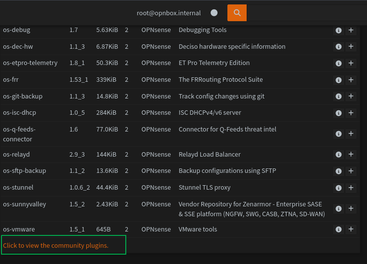
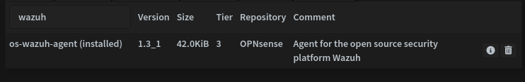
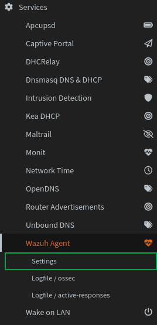
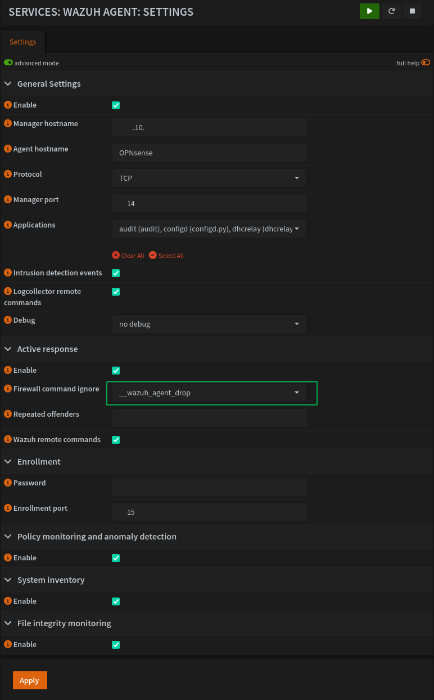
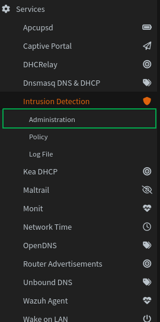
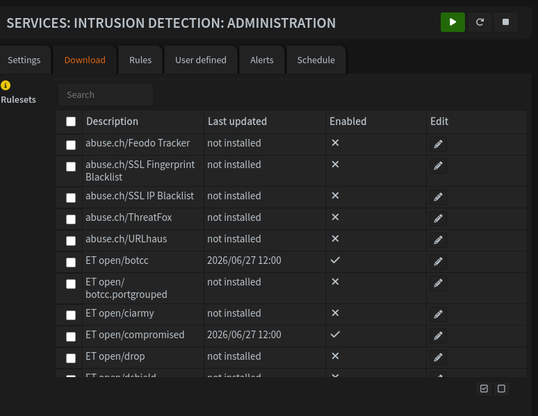

# Sysadmin Log: Wazuh MVP Deployment 

**Date:** 2026-06-26

**Report Time:** 23:48

**Category:**  Security 

**Status:**  Completed

---

## 1. Context & Problem Statement


**One-line summary:** Deploy Wazuh to provide agent-based endpoint visibility, MITRE-mapped threat detection, and active response capability for the Lab Environment.

**Background:** `ADR-007` and `ADR-008` directly trigger this deployment; they document the decision of deploying a SIEM solution alongside Stage 5 of the Hybrid Identity Infrastructure Project, and define Wazuh as the chosen platform. The existing Grafana Stack defined in `ADR-004` handles centralized log aggregation and cross-source correlation across OPNsense, Suricata, Docker and Windows Event Logs effectively, which provides a foundation for a security detection, but lacks MITRE-mapping and Active Response Capabilities. This is a known gap in the environment, which the following deployment aims to fix; this phase is a Minimum Viable Product deployment, to document the installation and configuration process. Active Directory integration is explicitly out of scope, as are the Workstation and other network clients.


## 2. Architectural Decisions & Strategy

### Decision 1: Wazuh XDR as the SIEM Solution for the Homelab.

**Decision statement:** Deploy Wazuh XDR to provide agent-based endpoint visibility, MITRE-mapped threat detection, and active response capability as a complement to the existing Grafana/Loki observability stack.

**Rationale:**

The platform selection is driven first by gap analysis. The existing Grafana stack handles log aggregation and cross-source correlation well, but provides no agent-based endpoint visibility, no built-in detection ruleset, no FIM, and no active response. The selected platform should fill these gaps, or replace the existing architecture by providing more capability. This immediately eliminates ELK (overlapping, but lacks SOAR integration), Splunk (overlapping, lacks SOAR integration, unsustainable data cap), and Security Onion (network-centric, lacks SOAR integration, architecturally competing). Extending Grafana alone would require custom engineering of every detection rule with no reusable outcome, even before examining the complexity of integrating a custom Shuffle deployment.

Between the remaining candidates, Wazuh and Microsoft Sentinel, the decision comes down to deployment model, cost sustainability, and SOAR integration.

Microsoft Sentinel with Defender for Identity is the most credible alternative and merits an honest assessment. Defender for Identity has purpose-built signatures for the exact AD attack techniques planned in Stage 5. The platform is cloud-native, enterprise-grade, and highly relevant for the hybrid identity context. However, it cannot be sustained beyond the 30-day M365 trial window without ongoing Azure spend. Even assuming the trial window was sufficient to complete Stage 5, this makes it a temporary solution at best. Additionally, OPNsense integration requires manual API configuration rather than the native plugin that Wazuh provides. 

Wazuh is selected because it fills every identified gap, is free and open source with no cost ceiling, the native OPNsense plugin includes Active Response capabilities, and has the added benefit of supporting multiple cloud integration platforms, including Defender for Identity, Splunk, and Google Cloud integrations. It is unclear at the time of writing whether Wazuh replaces the Grafana stack, or simply fills the gap. As part of this deployment, long-term evaluation is scheduled. A report will be produced summarizing the findings and issuing a recommendation: integrate Wazuh with Grafana, or accept Wazuh as a replacement.

### Decision 2: Deploy Wazuh as a Docker-Compose Stack.

**Decision statement:** Implement Wazuh Manager Docker stack on the main server.

**Rationale:**

The MacVTap loopback limitation is the primary architectural driver. A Wazuh Manager running as a VM cannot receive telemetry from an agent on the same KVM host due to MacVTap's inability to route traffic back to the host interface. Containerizing the manager on the host directly eliminates this constraint, allowing the server to forward its own telemetry to the manager without virtual switch workarounds or network performance penalties.
Linux agent deployments, however, will follow a bare-metal installation model using the official Wazuh Ansible Playbooks. While this departs from the containerized model that the homelab uses, using a Docker-based deployment for the Agents impairs the Active Response capabilities in Wazuh Manager, or requires bind-mounting several system directories and allowing write access, which defeats most of the benefits of containerization.
On the Windows side, agent deployment is enforced through Active Directory Group Policy, which mandates installation on domain-joined hosts via the DC. This deepens practical GPO knowledge as a direct extension of the existing hybrid identity work, rather than as a separate exercise.
Resource allocation is set at a 1GB RAM ceiling for the OpenSearch indexer, per  Wazuh documentation standards, but is configurable directly in the Compose file if the deployment requires adjustment. Storage is deliberately left uncapped during this phase: the ephemeral project window is treated as a calibration period, with raw data volume informing the retention and capacity policy for any future permanent deployment.

### Decision 3: Bind `/var/lib/docker/volumes` to a BTRFS subvolume for snapshotting

**Decision statement:** Accept default Wazuh Manager configuration, with docker managed volumes, but mount a BTRFS subvolume at `/var/lib/docker/volumes` in order to allow for clean snapshots.

**Rationale:**

While the standard procedure for dockerized services is to define btrfs snapshots as the bind-mount point for persistent data, the default Wazuh Docker configuration implements *15 different volumes*, all of them with different permissions and expected contents. This present multiple complexities. First and foremost, it requires extensive modification of the Docker Compose file, which would make future updates significantly more complex than a bare-metal installation. While a docker-compose.override.yml file is a potential solution, an initial attempt failed, despite bind-mounted folders being populated. This is likely a permissions issue, and could be solved by studying the expected permissions for the volumes; however, it is likely for this reason that the official compose file relies on docker managed volumes: it cleanly handles permission translation without a need for additional configuration. Thus, the decision is made to take a hybrid approach: create and bind a BTRFS subvolume at `/var/lib/docker/volumes`. This allows for atomic backups, while preserving from the benefits of docker-managed volumes.


## 3. Implementation & Execution

The minimal Wazuh Docker deployment is made simple thanks to Wazuh's detailed instructions and provided compose file. As such, deployment consisted of logging into the server, creating a subvolume, cloning the github repository, generating certificates and spinning up the compose stack.


<!-- SESSION_LOG_START -->
> *Session transcript — recorded 2026-06-27.*

* **Wazuh Docker Deployment:**

```bash
# Connected to the main server
╰─ ssh {MAIN SERVER}❯ ssh {MAIN SERVER}
# Mounted the btrfs root
❯ sudo mount /dev/{BTRFS_ROOT} /{TEMP_MOUNT_POINT}
[sudo] password for $USER:
# Created a new subvolume 
❯ sudo btrfs subvolume create /{TEMP_MOUNT_POINT/@docker-volumes}
# Mounted subvolume at default docker volumes location
❯ sudo mount -o subvol=@docker-volumes /dev{BTRFS_ROOT} /var/lib/docker/volumes
# (Additionally, at this point fstab was updated to automount this volume upon boot)
❯ cd /opt/docker/
# Created a BTRFS subvolume fon the docker-compose.yml and config files
❯ sudo btrfs subvolume create /opt/docker/wazuh
# Ensured user had permissions to write to folder
❯ sudo chown -R $USER:$USER /opt/docker/wazuh/
❯ cd /opt/docker/wazuh
# Cloned Wazuh Git repository, per Wazuh Documentation
❯ git clone https://github.com/wazuh/wazuh-docker.git -b v4.14.5
Cloning into 'wazuh-docker'...
❯ ls -l
total 0
drwxr-xr-x 1 $USER $USER	     24 Jun 27 00:06 .
drwxr-xr-x 1 $USER $USER	    348 Jun 27 00:05 ..
drwxr-xr-x 1 $USER autologin 314 Jun 27 00:07 wazuh-docker
❯ cd wazuh-docker
❯ ls
CHANGELOG.md		README.md		VERSION.json		docs/			multi-node/		tools/
LICENSE			SECURITY.md		build-docker-images/	indexer-certs-creator/	single-node/		wazuh-agent/	     
ID 8012 gen 3242220 top level 261 path @btrbk/ROOT.20260627T0000
❯ cd wazuh-docker
# Generate ssl certificates
❯ docker compose -f generate-indexer-certs.yml run --rm generator
# Start compose stack
❯ docker compose up -d
```

<!-- SESSION_LOG_END -->

* **OPNsense Enrollment:**

Now that Wazuh is installed, the next step for the deployment is configuring OPNsense. This is done almost entirely in the GUI, so the first step is enabling community plugins.


After which, a simple click installs the plugin



Once the plugin is installed, the next step is configuring the Wazuh Agent to connect to the manager. Configuration can be found under the services tab.



Wazuh is then configured with active response, enabling remote commands, policy monitoring, file integrity monitoring, and the manager and enrollment port are configured (shown partially obfuscated), and the manager hostname set (partially obfuscated). Here, the active response rule is __wazuh_agent_drop, which allows the Manager to instruct the OPNsense firewall to drop connections or clients. This firewall alias is created automatically upon Agent installation, and is enabled by default. No further configuration is required to achieve Active Response capabilities.



The next step is configuring Suricata alerts. This is also found in the Services tab, under Intrusion Detection.



In the download tab, we can select the rulesets we want and click on Download and Update.



Because there is no native way to filter the rulesets to only those enabled, the currently active ruleset must be fetched from the OPNsense configuration files:

```bash
# Log in to the OPNsense router
ssh {OPNSENSE_IP}
# Select Shell
8
# List rules
ls /usr/local/etc/suricata/rules
OPNsense.rules
emerging-malware.rules
emerging-ta_abused_services.rules 
botcc.rules
emerging-mobile_malware.rules
emerging-user_agents.rules 
compromised.rules
emerging-phishing.rules
emerging-worm.rules
emerging-attack_response.rules
emerging-scan.rules
rules.sqlite
emerging-dos.rules
emerging-shellcode.rules
rules.sqlite.LCK 
```

This is a very basic ruleset, and very likely contains overlaps and unnecessary rules. This will be fixed during Stage 5 of the Hybrid Identity Infrastructure Project, during the offensive telemetry stage. The two most important rulesets here are `emerging-scan.rules` and `emerging-shellcode.rules`. These two allow for two different kinds of tests to verify Wazuh is functional: a simple "testmyids" check, and a network-wide port-scan.

In order to test each, the following commands are issued in a terminal:

```bash
❯ curl http://testmyids.com
```
Which returns the text `uid=0(root) gid=0(root) groups=0(root)`.

This effectively triggers an alert, which Wazuh reports with the following (obfuscated) JSON:

```json
{
  "_index": "wazuh-alerts-4.x-2026.06.28",
  "_id": "n0vSD58BgvaihaX7XMul",
  "_score": 1,
  "_source": {
    "agent": {
      "ip": " X.X.{LAN_VLAN}.X",
      "name": "OPNsense",
      "id": "002"
    },
    "manager": {
      "name": "wazuh.manager"
    },
    "data": {
      "payload_printable": "HTTP/1.1 200 OK\r\nContent-Type: text/html\r\nContent-Length: 39\r\nConnection: keep-alive\r\nX-WS-Origin: available\r\nX-WS-RateLimit-Limit: 1000\r\nX-WS-RateLimit-Remaining: 999\r\nDate: Sun, 28 Jun 2026 20:01:05 GMT\r\nServer: Apache\r\nLast-Modified: Mon, 15 Jan 2007 23:11:55 GMT\r\nETag: \"27-4271c5f1ac4c0\"\r\nAccept-Ranges: bytes\r\n\r\nuid=0(root) gid=0(root) groups=0(root)\n",
      "app_proto": "http",
      "ip_v": "4",
      "in_iface": "igb0",
      "src_ip": "X.X.X.187",
      "src_port": "80",
      "event_type": "alert",
      "vlan": [
        {LAN_VLAN}
      ],
      "alert": {
        "severity": "2",
        "signature_id": "2100498",
        "rev": "7",
        "metadata": {
          "updated_at": [
            "2019_07_26"
          ],
          "confidence": [
            "Medium"
          ],
          "created_at": [
            "2010_09_23"
          ],
          "signature_severity": [
            "Informational"
          ]
        },
        "gid": "1",
        "signature": "GPL ATTACK_RESPONSE id check returned root",
        "action": "allowed",
        "category": "Potentially Bad Traffic"
      },
      "payload": "SFRUUC8xLjEgMjAwIE9LDQpDb250ZW50LVR5cGU6IHRleHQvaHRtbA0KQ29udGVudC1MZW5ndGg6IDM5DQpDb25uZWN0aW9uOiBrZWVwLWFsaXZlDQpYLVdTLU9yaWdpbjogYXZhaWxhYmxlDQpYLVdTLVJhdGVMaW1pdC1MaW1pdDogMTAwMA0KWC1XUy1SYXRlTGltaXQtUmVtYWluaW5nOiA5OTkNCkRhdGU6IFN1biwgMjggSnVuIDIwMjYgMjA6MDE6MDUgR01UDQpTZXJ2ZXI6IEFwYWNoZQ0KTGFzdC1Nb2RpZmllZDogTW9uLCAxNSBKYW4gMjAwNyAyMzoxMTo1NSBHTVQNCkVUYWc6ICIyNy00MjcxYzVmMWFjNGMwIg0KQWNjZXB0LVJhbmdlczogYnl0ZXMNCg0KdWlkPTAocm9vdCkgZ2lkPTAocm9vdCkgZ3JvdXBzPTAocm9vdCkK",
      "stream": "1",
      "flow_id": "372882485248025.000000",
      "dest_ip": " X.X.{LAN_VLAN}.Y",
      "proto": "TCP",
      "dest_port": "45336",
      "pkt_src": "wire/pcap",
      "flow": {
        "src_ip": " X.X.{LAN_VLAN}.Y",
        "src_port": "45336",
        "pkts_toserver": "5",
        "dest_ip": "X.X.{LAN_VLAN}.X",
        "start": "2026-06-28T16:01:05.414498-0400",
        "bytes_toclient": "645",
        "bytes_toserver": "435",
        "pkts_toclient": "4",
        "dest_port": "80"
      },
      "timestamp": "2026-06-28T16:01:05.736023-0400",
      "direction": "to_client"
    },
    "rule": {
      "firedtimes": 2,
      "mail": false,
      "level": 3,
      "description": "Suricata: Alert - GPL ATTACK_RESPONSE id check returned root",
      "groups": [
        "ids",
        "suricata"
      ],
      "id": "86601"
    },
    "decoder": {
      "name": "json"
    },
    "input": {
      "type": "log"
    },
    "@timestamp": "2026-06-28T20:01:06.787Z",
    "location": "/var/log/suricata/eve.json",
    "id": "1782676866.1556412",
    "timestamp": "2026-06-28T20:01:06.787+0000"
  },
  "fields": {
    "timestamp": [
      "2026-06-28T20:01:06.787Z"
    ],
    "@timestamp": [
      "2026-06-28T20:01:06.787Z"
    ],
    "data.timestamp": [
      "2026-06-28T20:01:05.736Z"
    ]
  }
}
```

Afterwards, an aggressive port scan is triggered inside the VLAN, in order to trigger an IDS alert.

```bash
sudo nmap -sS -Pn -T5 -p- X.X.{TEST_VLAN}.0/24
```

Which gives the output

```json

{
  "_id": "2ku7Hp8BgvaihaX7eNXB",
  "input": {
    "type": "log"
  },
  "agent": {
    "ip": "X.X.{LAN_VLAN}.X",
    "name": "OPNsense",
    "id": "002"
  },
  "manager": {
    "name": "wazuh.manager"
  },
  "data": {
    "ip_v": "4",
    "in_iface": "vlan0.{LAN_VLAN}",
    "src_ip": "X.X.{LAN_VLAN}.Y",
    "src_port": "36242",
    "event_type": "alert",
    "alert": {
      "severity": "3",
      "signature_id": "2001581",
      "rev": "15",
      "metadata": {
        "updated_at": [
          "2019_07_26"
        ],
        "confidence": [
          "Medium"
        ],
        "created_at": [
          "2010_07_30"
        ],
        "signature_severity": [
          "Informational"
        ]
      },
      "gid": "1",
      "signature": "ET SCAN Behavioral Unusual Port 135 traffic Potential Scan or Infection",
      "action": "allowed",
      "category": "Misc activity"
    },
    "stream": "0",
    "flow_id": "1377019252256989.000000",
    "dest_ip": "X.X.{TEST_VLAN}.X",
    "proto": "TCP",
    "dest_port": "135",
    "pkt_src": "wire/pcap",
    "flow": {
      "src_ip": "X.X.{LAN_VLAN}.Y",
      "src_port": "36242",
      "pkts_toserver": "1",
      "dest_ip": "X.X.{TEST_VLAN}.X",
      "start": "2026-07-01T13:30:20.975972-0400",
      "bytes_toclient": "0",
      "bytes_toserver": "60",
      "pkts_toclient": "0",
      "dest_port": "135"
    },
    "timestamp": "2026-07-01T13:30:20.975972-0400",
    "direction": "to_server"
  },
  "rule": {
    "firedtimes": 12,
    "mail": false,
    "level": 3,
    "description": "Suricata: Alert - ET SCAN Behavioral Unusual Port 135 traffic Potential Scan or Infection",
    "groups": [
      "ids",
      "suricata"
    ],
    "id": "86601"
  },
  "location": "/var/log/suricata/eve.json",
  "decoder": {
    "name": "json"
  },
  "id": "1782927024.104261",
  "timestamp": "2026-07-01T17:30:24.265+0000"
}

```
This output confirms that Suricata is correctly flagging the traffic, but Wazuh is failing to map it to the MITRE attack pattern. It also reveals incorrect mapping of severity. A quick Google search pointed towards a [GitHub Issue](https://github.com/wazuh/wazuh/issues/28520) that suggests a better approach to Severity Mapping, which is recorded in [this](../artifacts/wazuh/2026-07-01_OPNsense_suricata-better-severity-mapping.xml) artifact. 

## 4. Outcome & Future Considerations

While Suricata alerts are confirmed to be correctly ingested, MITRE mapping has not been validated. This is a specific requirement of Phase 1 of the test plan. Looking into the specific rules, this is a consequence of a lack of MITRE-enrinchment at the source (Suricata). While Proofpoint, the team behind the Emerging Threats Ruleset, has spoken publicly about their work to [Improve Metadata](https://www.proofpoint.com/us/blog/threat-insight/emerging-threats-updates-improve-metadata-including-mitre-attck-tags), a substantial amount of their existing rules do not contain MITRE-mapping by default. This explain why the `nmap` or `testmyids.com` alerts above did not contain MITRE mapping. Both automated and manual solutions for MITRE mapping were considered, but ultimately discarded. The decision is made to accept the lack of MITRE mapping for both, despite the initial Acceptance Criteria. These two test cases were chosen as proof of concept for the underlying mechanism: demonstrating that MITRE mapping in Suricata Rules is correctly ingested and displayed in Wazuh. Studying the ruleset and its internal structure acts as validation, with an important caveat: in order for Wazuh to correctly identify MITRE information, Suricata rules have to contain MITRE-mapping information. The specific rules chosen as proofs of concept did not contain such information, and as such are not fit to be used as proofs of concept, which was not known at the time the ADR was initially drafted. 

Furthermore, analysis of Suricata rulesets reveal further assumptions that prove incorrect: rules are almost exclusively designed to evaluate traffic that travels between the External and Internal networks, as opposed to lateral movement. While this initially may appear to be a gap, further investigation suggests it's a symptom of a changing approach in detection and alerting: a focus on Endpoint Detection, instead of at the network level, which is precisely the gap that Wazuh is designed to cover.

Given rule construction and detection tuning is explicitly a goal of Phase 5 of the Hybrid Identity Infrastructure Project, the decision is made to postpone any writing of custom MITRE-mapped rules until this phase.

* **Result:** Wazuh Manager docker stack deployed.

* **Result:** Suricata Log ingestion confirmed.

### Next Steps
- [ ] * **Pending:** Ensuring all relevant rulesets are MITRE-Mapped is postponed until Stage 5 of the Hybrid Identity Infrastructure Project
- [ ] * **Pending:** Suricata Severity Mapping fix is postponed until Stage 5, alongside the MITRE-mapping fix.

## References

- [Better Suricata Severity Mapping #28520](https://github.com/wazuh/wazuh/issues/28520) Improves Severity Mapper in Suricata
- [Responding to Network Attacks with Suricata and Wazuh XDR:](https://wazuh.com/blog/responding-to-network-attacks-with-suricata-and-wazuh-xdr/#:~:text=Add%20the%20following%20rules%20to%20the%20/var/ossec/etc/rules/local_rules.xml%20file%3A) Tools 
- [Emerging Threats Updates Improve Metadata, Including MITRE ATT&CK Tags ](https://www.proofpoint.com/us/blog/threat-insight/emerging-threats-updates-improve-metadata-including-mitre-attck-tags)
