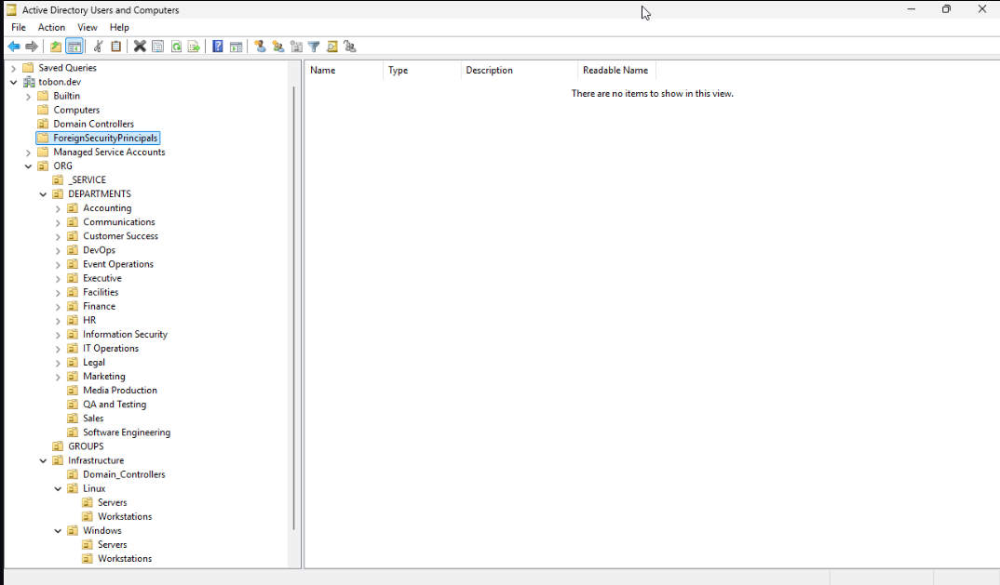
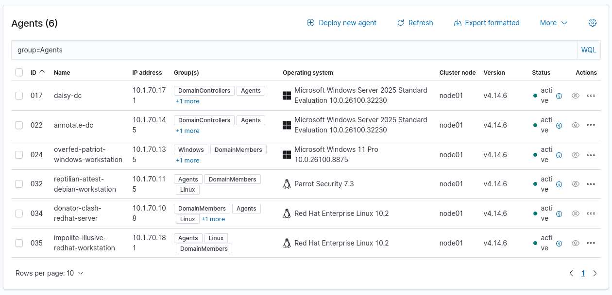

# Sysadmin Log: Hybrid OS Lab Stage 4 

**Date:** 2026-07-12

**Report Time:** 16:13

**Category:** Architecture

**Status:** Completed

> **PRIORITIZED to follow Stage 2:** This Stage of the Hybrid Identity Infrastructure Project (HIIP) was originally designed to follow Stage 3. However, due to the parallel deployment of Wazuh XDR and subsequent offensive telemetry project (Stage 5), the decision was made to move Stage 4 forward. This Stage will now also include an evaluation on whether adding RHEL clients to Stage 5 provides useful telemetry for Detection Engineering in the production environment, outside of the isolated Active Directory Project.

---

## 1. Context & Problem Statement

**One-line summary:** Stage 4 of the Hybrid Identity Architecture Project consists of enforcing centralized identity, authentication and access management across operating systems by joining a `RHEL` endpoint to the Windows domain.

**Background:** Following the completion of Stage 2, the goal of this stage is to expand on the existing Active Directory Domain by joining RHEL clients using `realmd` and `sssd`, mapping permissions between systems, and confirming authentication is centralized at the Domain Controller level by logging in to an Active Directory Domain User Account in a Domain-Joined RHEL client.


## 2. Architectural Decisions & Strategy

### Decision 1: OpenSSH Remoting.

**Decision:** Manage all RHEL and Windows Hosts via OpenSSH Remoting.
**Rationale:** OpenSSH is now well established as a control mechanism in Windows Server, starting with Windows Server 2019. As such, using OpenSSH as the remote management tool provides parity between Windows and RHEL hosts, while enabling Journal-Helper to log remote sessions seamlessly.

### Decision 2: Ansible-Driven Alloy and Wazuh-Agent installation.

**Decision:** Install Alloy and Wazuh-Agent in all clients using Ansible prior to Domain Join.
**Rationale:** The [Wazuh MVP Deployment Log](./2026-06-26-wazuh-mvp-deployment.md) revealed telemetry collection at the DC and Firewall level did not offer sufficient visibility against lateral movement attacks. For this reason, the official playbooks are used and adapted to install the Alloy and Wazuh-Agent in both Windows and Linux Hosts. The Domain-Join playbook additionally checks the services are running and aborts if they are not.

### Decision 3: Ansible-Driven Domain Join using Bootstrapping Playbook

**Decision:** Automate Domain-Join using Ansible, including Alloy and Wazuh-Agent checks using `include_tasks:` to call on official installation playbooks.
**Rationale:** Ansible automation is chosen as a solution for Domain-Join due to its cross-platform compatibility. Mandating a check for running services prior to domain join ensures that any Domain-Joined client is, by definition, compliant.

### Decision 4: Security Hardening for Cross-OS Admins

**Decision:** Enforce an automated, segmented AD structure isolating Windows Machines and Linux Machines, governed by strictly defined groups (`System Engineers`, `Linux Admins`, `Linux Users`).
**Rationale:** This creates a narrower attack surface while establishing realistic Bloodhound enumeration paths. The CSV generation script strips the default `Domain Admins` group assignments from standard IT and Security roles forces more complex privilege escalation tracking basedo on job title in addition to department.

### Decision 5: Sudo Governance - Dual Approach

**Decision:** Implement mechanisms for sudo governance both by using `/etc/sudoers.d/` files and by AD Schema Extension
**Rationale:**  Managing local `/etc/sudoers.d/` files at scale is prone to configuration drift, whereas extending Active Directory Schemas can break them. Using both standards ensures familiarity with two realistic approaches to permissions mapping. The `sudo_governance=schema` variable allows the playbooks to seamlessly deploy this architecture by mapping sudo commands, host allowances, and run-as permissions to AD objects. The `sudo_governance=sudoers` variable places the governance in the hands of every host, allowing for similar permissions mapping without extending the AD Schema.

## 3. Implementation & Execution

### Phase 1: Manual Exploration and Setup

**OpenSSH Service & Network Configuration**

The SSH service was manually enabled and configured on the Domain Controller and a Windows 11 Client, and firewall rules were updated to allow TCP Port 22 inbound. A PowerShell script was drafted as a post-installation task for new clients to ensure the `OpenSSH.Server` capability is installed, the service is set to Automatic, PowerShell is set as the default shell, and firewall rules are actively enforced.

```powershell
if ((Get-WindowsCapability -Online -Name OpenSSH.Server*).State -ne 'Installed') {
    Add-WindowsCapability -Online -Name OpenSSH.Server~~~~0.0.1.0
}
# Enable SSH service for manageability
Set-Service -Name sshd -StartupType 'Automatic'
# Set Powershell as Default for SSH
New-ItemProperty -Path "HKLM:\SOFTWARE\OpenSSH" -Name DefaultShell -Value "C:\Windows\System32\WindowsPowerShell\v1.0\powershell.exe" -PropertyType String -Force
# Confirm the Firewall rule is configured.
if ((Get-NetFirewallRule -Name "OpenSSH-Server-In-TCP" | Where-Object -Property "Profile" -NotMatch "Domain, Private" -ErrorAction SilentlyContinue)) {
    Write-Output "Firewall Rule 'OpenSSH-Server-In-TCP' does not exist or isn't properly configured. Fixing."
    Remove-NetFirewallRule -Name 'OpenSSH-Server-In-TCP' -ErrorAction SilentlyContinue
    New-NetFirewallRule -Name 'OpenSSH-Server-In-TCP' -DisplayName 'OpenSSH Server (sshd)' -Enabled True -Profile "Domain, Private" -Direction Inbound -Protocol TCP -Action Allow -LocalPort 22
} else {
    Write-Output "Firewall rule 'OpenSSH-Server-In-TCP' exists and is properly configured."
}
# Start the sshd service
Start-Service sshd
```

Because authorized keys were not yet imported, `sshd_config` was temporarily modified to accept password logins by adding `PasswordAuthentication yes` and restarting the service:

```powershell
# Open Notepad to Edit Value
notepad $Env:ProgramData\ssh\sshd_config
# Restart Service
Restart-Service -Name sshd
```

Connections to both clients were successfully tested from the workstation, and key-based authentication was subsequently staged for Domain Administrators by copying the identity file to `C:/ProgramData/ssh/administrators_authorized_keys`.

```bash
# Connection Test
ssh -l {AD_USER}@{DOMAIN} {DOMAIN_CONTROLLER}
ssh -l {AD_USER}@{DOMAIN} {WORKSTATION}
# Key Copying
scp -P 22 {IDENTITY_FILE} {AD_ADMIN}@{DOMAIN}@{DOMAIN_CONTROLLER}:C:/ProgramData/ssh/administrators_authorized_keys
# For Domain Administrators Only. Non-Administrator users follow the standard .ssh/authorized_keys format
```

**Active Directory Hierarchy & Group Provisioning**

To limit cross-domain authorized users and establish RBAC, `LinuxUsers`, `LinuxAdmins`, and `SystemEngineers` groups were created on the Domain Controller. A highly privileged test account mimicking a System Engineer was provisioned and added to these groups to validate cross-domain authentication. This sets up a foundation to later automate using Ansible.

```powershell
# Create Relevant Groups
$groups = 'SystemEngineers', 'Domain Admins', 'LinuxUsers'
$path = "OU=_GROUPS,DC=TOBON,DC=DEV"
foreach ($group in $groups) {
    New-ADGroup -Name $group -GroupScope Global -Path $path
}
$splat = @{
>>                 Name                  = "{FIRSTNAME LASTNAME}"
>>                 DisplayName           = "{FIRSTNAME LASTNAME}"
>>                 GivenName             = "{FIRSTNAME}"
>>                 Surname               = "{LASTNAME}"
>>                 SamAccountName        = "{SamAccountName}"
>>                 UserPrincipalName     = "{SamAccountName}@tobon.dev"
>>                 AccountPassword       = (ConvertTo-SecureString '{PASSWORD}' -AsPlainText -Force)
>>                 Enabled               = $true
>>                 PasswordNeverExpires  = $true
>>                 ChangePasswordAtLogon = $false
>>                 Path                  = "OU=SystemEngineers,DC=tobon,DC=dev"
>>             }
>> New-ADUser @splat
# Add User to System Engineers Group
$groups = 'SystemEngineers', 'Domain Admins', 'LinuxUsers',
$username = '{SamAccountName}'
foreach ($group in $groups) {
    Add-ADGroupMember -Identity $group -Members $username
}
```
An Infrastructure Hierarchy was defined (`OU=ORG,DC=TOBON,DC=DEV`), cleanly separating `Domain_Controllers`, `Linux` (Workstations/Servers), and `Windows` (Workstations/Servers). A PowerShell script was engineered to automatically build this OU structure, including cleanup logic to remove existing unstructured containers and recursively deploy the first- and second-level sub-OUs securely.

```powershell
# create-infrastructure-ous.ps1
# Define Base Domain Path

$domainDN = "DC=tobon,DC=dev"
$orgOU = "OU=ORG,$domainDN"
$infrastructureOU = "OU=Infrastructure,$orgOU"

# Define the desired OU structure
$structure = [ordered]@{
    "Infrastructure" = @("Domain_Controllers", "Linux", "Windows")
    "Linux"          = @("Workstations", "Servers")
    "Windows"        = @("Workstations", "Servers")
}

Write-Host "Ensuring Active Directory Infrastructure OU Tree exists..." -ForegroundColor Cyan

# 1. Create the Root ORG OU
if (-not (Get-ADOrganizationalUnit -Identity $orgOU -ErrorAction SilentlyContinue)) {
    New-ADOrganizationalUnit -Name "ORG" -Path $domainDN -ProtectedFromAccidentalDeletion $true
    Write-Host "Created Root OU: ORG" -ForegroundColor Green
}

# 2. Create the Infrastructure OU
if (-not (Get-ADOrganizationalUnit -Identity $infrastructureOU -ErrorAction SilentlyContinue)) {
    New-ADOrganizationalUnit -Name "Infrastructure" -Path $orgOU -ProtectedFromAccidentalDeletion $true
    Write-Host "Created Nested OU: Infrastructure" -ForegroundColor Green
}

# 3. Create the First-Level Sub-OUs (Domain_Controllers, Linux, Windows)
foreach ($subOU in $structure["Infrastructure"]) {
    $subOUPath = "OU=$subOU,$infrastructureOU"
    if (-not (Get-ADOrganizationalUnit -Identity $subOUPath -ErrorAction SilentlyContinue)) {
        # Corrected Path: Routing to $infrastructureOU instead of $orgOU
        New-ADOrganizationalUnit -Name $subOU -Path $infrastructureOU -ProtectedFromAccidentalDeletion $true
        Write-Host "Created First-Level OU: $subOU" -ForegroundColor Green
    }
}

# 4. Create Second-Level Sub-OUs (Workstations & Servers)
$secondLevelParents = @('Linux', 'Windows')
foreach ($parent in $secondLevelParents) {
    $parentPath = "OU=$parent,$infrastructureOU"
    
    foreach ($child in $structure[$parent]) {
        $childPath = "OU=$child,$parentPath"
        
        if (-not (Get-ADOrganizationalUnit -Identity $childPath -ErrorAction SilentlyContinue)) {
            New-ADOrganizationalUnit -Name $child -Path $parentPath -ProtectedFromAccidentalDeletion $true
            Write-Host "Created Second-Level OU: $child (under $parent)" -ForegroundColor Green
        }
    }
}

Write-Host "Infrastructure OU Tree verification complete." -ForegroundColor Cyan
```

The resulting structure is as follows:

DC=TOBON,DC=DEV
  OU=ORG
    OU=Infrastructure
      OU=Domain_Controllers
      OU=Linux
        OU=Workstations
        OU=Servers
      OU=Windows
        OU=Workstations
        OU=Servers


**Schema Extension & Sudo Governance**

The official Sudo schema was transferred to the DC. A sudoers OU was created, and sudoRole objects were dynamically mapped using New-ADObject to validate the LDAP attributes for users, hosts, and commands.

A top-level `sudoers` OU was created, and `sudoRole` objects (`Engineers`, `Admins`, `Maintenance`, `WebMaster`) were nested within it, which resulted in the following structure:

OU=sudoers
  CN=Engineers
  CN=Admins
  CN=Maintenance
  CN=WebMaster

Without real or simulated services and systems to map to permissions and users, the proof-of-concept permissions mapping needs to be fairly simple. In this scenario, the following simple sudo permission sets are used:

| sudoRole | Group Name | Allowed Hosts | Allowed Commands |
| --- | --- | --- | --- |
| Engineers | SystemEngineers | All | All |
| Admins | LinuxAdmins | Linux Workstations | All |
| Maintenance | ITOperations | Linux Servers | `/bin/systemctl restart` |
| WebMaster | ServiceAccount | nginx Server | `/bin/systemctl * nginx` |

While simple, they cover the basics of permissions control:

- Who is authorized
- Where are they authorized
- What are they authorized to do

#### Manual RHEL Domain Join Validation
[Setup Comands](../artifacts/hybrid-os-lab-stage-4/manual-rhel-domain-validation.md)

In a RHEL VM, `realmd` integration was manually validated. Following a successful join,  RBAC was enforced by denying all access by default and explicitly permitting the `LinuxUsers`, `LinuxAdmins`, and `SystemEngineers` groups. Domain User login was validated and sudo permissions were verified against the sudoRole objects.

*Domain login Validation:*

| User Group Name | Target Host | Allowed Hosts | Expected | Result |
| --- | --- | --- | --- | --- |
| SystemEngineers | RHEL Server | All | Login Success | Pass |
| SystemEngineers | RHEL Workstation | All | Login Success | Pass |
| Linux Admins | RHEL Server | Linux Workstations | Login Fail | Pass |
| Linux Admins | RHEL Workstation | Linux Workstations | Login Success | Pass |
| Linux Users | RHEL Server | Linux Workstations | Login Fail | Pass |
| Linux Users | RHEL Workstation | Linux Workstations | Login Success | Pass |

*Federated sudo governance validation:*

| Sudo Role | User Group Name | Target Host | Allowed Hosts | Commands Expected | Command Tried | Expected | Result |
| --- | --- | --- | --- | --- | --- | --- | --- |
| Engineers | SystemEngineers | RHEL Server | All | All | `sudo su` | Authorized | Pass |
| Engineers | SystemEngineers | RHEL Workstation | All | All | `sudo su` | Authorized | Pass |
| Admins | LinuxAdmins | RHEL Server | Linux Workstations | NONE | `sudo su` | Not Authorized | Pass |
| Admins | LinuxAdmins | RHEL Workstation | Linux Workstations | All | `sudo su` | Pass | Pass |
| Maintenance | ITOperations | RHEL Server | Linux Servers | `/bin/systemctl restart *` | `sudo systemctl restart sshd` | Authorized | Pass |
| Maintenance | ITOperations | Nginx Server | Linux Servers | `/bin/systemctl restart *` | `sudo systemctl restart nginx` | Authorized | Pass |
| Maintenance | ITOperations | Nginx Server | Linux Servers | `/bin/systemctl restart *` | `sudo systemctl restart sshd` | Authorized | Pass |
| Maintenance | ITOperations | RHEL Workstation | Linux Servers | NONE | `sudo systemctl restart sshd` | Not Authorized | Pass |
| WebMaster | ServiceAccount | Nginx Server | Nginx Server | `/bin/systemctl * nginx` | `sudo systemctl restart nginx` | Authorized | Pass |
| WebMaster | ServiceAccount | Nginx Server | Nginx Server | `/bin/systemctl * nginx` | `sudo systemctl restart sshd` | Not Authorized | Pass |
| WebMaster | ServiceAccount | Nginx Server | Nginx Server | `/bin/systemctl * nginx` | `sudo su` | Not Authorized | Pass |
| WebMaster | ServiceAccount | RHEL Server | Nginx Server | NONE | `sudo systemctl restart nginx` | Not Authorized | Pass |
| WebMaster | ServiceAccount | Linux Workstation | Nginx Server | NONE | `sudo restart nginx` | Not Authorized | Pass |

*Local sudoers validation:*

Local Validation performs the exact same checks as above.
All results are confirmed identical, regardless of governance model.

### Phase 2: Playbook Creation

**Credential Bootstrapping:** To provision clients en-masse, a lightweight nginx Fileserver was set-up. A Powershell/Bash script pair `ansible_bootstrap.{ps1,sh}` was published, allowing raw VMs to download the SSH key, set Windows system locales (en-DV/us-DV), set firewall profiles, and start the SSH daemon using a single command.

Windows Credential Bootstrapping:
```powershell
Invoke-RestMethod -Uri "http://curious-aristocrat-ubuntu-fileserver.tobon.dev/ansible_bootstrap.ps1" | Invoke-Expression
```
Linux Credential Bootstrapping:
```bash
curl -s http://curious-aristocrat-ubuntu-fileserver.tobon.dev/ansible_bootstrap.sh | sudo bash
```

**Telemetry and XDR Automation**

Prior to automating the Domain Join, Wazuh agent installation was handled by cloning the `wazuh-ansible` repository (branch `v4.14.6`) in the Ansible Controller. Grafana Alloy provisioning required installing the `grafana.grafana` collection and the `xkcdpass` Python library. Because the official Alloy Ansible Playbook lacked Windows installation tasks, custom tasks were engineered using the Wazuh Playbook as a baseline.

*It is important to remark that the Wazuh Github repository has re-written the Windows Installation and greatly simplified it, but this update hasn't made it into the current release at the time of writing (`v4.14.6`). Manually updating the `v4.14.6` Wazuh Playbook to the newer approach was deemed out of scope, but the Windows Alloy tasks were developed using this new, simpler, model as a baseline. This explains the discrepancy found in both approaches.*

```bash
# Wazuh Repository Glone
git clone --branch v4.14.6 https://github.com/wazuh/wazuh-ansible.git
# Grafana Collection Install
ansible-galaxy collection install grafana.grafana
# Install xkcdpass Python library
sudo pacman -S xkcdpass
```

**Ansible Pre-Flight & Hostname Standardization:** The `domain-bootstrap.yml` playbook was developed with a `pre_tasks` block that actively asserts the Wazuh and Alloy services are running. Once telemetry compliance is validated, the playbook generates a randomized `agent_name` and standardizes the hostname format (e.g., `[random]-[os_family]-[computer_role]`) for both Windows and Linux clients.

**Linux Domain Join & SSSD Configuration:** The domain join tasks were written to dynamically adapt to OS differences, installing `libsss_sudo` for RedHat-based systems and `libsss-sudo` for Debian-based distros via conditional `ansible_os_family` checks.

To support the AD Schema sudo governance, tasks were added to modify `nsswitch.conf` and `sssd.conf`, enabling the sudo responder and pointing the `ldap_sudo_search_base` to the newly created `sudoers` OU.

**Active Directory Infrastructure as Code:** The imperative PowerShell logic drafted in Phase 1 was translated into native Ansible modules.
- *DC Provisioning:* The domain-bootstrap.yml playbook was expanded to include the provision_dc role, utilizing microsoft.ad.domain to dynamically create the forest and reboot the server automatically. It additionally includes an abridged implementation of the hostname standardization tasks.
- *OU Architecture:* The manual nested loops in the manual testing phase were replaced with a declarative YAML structure (`infra_OU_tree.yml`) that utilizes the microsoft.ad.ou module to deploy the multi-tiered directory schema.  

### Phase 3: Validation and Artifact Generation

A template task was added to the playbook. Upon a successful join, Ansible renders a time-stamped Markdown report in the [Stage 4 Artifacts Directory](../artifacts/hybrid-os-lab-stage-4/ansible), documenting per-host domain join/promotion, including service state. The validation occurred against the following hosts:

| Hostname | Operating System | Role | OU Path |
| ---- | ---- | ---- | ---- |
| annotate-dc | Windows Server | Secondary Domain Controller | OU=Domain_Controllers,OU=Infrastructure,OU=ORG,DC=tobon,DC=dev |
| daisy-dc | Windows Server 2025 | Primary Domain Controller | OU=Domain_Controllers,OU=Infrastructure,OU=ORG,DC=tobon,DC=dev |
| donator-clash-redhat-server | RHEL 10.1 | Server | OU=Servers,OU=Linux,OU=Infrastructure,OU=ORG,DC=tobon,DC=dev |
| overfed-patriot-windows-workstation | Windows 11 Pro | Workstation | OU=Workstations,OU=Windows,OU=Infrastructure,OU=ORG,DC=tobon,DC=dev |
| impolite-elusive-redhat-workstation | RHEL 10.2 | Workstation | OU=Workstations,OU=Linux,OU=Infrastructure,OU=ORG,DC=tobon,DC=dev |
| tarmac-mandatory-parrot-workstation | Parrot OS 8 | Workstation | OU=Workstations,OU=Linux,OU=Infrastructure,OU=ORG,DC=tobon,DC=dev |

#### Graphical Hierarchy Validation



#### Login and sudo validation

Phase 3 validation performs the same checks as [Phase 2 Domain Join Validation](#manual-rhel-domain-join-validation).
The [Stage 4 Artifacts Directory](../artifacts/hybrid-os-lab-stage-4/ansible) contains artifacts for both governance models.
It is of note that the sudoers domain join was performed only against the Linux Hosts, since, by definition, their authentication governance is local in that model.

In a RHEL VM, `realmd` integration was manually validated. Following a successful join,  RBAC was enforced by denying all access by default and explicitly permitting the `LinuxUsers`, `LinuxAdmins`, and `SystemEngineers` groups. Domain User login was validated and sudo permissions were verified against the sudoRole objects.

*Domain login Validation:*

| User Group Name | Target Host | Allowed Hosts | Expected | Result |
| --- | --- | --- | --- | --- |
| SystemEngineers | RHEL Server | All | Login Success | Pass |
| SystemEngineers | RHEL Workstation | All | Login Success | Pass |
| Linux Admins | RHEL Server | Linux Workstations | Login Fail | Pass |
| Linux Admins | RHEL Workstation | Linux Workstations | Login Success | Pass |
| Linux Users | RHEL Server | Linux Workstations | Login Fail | Pass |
| Linux Users | RHEL Workstation | Linux Workstations | Login Success | Pass |

*Federated sudo governance validation:*

| Sudo Role | User Group Name | Target Host | Allowed Hosts | Commands Expected | Command Tried | Expected | Result |
| --- | --- | --- | --- | --- | --- | --- | --- |
| Engineers | SystemEngineers | RHEL Server | All | All | `sudo su` | Authorized | Pass |
| Engineers | SystemEngineers | RHEL Workstation | All | All | `sudo su` | Authorized | Pass |
| Admins | LinuxAdmins | RHEL Server | Linux Workstations | NONE | `sudo su` | Not Authorized | Pass |
| Admins | LinuxAdmins | RHEL Workstation | Linux Workstations | All | `sudo su` | Pass | Pass |
| Maintenance | ITOperations | RHEL Server | Linux Servers | `/bin/systemctl restart *` | `sudo systemctl restart sshd` | Authorized | Pass |
| Maintenance | ITOperations | Nginx Server | Linux Servers | `/bin/systemctl restart *` | `sudo systemctl restart nginx` | Authorized | Pass |
| Maintenance | ITOperations | Nginx Server | Linux Servers | `/bin/systemctl restart *` | `sudo systemctl restart sshd` | Authorized | Pass |
| Maintenance | ITOperations | RHEL Workstation | Linux Servers | NONE | `sudo systemctl restart sshd` | Not Authorized | Pass |
| WebMaster | ServiceAccount | Nginx Server | Nginx Server | `/bin/systemctl * nginx` | `sudo systemctl restart nginx` | Authorized | Pass |
| WebMaster | ServiceAccount | Nginx Server | Nginx Server | `/bin/systemctl * nginx` | `sudo systemctl restart sshd` | Not Authorized | Pass |
| WebMaster | ServiceAccount | Nginx Server | Nginx Server | `/bin/systemctl * nginx` | `sudo su` | Not Authorized | Pass |
| WebMaster | ServiceAccount | RHEL Server | Nginx Server | NONE | `sudo systemctl restart nginx` | Not Authorized | Pass |
| WebMaster | ServiceAccount | Linux Workstation | Nginx Server | NONE | `sudo restart nginx` | Not Authorized | Pass |

*Local sudoers validation:*

Local Validation performs the exact same checks as above.
All results are confirmed identical, regardless of governance model.

#### Graphical Wazuh Enrollment Validation



*NOTE:* During the final phase of artifact production, a minor bug was found in the domain-join playbook. The Hostname Compliance was evaluating against the "os_family", but enforcing the generated hostname based on the "distribution". This bug wasn't found until the final stages of the playbook validation, where the join process was repeated on the same hosts, using both sudo governanced models, resulting in an edgecase where the RHEL hosts, which belong to the RedHat OS family and the RedHat distribution evaluated correctly, wheras the ParrotOS host, which belongs to the Debian OS family, but the Parrot distribution, failed the compliance check, which meant its hostname was overwritten with every run of the playbook. This has been corrected by enforcing the generated hostname based on the "os_family" instead of the Distribution. The decision is made not to regenerate the artifacts, given everything else has been validated.

## Klist Validation 

One account with no privileges outside of Linux Login access was used to validate Kerberos Ticket Generation for all systems.

| Property | Value |
| --- | --- |
| username | gnakamura |
| firstName | Giovanni |
| lastName | Nakamura |
| displayName | Giovanni Nakamura |
| password | PASSWORD |
| enabled | true |
| passwordNeverExpires | false |
| changePasswordAtLogon | false |
| groups | ["ITOperations","Employees","NetworkEngineers","LinuxUsers","FakeAccounts"] |
| department | IT Operations |
| title | Network Engineer |
| description | Automated load test account - IT Operations |

Klist Validation Reports are found in the [Stage 4 Artifacts Directory](../artifacts/hybrid-os-lab-stage-4/ansible). They prove not only that ticket generation is successful, but, additionally, validate that this unprivileged user cannot log in on the Domain Controllers. However, for the  authorized machine, output redirection means that the ticket isn't in `stdout` for a successful command. A command was run manually and pasted in a copy of the artifact. This workaround is deemed sufficient, given the fact that the only purpose of the `klist_validation` task is to automate the artifact generation, and any further time investments would only delay the continuation of the project.


## 4. Outcome & Future Considerations

Stage 4 succeeds and exceeds its original objectives and scope: RHEL clients successfully join the domain and authenticate against the DC using Kerberos. Sudo governance is implemented using both local sudoers and extended schema approaches, and group permissions are validated. The creation of an Ansible Playbook for this stage means high reproduceability of the testing environment, setting up an Active Directory as Code Environment that will provide a baseline for future projects. Additionally, mandating Wazuh and Alloy Agent installation in all hosts provides a baseline for future offensive testing telemetry and detection engineering in Stage 5.

* **Result:** Active Directory infrastructure and tiered OU hierarchy managed idempotently via Ansible.
* **Result:** Zero-touch provisioning pipeline successfully enforces standardized hostnames, automated AD join, and unified XDR telemetry ingestion across Windows, RHEL, and Debian endpoints.
* **Result:** Cross-platform Privilege Access Management (PAM) is successfully centralized via AD Schema extensions, eliminating local sudoers configuration drift.
* **Result:** Cryptographic trust is verified across all OS families via centralized Kerberos TGT issuance and strict logon restriction enforcement.

### Next Steps

- [x] **Completed:** Tear down Domain Controller and rebuild using [Automated AD Build Runbook](../runbooks/runbook-2026-07-24-005-ad-domain-automated-build-via-ansible-playbook.md) [2026-07-24]
- [x] **Completed:** Tear down domain and rebuild using [Mass AD Provisioning Runbook](../runbooks/runbook-2026-05-26-003-mass-ad-user-provisioning-with-json-schema.md)[2026-07-30]
- [x] **Completed:** Finalize Operations Log Write-Up.[2026-07-31]
- [ ] **Pending:** Write [Domain-Join Runbook](../runbooks/{PLACEHOLDER}.md)
- [x] **Completed:** Custom Alloy Windows Ansible Task written and validated. [2026-07-20]
- [x] **Completed:** RHEL, Debian, and Windows Ansible-Driven Alloy Installation validated. [2026-07-20]
- [x] **Completed:** RHEL, Debian, and Windows Ansible-Driven Wazuh Agent Installation and Enrollment validated. [2026-07-30]
- [x] **Completed:** RHEL, Debian, and Windows Ansible-Driven Domain Join validated. [2026-07-20]
- [x] **Completed:** AD Schema extension and automated sudoRole provisioning. [2026-07-20]
- [x] **Completed:** Mandated Wazuh and Alloy telemetry deployment. [2026-07-20]
