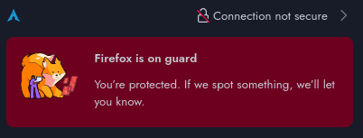
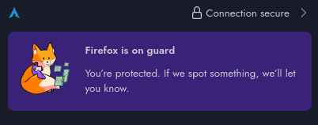

# Sysadmin Log: Traefik Implementation and Deployment

**Date:** 2026-08-02

**Report Time:** 20:18

**Category:** Architecture | Networking 

**Status:** In Progress

---

## 1. Context & Problem Statement

**One-line summary:** Implement Traefik as a Unified Reverse Proxy Solution, using a wildcard certificate base via DNS-01 Challenge to secure internal traffic and implement internal DNS Resolution.

**Background:** The current homelab architecture features plaintext communication over HTTP in most services, while the most critical ones use self-signed certificates. Both approaches were deemed sufficient at the time, considering services are separated in a trusted zone, and prioritizing further learning and deployment. As the number of services increases, and more of them are security-focused, the number of self-signed certificates increases, and creating exceptions or trusted certificates is no longer a sustainable approach. Additionally, as the service count continues to increase, maintaining a clear record of which service is mapped to which IP and port combination has become a time-consuming endeavour. Traefik is designed to resolve both issues, doubling as a Reverse Proxy and SSL Manager.


## 2. Architectural Decisions & Strategy


### Decision 1: Deploy Traefik in Main Server

**Decision:** Implement Traefik as the Reverse Proxy and SSL Manager for the existing infrastructure.

**Rationale:**

**Pros:**
* Featuring Native Docker Integration immediately puts Traefik high on the candidate list. Most of the services currently running in the homelab are dockerized.
* Traefik supports proxying to IPs outside of the docker socket, meaning it can easily continue to serve as the SSL and Reverse Proxy solution as the homelab scales. 
* The documentation for it is abundant, if slightly obtuse, and the community support is the second largest in the list (topped only by nginx).
**Cons:**
* Traefik is the most difficult service to set up, and it requires rewriting a considerable amount of docker compose stacks.
* As with any of the options considered, the model requires rethinking the firewall isolation rules and moving access controls up to the proxy layer.

### Decision 2: Isolate Out-of-Bands (OOB) Management Services

**Decision:** Decouple Out-of-Bands Management Services from Reverse Proxy implementation
**Rationale:** Utilizing a reverse proxy introduces an additional single-point-of failure to the current infrastructure. While this risk is accepted, it needs to be mitigated by ensuring OOB Management Services remain accessible when the proxy host or proxy are down, including from outside the network. For this reason, the cloudflare zero-trust tunnels providing emergency ingress remain decoupled from the Reverse Proxy Implementation.

### Decision 3: Implement Socat-based connection for the HomeAssistant VM.

**Decision:** Implement isolated virtual network connection for HomeAssistant VM using Socat forwarding.
**Rationale:** The HomeAssistant VM is attached to the Traefik host via MacVTap interface.
As a consequence, direct communication between the host and VM is impossible.
Creating a Bridge interface is rejected as a solution due to interference with the remote unlocking capabilities and IPMI remoting.
The decision is made to create an internal virtual network to connect the two, and a socat service to achieve Network Address Translation between the VM and the Traefik container.

## 3. Implementation & Execution

* **Phase 1 (Preparation):** ...

- Reading on Traefik implementations, and finding inspiration in github repositories
- Creating Docker-Compose File
- Creating a new Docker-Proxy for the Proxy Socket, adding it to the traefik mesh network and compose stack.
- Studying options to maintain service isolation: Middleware definitions in Traefik are chosen.


* **Phase 2 (Execution):** ...


- Implementing non-critical service as test: `it-tools`.
- Validating service connection:
- Restricting access to services by VLAN segments via middleware definition
- Disabling existing cross-VLAN firewall rules.
- Replacing Firewall rules with single pinhole rule to port 443 on every VLAN.
- Using it-tools as test scenario, restrict to LAN_VLAN and test connection.
- Validated connection on LAN VLAN.
- Validating isolation by connecting to other VLANs and attempting connection. Connection requests denied.
- Allowing ingress from multiple VLANS necessitates creating a middleware group with all the included networks or IPs as a list.
- Attempting connection from external network (via VPN).
- Confirm that ingress is broken, due to the port no longer being connected to the docker container.
- Attempt to fix connection by switching the IP:PORT pair to the FQDN for the service.
- Cloudflare tunnel resolves, but the request is denied.
- Traefik logs indicate IP (cloudflare tunnel internal IP) not allowed to resolve.
- Add Cloudflare Tunnel to the proxy_mesh network to resolve.
- Service now resolves externally.


#### MacVTap interface limitation workarounds:

Create a temporary file with a network definition, and exactly enough range for two hosts: the VM and the KVM host. Then initialize the network and attach the NIC to the VM and then the host.

```bash
# RUN AS ROOT
# Create temporary network definition
sudo cat <<EOF > /tmp/isolated.xml
<network>
  <name>isolated</name>
  <ip address='X.X.16.1' netmask='255.255.255.0'>
    <dhcp>
      <range start='X.X.16.2' end='X.X.16.24' />
    </dhcp>
  </ip>
</network>
EOF
# Import Network Definition
sudo virsh net-define /tmp/isolated.xml
# Ensure Autostart with system boot
sudo virsh net-autostart isolated
# Start now
sudo virsh net-start isolated
# Then add a network definition to the VM
sudo virsh edit {VM_NAME}
```
Network definition:
```xml
<interface type='network'>
      <source network='isolated'/>
      <model type='virtio'/>
    </interface>
```
Restart the VM

```bash
# RUN AS ROOT
sudo virsh shutdown {VM_NAME}
sudo virsh start {VM_NAME}
# Get Assigned Leases
sudo virsh net-dhcp-leases isolated
```
Redacted Response:

| Expiry Time | MAC Address | Protocol | IP Address | Hostname | Client ID or DUID |
| --- | --- | --- | --- | --- | --- |
| 2026-08-02 23:11:14 | XX:XY:YX:XX | ipv4 | X.X.16.3 | {VM_NAME} XX:XY:YX:XX |

```bash
# Ping VM from host
ping {VM_ISOLATED_IP}
```
The VM responds and the connection is validated. 
```
--- X.X.16.3 ping statistics ---
3 packets transmitted, 3 received, 0% packet loss, time 1060ms
```
To validate isolation, a different host attempts to ping the VM.
```
--- X.X.16.3 ping statistics ---
3 packets transmitted, 0 received, 100% packet loss, time 2077ms
```
Network Isolation is confirmed.

After a basic connectivity test, the test moves on to the docker tunnel. A published application route is created and defined to the {VM_ISOLATED_IP} in the VM host. Connectivity is tested using a VPN to bypass the Host Override in the internal network.
The connectivity test fails. Moving the cloudflare tunnel into the host network doesn resolve the issue.

The decision is made to evaluate whether it is a cloudflare issue specifically, and the IP address for the HA VM is changed in the Traefik environment file. The stack is brought down using `docker compose down` and then recreated using `docker compose up -d`. To validate Traefik is once again operational, the `it-tools` service is tried first. This resolves correctly. Despite this, the Home Assistant service fails to load through Traefik. 

The HomeAssistant VM has proven to be the most difficult problem to solve. The Isolated Network model was scrapped in favour of the Default NAT in order to identify the root cause of the communication impairment: it's unclear whether it's a docker network issue, or rather a network that is too isolated. The defaul NAT network also proved to be fruitless. Furthermore, connecting to a container inside the proxy_meshnetwork confirmed that the containers can reach other devices in the same VLAN, proving that the issue doesn't lie at the container isolation level. It's strictly a failure to direct the packages from the container to the VM.

A solution ocurred: creating a docker network that is bridged not to the lan interface, but the virtual isolated network instead. This idea was tested by finding the correct interface using `ip -4 addr show {interface}`. Once the interface using the gateway IP corresponding to our network definition was found, the bridge was manually created using `docker network create -d macvlan --subnetX.X.16.0/24 --gateway=X.X.16.1 -o parent={INTERFACE} kvm_bridge`. The network was defined as external in the docker compose file of a test container and the container went up. Connectivity still failed. Several methods were tried, and they all failed. In the end, a socket proky between the Docker host and the Isolated KVM Bridge network proved to be the best solution. `socat` was chosen for this purpose, using a custom [systemd unit](../artifacts/traefik/ha-vm-socat.service).

Connectivity was resolved immediately. HomeaAssistant's listening interface remains to be bound to the internal KVM network exclusively. This was attempted, but resulted in a complete loss of conectivity. Debugging is deemed low priority. The HomeAssistant dashboard is password-protected and no IoT or TV devices coexist in the VLAN.

Now that everything has been confirmed, the task is to migrate all the existing docker compose services to a traefik-native model. This is a perfect task to automate. For YAML parsing, JinJa and Python are the best tools, and the work already done with Ansible heavily informs the templating.

The script is designed to take an existing or future docker-compose project and turn it into a traefik-native deployment. A Python script was then written to take a compose file as input, read variables from a `.env` or `.sops.env` config file, and output the projects `docke-compose.yml` and `.env` files with the traefik definitions.

* **Phase 3 (Verification):** 

The test plan defined in the ADR was followed in order to validate the deployment. It followed the basic pattern:

1. Get service self-signed certificate information using openssl.
`openssl s_client -showcerts -connect {SERVER_IP}:9090`

2. Get service wildcard certificate information using openssl.
`openssl s_client -showcerts -connect {SERVICE_URL}:443`

With this initial test passing validation, the Python Script was tested and debugged using a simple HTTP-only service (`it-tools`). The container started successfully and the web-ui was reachable with the same valid certificate. 

Results for two cases (Self-signed -> Valid TLS, HTTP -> Valid TLS) are available in the [openssl-validation.md artifact](../artifacts/traefik/openssl-validation.md).

Browser certificate information was also compared before and after; only one service shown here for brevity:





## 4. Outcome & Future Considerations

* **Result:** All Docker Services resolve internally via human-readable URL with valid certificates.
* **Result:** Cloudflare Tunnels updated to match internal mappings, and accessible without bypassing TLS verification.

### Next Steps
- [ ] **Pending:** Run a Recovery Plan test and restore services to the pre-deployment state.
- [x] **Completed:** Migrate existing services to Traefik. [2026-08-05]
- [x] **Completed:** Validate new SSL Certificates [2026-08-04]
