# Sysadmin Log: SUSE-Based AD SAMBA Server

**Date:** 2026-08-10

**Report Time:** 22:37

**Category:** Architecture

**Status:**  In Progress

---

## 1. Context & Problem Statement

**One-line summary:** Create a SUSE-based SAMBA fileserver where the Domain Controller handles Identity and Access Management.

**Background:** Sage 4 of the Hybrid Identity Infrastructure Project revealed that a lack of real services in the domain means permissions are theoretical and can't be measured and tested. This project aims to create a SAMBA fileserver, configure identity and access management across different shares and test configured domain permissions against a real, live system.

### NOTE: A future deployment of a Windows-based SAMBA server is complementary to this exercise.


## 2. Architectural Decisions & Strategy

### Decision 1: Create an OpenSUSE-based SAMBA server.

**Decision:** Join an OpenSUSE based server to the existing Stage 4 domain using the exsiting Ansible Playbooks.
**Rationale:** OpenSUSE is an enterprise-grade Linux System. Whereas RHEL is the most common enterprise choice in the US, SUSE is a considerable force in Europe.  Adding another distribution to the domain tests the resiliency and os-agnosticism of the configured Ansible Playbooks, while additionally resolving the need for a fileserver to test Identity and Access Management in Active Directory.

### Decision 2: Define and defer a Windows-based SAMBA Fileserver.

**Decision:** Define and defer a complementary project for a Windows-based SAMBA server as an additional but separate excercise in tooling familarization.
**Rationale:** Linux is broadly regarded as the standard server OS, and, as such, the existence of a Linux-based SAMBA server is a realistic scenario. However, it is important to note that a Windows-based SAMBA server is equally, if not more likely, and, as such, both should be tested, configured and documented in order to develop proficiency on both SAMBA server models.

### Decision 3: Implement OpenSUSE Server

**Decision:** Implement OpenSUSE's Server image as the base for the SAMBA server, as opposed to its Micro image.
**Rationale:** While OpenSUSE's Micro image offers a more streamlined system with a lower base resource consumption, previous experience with Ubuntu's minimal server installation proved unnecessarily frustrating by forcing package installations in the middle of mundane tasks due to missing utilities, and leading to a final system that wasn't significantly leaner than the standard installation, after the missing utilities and quality-of-life packages had been installed. While it is accepted that a leaner server is a more secure server, the increased attack surface is an acceptable trade-off in a homelab environment, where the distribution is one the operator hasn't used extensively.

## 3. Implementation & Execution

### Initial Bootstrapping; This bootstrapping was done using the bootsrapping server developed for Stage 4. This session follows from that installation

```bash

ssh -p 22 -i ~/.ssh/ansible_ed25519 susamba@{SUSAMBA}❯ ssh -p 22 -i ~/.ssh/ansible_ed25519 susamba@10.1.70.107

nslookup cylindrical-dc.tobon.dev
Server:		10.1.70.171
Address:	10.1.70.171#53

Name:	daisy-dc.tobon.dev
Address: 10.1.70.171

sudo zypper update
[sudo] password for susamba:
Refreshing service 'openSUSE'.
Loading repository data...
Reading installed packages...
Nothing to do.

sudo zypper install realmd
sudo realm list
sudo realm discover
tobon.dev
  type: kerberos
  realm-name: TOBON.DEV
  domain-name: tobon.dev
  configured: no
  server-software: active-directory
  client-software: sssd
  required-package: sssd-tools
  required-package: sssd
  required-package: sssd-ad
  required-package: adcli
  required-package: samba-client
╰─ nano hosts.yml❯ nano hosts.yml
cp host_vars/donator_clash_redhat_server.sops.yml host_vars/canary_underplay_suse_server.sops.yml
sops host_vars/canary_underplay_suse_server.sops.yml
```

### Snapshot SUSE Server Pre-Join

```bash
sudo virsh snapshot-create-as opensuse16.0 --name "Pre-Join" --description "Snapshot Taken of SUSE, after realmd installation, before domain join" --disk-only
Domain snapshot Pre-Join created
 Pre-Join	 2026-08-10 23:10:41 -0400   disk-snapshot
 
ansible-playbook -i hosts.yml domain-bootstrap.yml --limit=canary_underplay_suse_server
```
Ultimately, the SUSE domain join proved significantly harder than expected. Wazuh does not provide an Ansible Playbook that is suited for it. The Wazuh installation was resolved, but the domain join failed at the package installation validation, since SUSE doesn't have a native Ansible module, it's not compatible with the builtin.package module.

This could have been fixed by writing a SUSE specific task, but ultimately it was decided it should be out of scope, and was documented as Isue #9. The Wazuh fix itself was sufficient as proof of concept and the SAMBA creation needed to move forward. It is noted that, at this time, the SUSE server is _NOT_ enforcing the standard domain policy of restricting login to `LinuxAdmin` group members, as every server does. This is done to make the SAMBA permissions testing easier without the need to use a `LinuxAdmin` account.

```bash
ssh -p 22 -i ~/.ssh/ansible_ed25519 susamba@10.1.70.107
Have a lot of fun...
sudo realm list
[sudo] password for susamba:
tobon.dev
  type: kerberos
  realm-name: TOBON.DEV
  domain-name: tobon.dev
  configured: kerberos-member
  server-software: active-directory and Standard Operating Procedures."
  client-software: sssd
  required-package: sssd-tools
  required-package: sssd
  required-package: sssd-ad
  required-package: adcli
  required-package: samba-client
  login-formats: %U@tobon.dev
  login-policy: allow-realm-logins
sudo getent passwd TOBONDEV\marcos
sudo getent passwd TOBONDEV\Administrator
sudo nano /etc/nsswitch.conf
sudo getentepasswdwTOBONDEV\Administrator
sudo systemctl restart sssd
sudo getentepasswdwTOBONDEV\Administrator
exit
logout
Connection to 10.1.70.107 closed.
ssh -p 22 -i ~/.ssh/ansible_ed25519 administrator@tobon.dev@10.1.70.107
(administrator@tobon.dev@10.1.70.107) Password:
Creating directory '/home/administrator@tobon.dev'.
Have a lot of fun...
administrator@tobon.dev@canary-underplay-suse-server:~> sudo
administrator@tobon.dev@canary-underplay-suse-server:~> sudo su
We trust you have received the usual lecture from the local System
Administrator. It usually boils down to these three things:

    #1) Respect the privacy of others.
    #2) Think before you type.
    #3) With great power comes great responsibility.

For security reasons, the password you type will not be visible.

[sudo] password for root:
sudo: PAM authentication error: User not known to the underlying authentication module
sudo: a password is required
administrator@tobon.dev@canary-underplay-suse-server:~> exit
logout
```

### Domain Share Architecture

#### All network shares use Access Based Ennumeration by default. This ensures a less cluttered environment.

| Share Name | Directory Path | Read-Only Access | Read/Write Access | Security Controls | Notes |
| --- | --- | --- | --- | --- | --- |
| **company_public** | `/srv/samba/public` | `Employees` | `Communications`, `HR` | **Controls:** write-list. | Allows company-wide read access for policies and announcements, but strictly limits modifications to HR and Comms. |
| **it_infrastructure** | `/srv/samba/it_infra` | `Tier1Support` | `ITOperations`, `LinuxAdmins`, `NetworkEngineers` | **Controls:** write-list, filesystem permissions |  High-value target, containing infrastructure details, runbooks and inventories. |
| **dev_release** | `/srv/samba/dev_release` | `QA`, `InfoSec` | `Engineering`, `DevOps`, `WebServerAdmins` | **Controls:** write-list | Creates a pipeline where Engineering and Web Admins can write builds, while QA tests and InfoSec audits them. |
| **finance_ledger** | `/srv/samba/finance` | `Executive`, `AuditAccess` | `Finance`, `Accounting` | **Controls:** vfs_full_audit, filesystem permissions, write-list | Stores Sensitive Company Financial Information. High Value Target. |
| **payroll_secure** | `/srv/samba/payroll` | *None* | `PayrollManagers` | **Controls:** filesystem permissions, narrow abe, vfs_full_audit | Extreme restriction. Only accessible by explicitly designated Payroll Specialists, instead of the general HR and Accounting groups. High Value Target. |
| **media_vault** | `/srv/samba/media_vault` | `Communications`, `Marketing` | `MediaProduction`, `MediaNetworkShare` | **Controls:** write-list  | Tuned for large file transfers |
| **security_audits** | `/srv/samba/sec_audits` | `AuditAccess`, `Executive` | `InfoSec`, `SecurityEngineers` | **Controls:** read-only write-mask, filesystem permissions, vfs_full_audit | Extremely High Value Target. Contains details of the internal security. Content is set to read-only upon dropping, to ensure integrity. |
| **cloud_configs** | `/srv/samba/cloud_cfg` | `DevOps` | `CloudAdmins`, `SystemEngineers` | **Controls:** write-list, vfs_full_audit | Segregated from general IT to protect sensitive infrastructure-as-code and CI-CD pipelines |

---

As a first step, only one of the shares is chosen to validate permissions: Company Public, allowing for all employees to browse, but restricting write access to members of the Communications and HR Departments, which provides a simple three tier access control.

```toml
[global]
        workgroup = TOBONDEV
        netbios name = SUSAMBA
        password server = *
        encrypt passwords = Yes
        preferred master = No
        domain master = No
```


```toml
[company_public]
    path = /srv/samba/company_public
    comment = Company Public Share
    writable = no
    browsable = yes
    write list = "@TOBONDEV\ HR, @TOBONDEV\ Communications"
    guest ok = no
    valid users = "@TOBONDEV\ Employees"
```


### Implementation

Implementation begins by creating all the necessary directories that will host future samba shares.

```bash
ssh -p 22 -i ~/.ssh/ansible_ed25519 susamba@{SUSAMBA}
sudo mkdir -p /srv/samba/{company_public,it_infrastructure,dev_release,finance_ledger,payroll_secure,media_vault,security_audits,cloud_configs}
sudo semanage fcontext -a -t samba_share_t "/srv/samba(/.*)?"
sudo restorecon -R -v /srv/samba
sudo smbpasswd -a susamba
sudo systemctl enable --now smb.service
sudo smbclient -U susamba -L localhost
########################################
Sharename       Type      Comment
---------       ----      -------
profiles        Disk      Network Profiles Service
users           Disk      All users
print$          Disk      Printer Drivers
company_public  Disk      Company Public Share
IPC$            IPC       IPC Service (Samba 4.22.11-git.552.66cfeb7de0a160000.1.1SUSE-oS16.0-x86_64)
susamba         Disk      Home Directories
########################################
```
Once basic service was validated, the first test account (`gnakamura`) was used to validate SAMBA acces:
```bash
sudo smbclient -U gnakamura -L localhost
########################################
Sharename       Type      Comment
---------       ----      -------
profiles        Disk      Network Profiles Service
users           Disk      All users
print$          Disk      Printer Drivers
company_public  Disk      Company Public Share
IPC$            IPC       IPC Service (Samba 4.22.11-git.552.66cfeb7de0a160000.1.1SUSE-oS16.0-x86_64)
nobody         Disk      Home Directories
########################################
```
Once validated, firewall rules for SAMBA and Web Service Discovery host Daemon (`wsdd`) were enabled and validated, before enabling the `wsdd` service.
```bash
sudo firewall-cmd --add-service=samba --permanent
sudo firewall-cmd --add-service=wsdd --permanent
sudo firewall-cmd --reload
sudo firewall-cmd --list-services
########################################
dhcpv6-client samba ssh wsdd
########################################
sudo systemctl enable --now wsdd
```

With wsdd enabled, a Windows 11 Domain Member was used to check share visibility. 

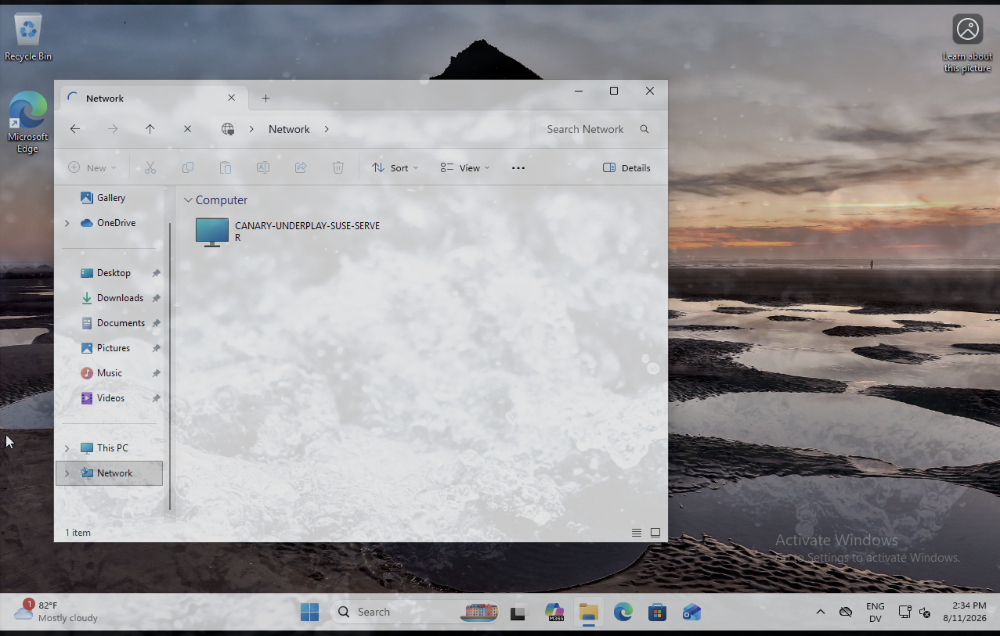


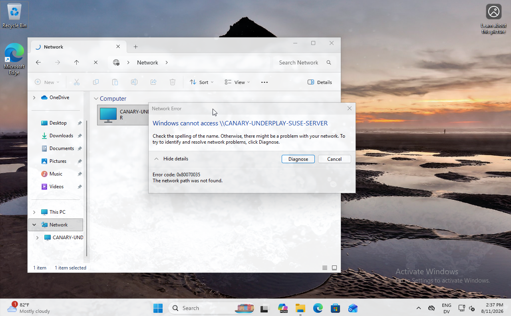

The firewall configuration was validating by checking the logs using `sudo journalctl -xe -u firewall-cmd` (which was empty) and `sudo tail /var/log/firewalld`, which only provided a warning log from the bootstrapping script (attempted to add a firewall rule for SSH, but it was already present). To verify user group mapping, `sudo id gnakamura` was executed.

This resulted in the following output:

```bash
uid=284001292(gnakamura@tobon.dev) gid=284000513(domain users@tobon.dev) groups=284000513(domain users@tobon.dev),284001124(s-1-5-21-1405588876-2272961408-3925895949-1124@tobon.dev),284001129(s-1-5-21-1405588876-2272961408-3925895949-1129@tobon.dev),284001120(s-1-5-21-1405588876-2272961408-3925895949-1120@tobon.dev),284001110(s-1-5-21-1405588876-2272961408-3925895949-1110@tobon.dev),284001115(s-1-5-21-1405588876-2272961408-3925895949-1115@tobon.dev)
```

The lack of human-readable group-names in the automatic user assignment suggests that group-mapping is at fault.

Attempting to understand the mapping, the logs for sssd were checked. This revealed a series of error messages:

```bash
Aug 11 11:55:26 canary-underplay-suse-server ldap_child[43351]: Failed to initialize credentials using keytab [MEMORY:/etc/krb5.keytab]: Client 'CANARY-UNDERPLA$@TOBON.DEV' not found in Kerberos database. Unable to create GSSAPI-encrypted LDAP connection.
[snip: 11 identical entries omitted for brevity]
Aug 11 17:55:25 canary-underplay-suse-server ldap_child[46430]: Failed to initialize credentials using keytab [MEMORY:/etc/krb5.keytab]: Client 'CANARY-UNDERPLA$@TOBON.DEV' not found in Kerberos database. Unable to create GSSAPI-encrypted LDAP connection.
```
This suggested that the necessary packages for sssd configuration were not installed.
```bash
sudo zypper install libsss_nss_idmap0 sssd-winbind-idmap
sudo systemctl restart sssd
```
After installation, sssd was restarted and the logs were checked. This time, the error message pertained `ldap_sudo_search_base` not being set. This was fixed manually, noting that the sudoers OU is currently set *outside* the ORG OU, which is a bug. Issue #8 was created to update the Ansible Playbook to fix this.

The sssd cache was cleared and the service restarted, after which the `ldap_sudo_search_base` error was no longer present.

```bash
sudo sss_cache -E
sudo systemctl restart sssd
```
Now that the id mapping services were installed, once `sudo id gnakamura@tobon.dev` was tried once again. This time, the output was correct:

```bash
uid=284001292(gnakamura@tobon.dev) gid=284000513(domain users@tobon.dev) groups=284000513(domain users@tobon.dev),284001124(linuxusers@tobon.dev),284001129(networkengineers@tobon.dev),284001120(itoperations@tobon.dev),284001110(employees@tobon.dev),284001115(fakeaccounts@tobon.dev)
```
This did not have an effect. Suspecting a netbios/dns failure, a DNS record was added for the samba server:

```powershell
Add-DnsServerResourceRecordA -Name "canary-underplay-suse-server" -ZoneName "tobon.dev" -IPv4Address "{SUSAMBA}"
```
After doing so, running `nslookup canary-underplay-suse-server.tobon.dev` correctly returned the server's IP address, but the authorization issue remained.

Suspecting the issue might lie in the way group authorization was declared in the samba configuration ("@TOBONDEV\ Group"), the samba configuration was edited to use (+"group@tobon.dev")


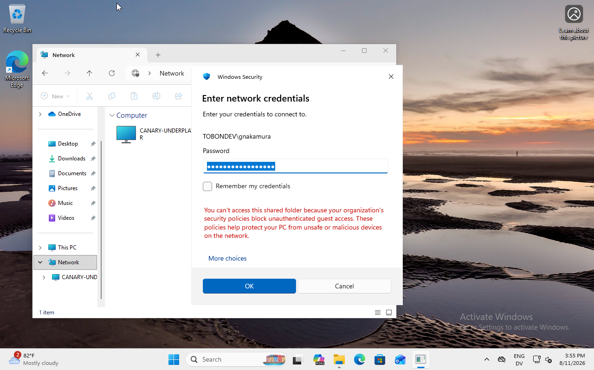

Connection was attempted with the created susamba@tobon.dev samba account, which suceeded. This suggests the specific authentication issue lies at the samba level, when authenticating against AD.

```bash
sudo net ads testjoin
########################################
Join to domain is not valid: {Access Denied} A process has requested access to an object but has not been granted those access rights.
```
The following global settings were used to point SAMBA towards ADDS for authentication.
```toml
[global]
    workgroup = TOBONDEV
    realm = TOBON.DEV
    security = ads
    kerberos method = secrets and keytab
```
Afterwards, a SAMBA domain join was performed
```bash
sudo net ads join -U Administrator
########################################
Using short domain name -- TOBONDEV
Joined 'SUSAMBA' to dns domain 'tobon.dev'
```

Following this success, `gnakamura`'s access to the SAMBA share was tested once more in the Windows 11 Domain Member. This time, no login screen appeared, but rather there was an authentication failure. The logs were checked once again, and the following message revealed the issue:
```bash
Aug 11 23:04:55 canary-underplay-suse-server smbd[48656]: [2026/08/11 23:04:55.897249,  0] ../../source3/auth/auth_winbind.c:120(check_winbind_security)
Aug 11 23:04:55 canary-underplay-suse-server smbd[48656]:   check_winbind_security: winbindd not running - but required as domain member: NT_STATUS_NO_LOGON_SERVERS
```
The Windbind Daemon was then enabled using `sudo systemctl enable --now windbind`.


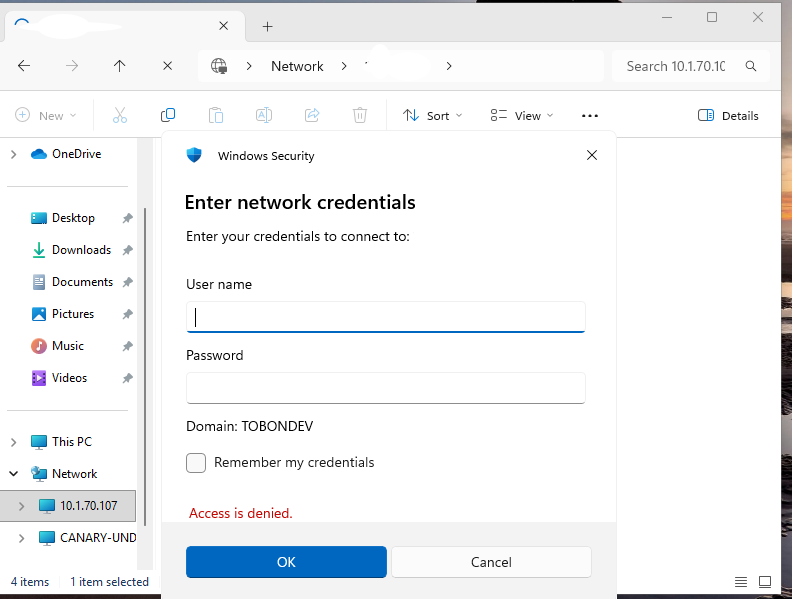

It appears that Kerberos authentication suceeded, but authentication is not correctly defined, it appears that Authorization is not correctly defined. This is further evidenced by the fact that the "home directory share (gnakamura@tobon.dev)" is accessible, with read and write access, both in the SUSE server and the Windows 11 Client.


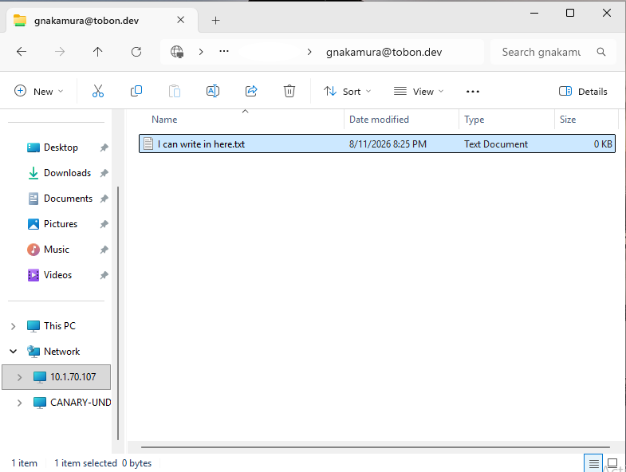

```bash
sudo chmod 1777 /srv/samba/
```

In order to get more information about this failure, smbclient was used in the SUSE server to attempt a connection as gnakamura.

```bash
smbclient //canary-underplay-suse-server.tobon.dev/company_public -U gnakamura@tobon.dev
########################################
tree connect failed: NT_STATUS_ACCESS_DENIED
########################################
sudo setenforce 0
smbclient //canary-underplay-suse-server.tobon.dev/company_public -U gnakamura@tobon.dev
########################################
tree connect failed: NT_STATUS_ACCESS_DENIED
########################################
sudo setenforce 1
```

This confirmed that SELinux Enforcement was not the issue, either.
Once again, the `smb.conf` file was modified. Quotation marks in the user groups were removed, in case they were being read as part of the group name.

During this edit, the issue was finally found:

```toml
[company_public]
    ...
    valid users = +employees@tobob.dev
    ...
```

Once this typo was fixed, authorization succeeded.

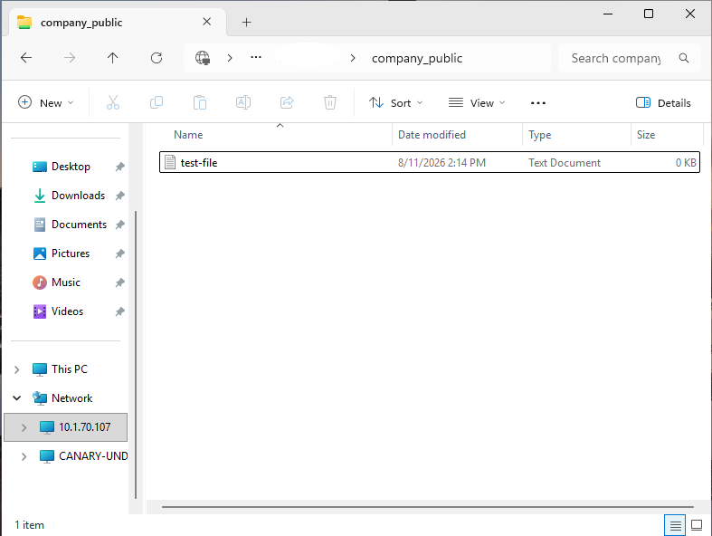

Icluding denying write access to `gnakamura`.


Now that the basic access for the employee group is validated, `realm deny --all` was executed, which produce an error:
```bash
realm: Couldn't change permitted logins: The Samba provider cannot restrict permitted logins.
```
Fortunately, the only login type that needs to be restricted is the `interactive` login, so other methods are available.

While the easiest method is using `sshd.conf` as the authorization gate, with its "Allowed Groups" policy, and, in this scenario, with a VM that provides no physical access, such a measure would likely be sufficient, a better option exists.
Since SAMBA is authenticating against the Domain Controller using `winbind` instead of `realm`, editing `realmd.conf` to disable samba allows the system to perform authentication separately for both services: `winbind` handles SAMBA exclusively, while `realm` handles interactive logins.

```toml
[providers]
samba = no
```

Following this change, the realm deny policy was completed without errors, and was validated against `gnakamura`, who is a member of the `LinuxUsers` group and against `marypilaf`, who is not.

```bash
sudo sss_cache -E
sudo systemctl restart sssd
sudo realm deny --allow
sudo realm permit --groups "LinuxAdmins"
sudo sss_cache -E
sudo systemctl restart sssd
su marypilaf@tobon.dev
########################################
su: Permission denied
su gnakamura@tobon.dev
########################################
gnakamura@tobon.dev@canary-underplay-suse-server:~> 
```

In this scenario `marypilaf` was chosen because it is a member of the `HR` group, and, thus, should be able to write to the company_public share, whereas `gnakamura` is only allowed read access. 

To ensure the samba service is able to continue authenticating against ADDS, despite the realm configurations changing, samba was restarted using `sudo systemctl restart smb.service`.

The read and write access for `marypilaf` was confirmed before executing the planned testing matrix, despite explicitly disallowing interactive login on the SAMBA server:


### Testing Matrix
#### Testing Methodology:

1. Read: `smbclient {SUSAMBA}/company_public -U {USER}@{DOMAIN} -c "get can-read.txt" && cat can-read.txt`
2. Write: `smbclient {SUSAMBA}/company_public -U {USER}@{DOMAIN} -c "put can-write.txt"`

| User | Groups | SAMBA Share | Allowed Groups | Defined Access | Tested Access | Expected | Result |
| --- | --- | --- | --- | --- | --- | --- | --- |
| gnakamura | ITOperations,Employees,NetworkEngineers,LinuxUsers | company_public | R: Employees; RW: Communications, HR | Read | Read | "You have read access" | Pass |
| gnakamura | ITOperations,Employees,NetworkEngineers,LinuxUsers | company_public | R: Employees; RW: Communications, HR | Read | Write | "NT_STATUS_ACCESS_DENIED opening remote file \can-write.txt
" | Pass |
| shttp | ServiceAccounts | company_public | R: Employees; RW: Communications, HR | NONE | Read | "tree connect failed: NT_STATUS_ACCESS_DENIED" | Pass |
| shttp | ServiceAccounts | company_public | R: Employees; RW: Communications, HR | NONE | Write | "tree connect failed: NT_STATUS_ACCESS_DENIED" | Pass |
| marypilaf | HR, Empolyees | company_public | R: Employees; RW: Communications, HR | Read | Read | "You have read access" | Pass |
| marypilaf | HR, Empolyees | company_public | R: Employees; RW: Communications, HR | Read | Write | "putting file can-write.txt as \can-write.txt" | Pass |
| ajackson | COMMUNICATIONS, Empolyees | company_public | R: Employees; RW: Communications, HR | Read | Read | "You have read access" | Pass |
| ajackson | COMMUNICATIONS, Empolyees | company_public | R: Employees; RW: Communications, HR | Read | Write | "putting file can-write.txt as \can-write.txt" | Pass |

Once this initial test passed, it was then time to create more network shares.

Following the [Network Share Architecture](#domain-share-architecture), the rest of the shares were defined in the `smb.conf` file. 

After all these tests were passed, the global configurations for SAMBA were updated to ensure that network shares were only visible to users listed in the corresponding ACL.

```toml
[global]
        access based share enum = yes
        hide unreadable = yes
```  
Additionally, for sensitive shares such as IT_Infrastructure or Finance_Ledger, logging was set with `vfs objects = full_audit` to ensure syslog tracking for all activity.

Since share visibility needed to be tested, it was at this time that the NETBIOS resolution issue needed to be fixed:

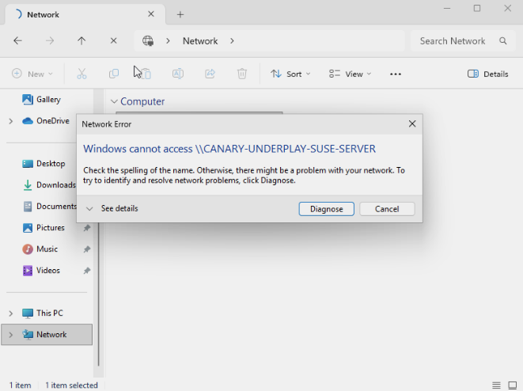

The chosen solution was forcing `winbind` into broadcasting the servers FQDN instead of its NETBIOS name, using `sudo systemctl wsdd edit` to insert an `override.conf` file for the winbind service containing the following configuration:

```toml
[Service]
ExecStart=
ExecStart=/usr/sbin/wsdd  -n SUSAMBA
```
Then, both SAMBA and `winbind` were restarted.

```bash
sudo systemctl stop winbind
sudo systemctl daemon-reload
sudo systemctl restart smb.service
sudo systemctl start winbind
```

This failed to resolve the issue. To validate whether winbind was still using the hostname as its broadcast/NETBIOS name, the server was renamed to "SUSAMBA", and the services restarted as above. This also failed to resolve the issue. Just in case the name was cached in the Windows system, the function discovery services were forcefully restarted.

```powershell
Restart-Service fdPHost -Force
Restart-Service FDResPub -Force
```

Then, the realization was made: wsdd needed restarting, too.

```bash
sudo systemctl restart wsdd
```

This resulted in the server name finally updating, revealing that the issue lied with the Web Services Dynamic Discovery configuration (`wsdd`).

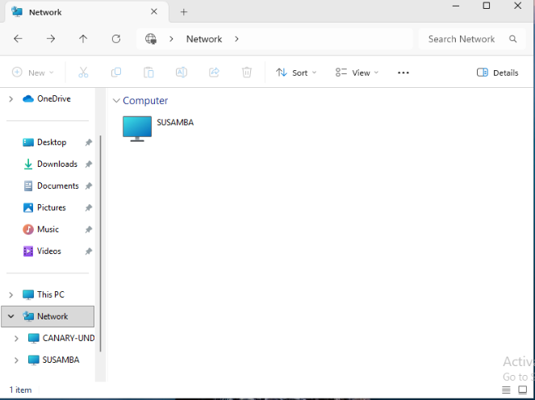

The read test was performed with the `ajackson` user, which doesn't have Linux Login permissions, and thus, no home directory shares are available for the user.

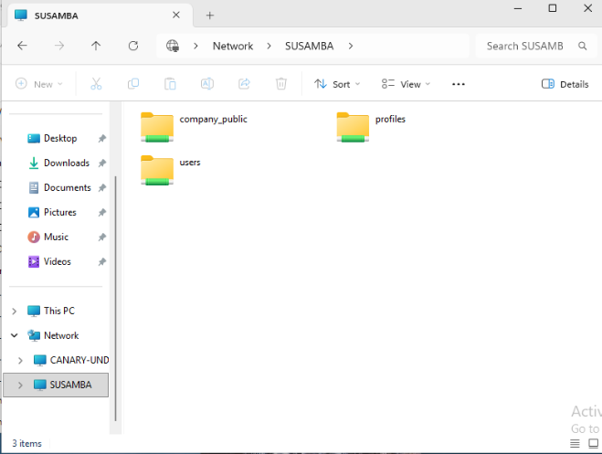

The root cause appears to be a failure to restart `wsdd` during a previous step. This was validated by once again modifying the configuration to delete the name override, which caused the broadcast name to go back to the hostname, and, furthermore, access was granted without issue in the Windows 11 Client.

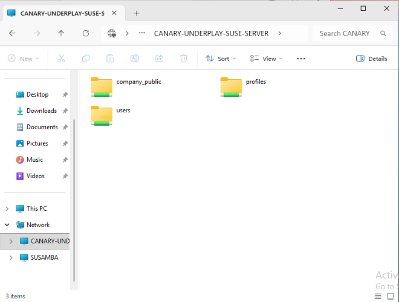

This was not an expected result, and it raised a series of questions. Without knowing what the actual fix was, a standard deployment procedure for SAMBA shares cannot be determined. As a result, the smb.conf file was heavily commented to achieve a bare-bones configuration and all services were restarted.

```bash
sudo systemctl restart smb nmb winbind wsdd
```

The connection was retried on the Windows 11 Client, and it succeeded without issue. Expanding on this, another connection was attempted on the Secondary Domain Controller. The broadcastname was set to the hostname, and upon attempting to open the share, the original error message appeared. Uncommetning the values and restarting the services once again did not allow the Secondary Domain Controller to access the network share through its discovered name (although the direct IP address does work). Due to this inconsistent behaviour, two more tests were performed: the Windows 11 Client was rebooted, and a different user (`marypilaf`) was logged in, in an attempt to rule out cached network discovery data as the cause behind the inconsistent behaviour. Additionally, a second Windows 11 Client that is not domain joined also attempted connecting to the network.

The results were as follow:

1. The user `marypilaf` accessed the discovered share on the original Windows 11 client without issue.
2. The user `localadmin` user in the non-member Windows 11 Client failed to access the Network Share.

Once again, the `wsdd` configuration was updated to force a short broadcast name, and the services were restarted.

```toml
[Service]
ExecStart=
ExecStart=/usr/sbin/wsdd  -n SUSAMBA
```
```bash
sudo systemctl daemon-reload
sudo systemctl restart smb nmb winbind wsdd
```

After this change, the Domain Controller Network Tab no longer showed a network service for `CANARY-UNDERPLAY-SUSE-SERVER`, but only for `SUSAMBA`, and successfully connected to the share. The `localadmin` user in the non-member Windows 11 Client had the same visibility change, but failed to acces the share, which was expected, given it's not authorized to do so. This suggests not only that thde `wssd` broadcast name is the solution, but also that there must be a caching system or secondary identifier that allows the connection to succeed with a long name so long as it has previously resolved with a short one. To test this theory, the name was swtiched once again and the services were restarted. 

Upon restarting the services, instead of the network tab name changing, the DC showed both names next to each oher. Accessing the `SUSAMBA` share was successful, despite the name change. A few minutes later, the `SUSAMBA` share dissapeared from the network tab (but remained in the sidebar) and only the `CANARY-UNDERPLAY-SUSE-SERVER` share remained, but it was still unaccessible.

The non-member Windows 11 Client, on the other hand, showed the expected behaviour of simply changing the name, and remained unable to access the share. Confused by this differing behaviour, a snapshot was taken for the non-member client, and it was then joined to the domain, in order to attempt accessing the share with the current configuration: no previous successful access, while the current network name is the hostname.

Upon joining the domain, this new member, which had never connected to the share, was able to correctly access it despite it using its hostname as the broadcast name.

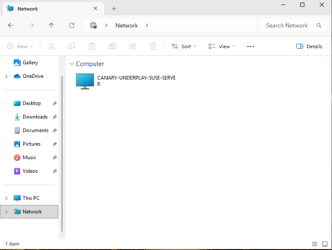

The read test was performed with the `ajackson` user, which doesn't have Linux Login permissions, and thus, no home directory shares are available for the user.

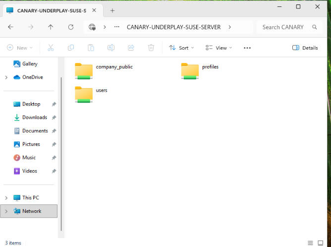

This evidence, combined with the previous behaviour on the Secondary Domain Controller, thoroughly disprove the working theory. This is not a matter of cached credentials. Given this fact, there is only one possible cause that can explain every single behaviour observed:

1. Linux Domain Members have always been able to access the share, both long and short names.
2. Windows 11 clients are able to access the share with both long and short names [caveat].
3. The Secondary Domain Controller is only able to access the share using the short name.

The only remaining explanation is that the Domain Controller is using a different, likely older, network share protocol which is incompatible with longer hostnames/netbios names. A series of experiments were performed, and the conclusion was polished. The NETBIOS name was defined as `SUSAMBA` manually in the original `smb.conf` file; for the Domain Controller to be able to resolve the share, this netbios name must also match the wsdd name. It is unclear exactly why only the Domain Controller has issues resolving via DNS. The samba configuration was reconfigured to autogenerate its NETBIOS name, and rejoined using this name.

```bash
sudo net ads join -U Administrator
########################################
Using short domain name -- TOBONDEV
Joined 'CANARY-UNDERPLA' to dns domain 'tobon.dev'
```

The `wsdd` configuration was then updated to match, and services restarted. Once again, the connection succeeded. This validates that as long as the NETBIOS name matches the one declared in `wsdd`, the connection will succeed. What still remained unclear was why the Secondary DC failed to connect.

On a hunch, DNS services were checked in the Secondary DC. Performing an `nslookup` for  `canary-underplay-suse-server.tobon.dev` yielded no result, despite the explicitly configured `A-record`. The Secondary DC reported to be querying itself. This was contrasted with the same query being performed on the SUSE server, which queried the Primary DC instead, and resolved the IP address succesfully. Suspecting DNS failure, the DNS service status was checked, and a warning about DNS synchronization was found.

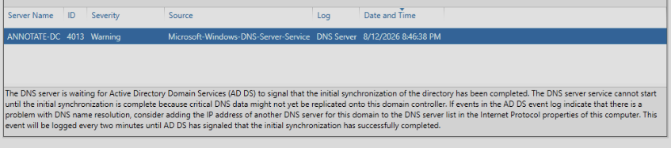

This thus explains why the DC itself is the only queried system that was unable to resolve share. Like every other system, it queried for the NETBIOS name and didn't find anything, falling back to DNS. Unlike all others, however, the Secondary DC queried itself instead of the Primary DC, found no DNS record, and failed. This is particularly strange, given that the Primary DC is configured to be the default DNS provider at the VLAN level. Given that this appeared insufficient, the Secondary DC was manually pointed towards the Primary DC as its DNS server, and it was then able to resolve the record.

```powershell
Name:    canary-underplay-suse-server.tobon.dev
Address:  {CORRECT_IP}
```

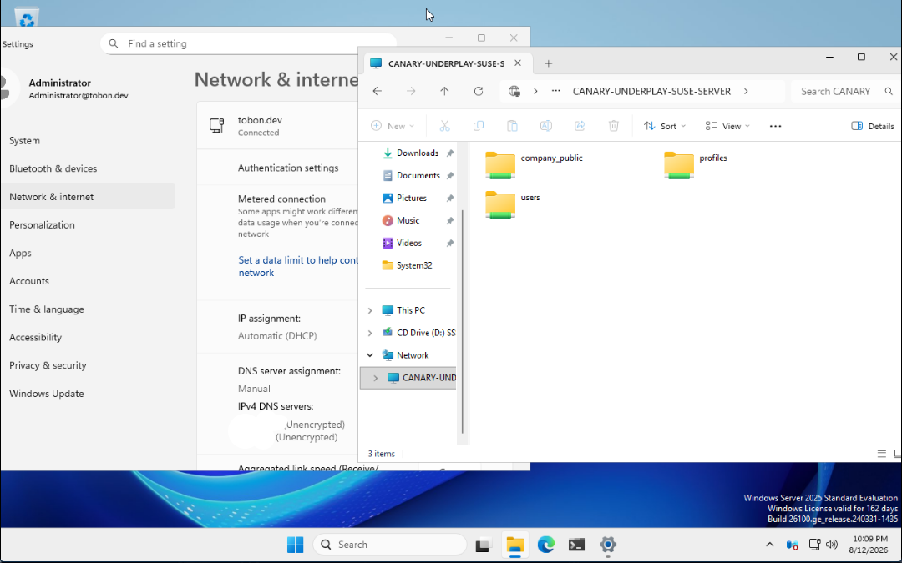

The `wsdd` configuration was reset to use the full hostname, and a connection was attempted from the Secondary DC. This time, finally, the Secondary DC was able to connect to the SAMBA share using the full name, by resolving the IP via DNS instead of NETBIOS. With this confirmation that the issue lied at the DNS level, the consideration was made to reset the name to the NETBIOS convention for resiliency purposes: that way, the services would still be available if DNS failed again.

This was decided against for a few reasons:

* DNS failure has broader ramifications than SAMBA `wsdd` broadcasting, meaning this added resiliency only affects a narrow system

* In the event of either DNS or even NETBIOS misconfiguration failure, the shares would remain accessible directly using IP addressing.

* Most systems would have a pinned link to the shares in a real world scenario, meaning network discovery is only a crucial link when accessing new shares

* Any event where DNS services are affected is disruptive enough that whether or not Network Share Discovery is working is far down the list of priorities.

Moving on to testing basic access of the more restricted shares, the user `wijackson` was chosen due to its membership in the InfoSec group, which grants it access to the highly restricted `security_audits` share, as well as broader read permissions for `it_infrastructure` and `dev_release`. Upon logging in and attempting to access the shares aformentioned, it's noted that, while they are visible for `wijackson`, unlike for `gnakamura` or `marypilaf`, access is denied.


The global `company_public` share remains accessible, suggesting the stricter permissions settings are at the core of the problem, with the number one suspect being a misconfiguration of the vfs_object settings for access auditing. These were then commented out entirely for the `it_infrastructure` share and reduced to only `full_audit` and a prefix designation for the `dev_release` share to compare and contrast all three, after which the SAMBA service was restarted.


Results:

1. The `it_infrastructure` share is now fully readable by the user.
2. The `dev_release` share is now fully readable by the user.
3. The `security_audits` share remains unreadable.

This result led to removing the narrow audit configurations for all shares, and simply setting up general logging, which fixed access for all three shares.


This setting was then propagated to all of the access logged shares. The current configuration for all Network Shares Artifact is available [here](../artifacts/active-directory-samba/smb.conf).

## 4. Outcome & Future Considerations

Once the DNS and access issue was resolved, this project comes to a close. It is important to acknowledge that the broader network share permissions have not been tested, and this is an accepted gap, with the intent of leaving room for a future project focused on compliance and auditing. This project will test these permissions and controls across the domain, generate a report, and recommend actions, which will form the base for Ansible Automation for Network Shares in this server, and a future Windows-based one as well.

* **Result:** OpenSUSE SAMBA Server defined and configured
* **Result:** SAMBA Shares accessible to Domain Users via `wsdd`, IP and DNS.
* **Result:** Company Public Share Set-up and validated
* **Result:** Basic Network Shares for Departments were generated, using basic ACLs, inherited by SAMBA, to restrict visibility and access rights.

### Next Steps
- [ ] **Pending:** Update Domain-Join Script to fix sudoers OU nesting. #8
- [ ] **Pending:** Update Domain-Join Script to add SUSE join capabilities. #9
- [ ] **Pending:** Create a playbook/role for SAMBA server setup, including smb.conf templating from SOPS-encrypted YAML. #10
- [ ] **Pending:** Run a Security Audit on the current Domain Status and write a compliance report. #11
- [x] **Completed:** Joined SUSE Server to Domain [2026-08-10]
- [x] **Completed:** Validated DNS resolution [2026-08-12]
- [x] **Completed:** Tested Basic Share Permissions [2026-08-13]
