# Sysadmin Log: Hybrid OS Lab Stage 3

**Date:** 2026-09-09

**Report Time:** 15:51

**Category:** Architecture

**Status:** In Progress

---

## 1. Context & Problem Statement

**One-line summary:** Synchronize the on-premises domain with a Microsoft 365 cloud tenant to establish and document a hybrid identity architecture.

**Background:** Following the Hybrid Identity Infrastructure Roadmap, the goal of this stage is to expand on the existing Active Directory Domain by connecting the local domain to an online tenant using Entra Cloud Sync.

## 2. Architectural Decisions & Strategy

### Decision 1: Deployment of Entra Provisioning Agent (Cloud Sync)
**Decision:** Implement Entra Cloud Sync via the lightweight Provisioning Agent rather than the legacy Entra Connect Sync server.
**Rationale:** Cloud Sync reduces on-premises infrastructure footprint and moves configuration management to the Entra portal, aligning with modern hybrid deployment standards.

### Decision 2: Utilization of gMSA for Agent Services
**Decision:** Configure the provisioning agent to run under a Group Managed Service Account (`provAgentgMSA`).
**Rationale:** Enhances security by delegating credential management and rotation of the service account directly to Active Directory.

### Decision 3: Password Hash Synchronization
**Decision:** Enable Password Hash Sync (PHS) during the Cloud Sync configuration.
**Rationale:** Allows users to authenticate to Microsoft 365 and Entra ID using their on-premises Active Directory passwords, providing a seamless single sign-on experience.

## 3. Implementation & Execution

### Phase 1 -- Preparation & Domain Validation

Verified the custom domain `tobon.dev` within the Entra tenant using a DNS TXT record.

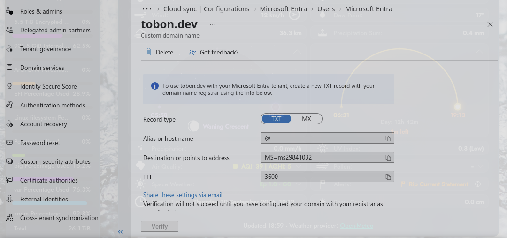

Configured the verified custom domain as the primary domain to ensure synchronized accounts format correctly as `{user}@tobon.dev`.

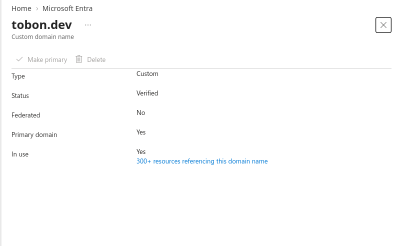

Initiated the Microsoft Entra provisioning agent configuration wizard.

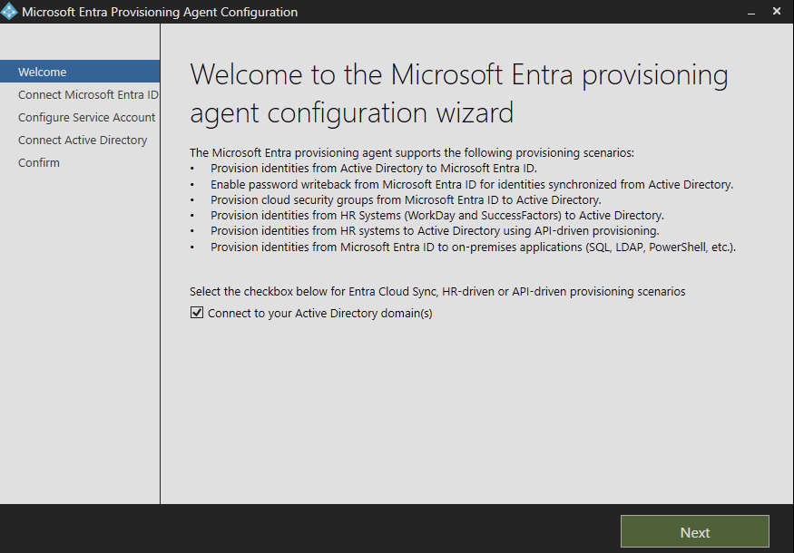

Selected the scenario to "Connect to your Active Directory domain(s)". Authenticated with Entra ID global administrator credentials.

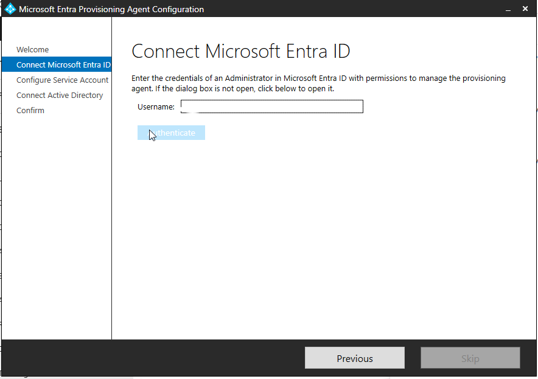

Added the local `tobon.dev` directory.

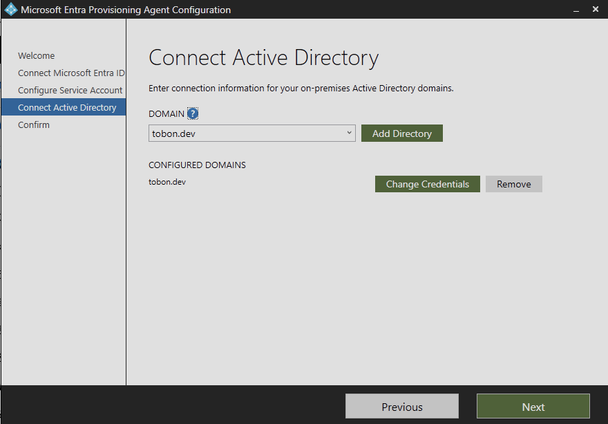

### Phase 2 -- Troubleshooting KDS & gMSA

The wizard failed to create the gMSA, throwing an error: "Unable to create gMSA because KDS may not be running on domain controller: annotate-dc.tobon.dev."

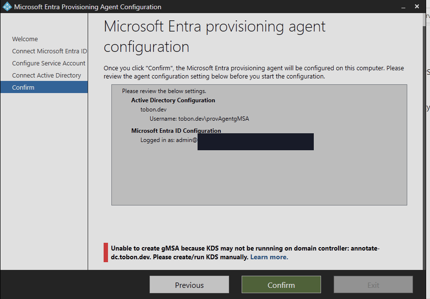

Attempted to manually generate the Key Distribution Services (KDS) root key via PowerShell using `Add-KdsRootKey -EffectiveTime ((get-date).addhours(-10))`.

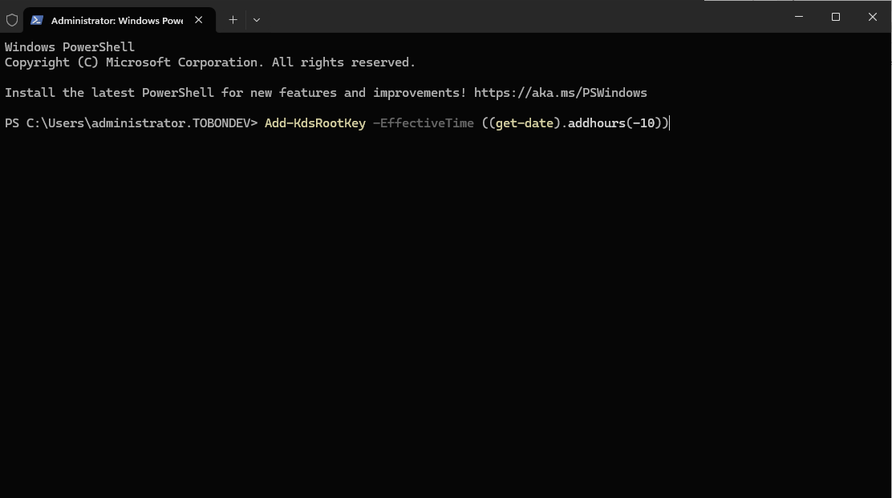

The command initially failed with an `0x80070020` file lock exception.

The root cause was identified: the Domain Controllers (`annotate-dc` and `daisy-dc`) had been moved out of the default `Domain Controllers` OU. The fix was moving them back to the default container using ADUC.

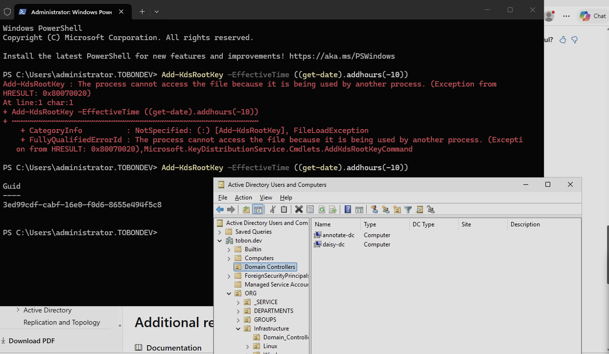

*Note: Github Issue #11 was created to fix the Ansible Playbooks and document that DCs cannot be relocated, as it unexpectedly breaks services.*

### Phase 3 -- Agent Configuration

Resumed the configuration wizard. Successfully registered the provisioning agent with Microsoft Entra ID using the newly created `tobon.dev\provAgentgMSA` account.

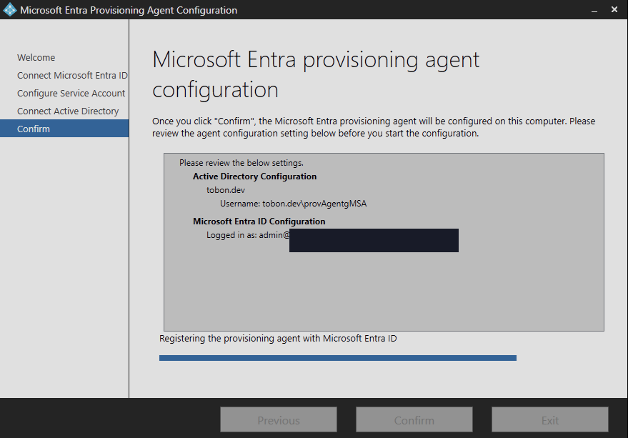

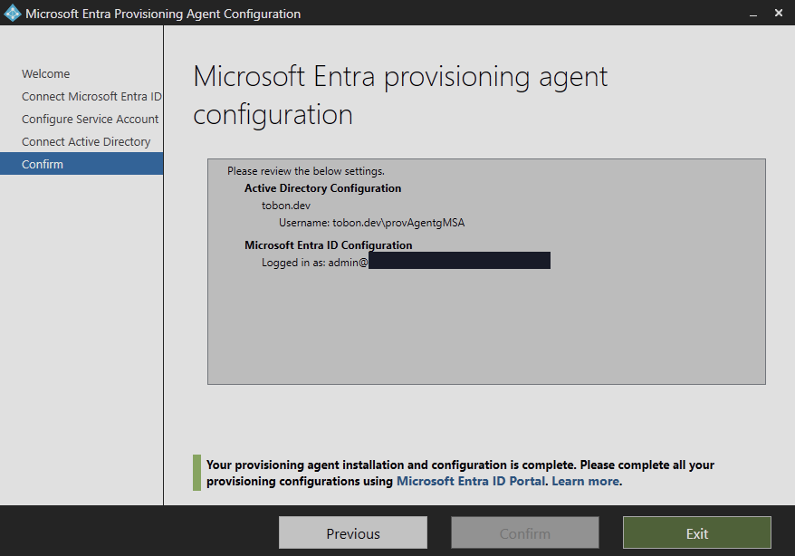

### Phase 4 -- Cloud Sync Setup

Navigated to the Microsoft Entra admin center -> Microsoft Entra Connect -> Cloud sync. Created a new configuration for the `tobon.dev` domain.
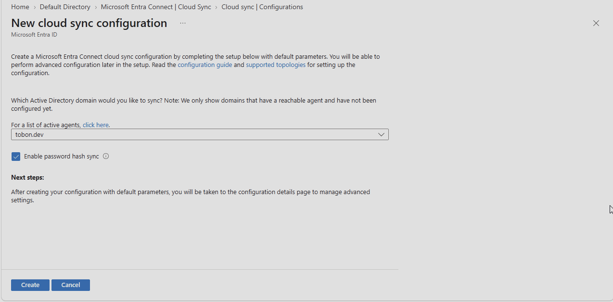
* Enabled password hash sync.
* Confirmed default scoping (All objects).
* Left "Prevent accidental deletion" enabled with a threshold of 500.
* Executed "Enable configuration".
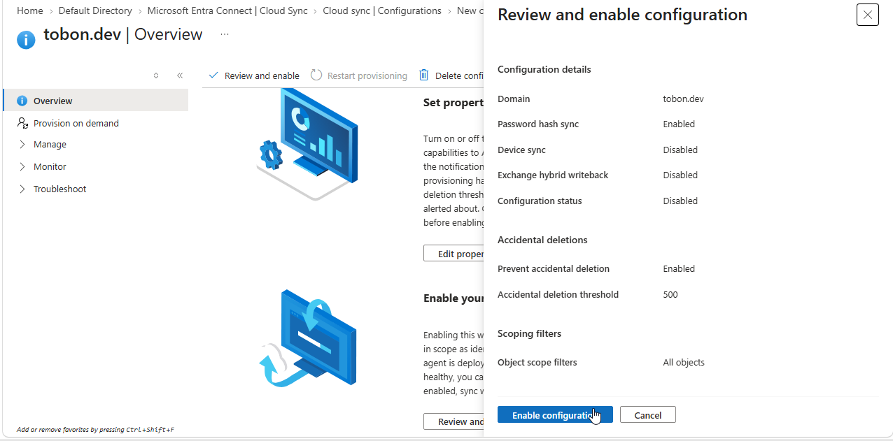

### Phase 5 -- Verification

Navigated to the Entra ID 'All users' blade. Verified that on-premises bulk-provisioned users (e.g., Avery Anderson, Avery Garcia) successfully populated in the cloud directory using the `{user}@tobon.dev` UPN format.
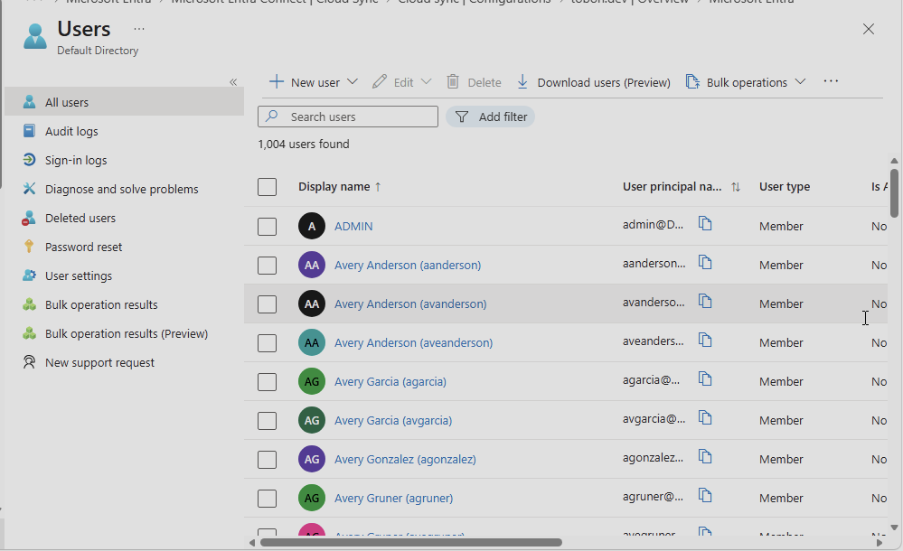

### Phase 6 -- New User & SSO Validation

Created a new user on the DC using the powershell script below, and validated user was synced successfully to Entra:

```powershell
$UserParams = @{
    Name                  = 'Marcos Tobon'
    SamAccountName        = 'marcos'
    UserPrincipalName     = 'marcos@tobon.dev'
    GivenName             = 'Marcos'
    Surname               = 'Tobon'
    Path                  = 'OU=DevOps,OU=DEPARTMENTS,OU=ORG,DC=tobon,DC=dev'
    AccountPassword       = (ConvertTo-SecureString 'PassW0rd!' -AsPlainText -Force)
    ChangePasswordAtLogon = $true
    Enabled               = $true
}

New-ADUser @UserParams
```

This temporary password was rotated before the account was validated in EntraID.

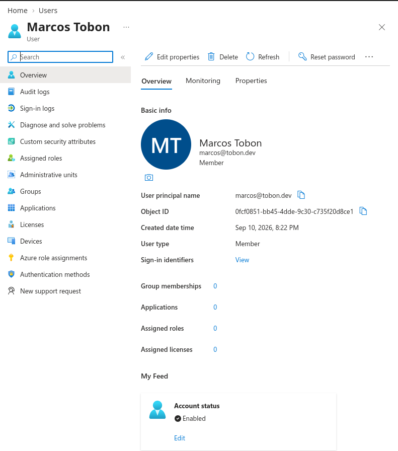

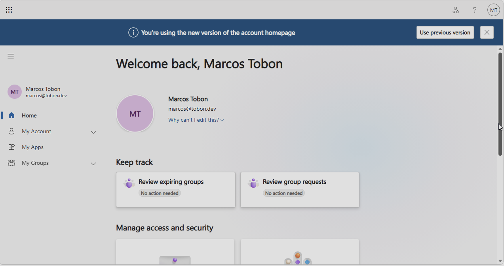

MFA policies are correctly applied to the account upon first login, prompting the new user to register security info before proceeding.

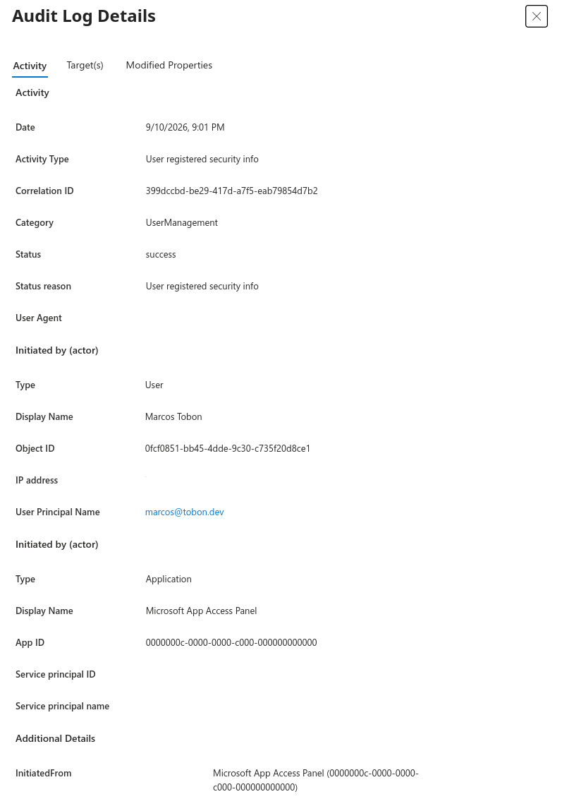

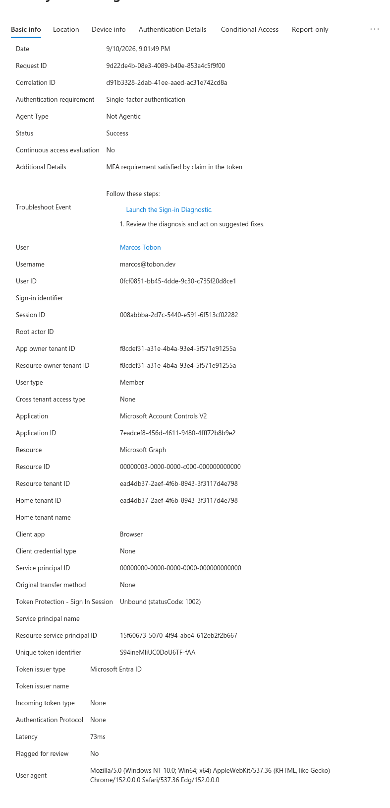

## 4. Outcome & Future Considerations

* **Result:** Hybrid identity architecture successfully established. On-premises Active Directory accounts for `tobon.dev` are actively syncing to Microsoft Entra ID.
* **Result:** Provisioning agent deployed securely using a gMSA, minimizing credential management overhead and attack surface.

### Next Steps
- [ ] **Pending:** Verify Microsoft 365 licensing automation logic against the newly synced Entra ID cloud identities.
- [x] **Completed:** Audit Entra ID sign-in logs to confirm Password Hash Sync is authenticating users successfully. [2026-09-10]
